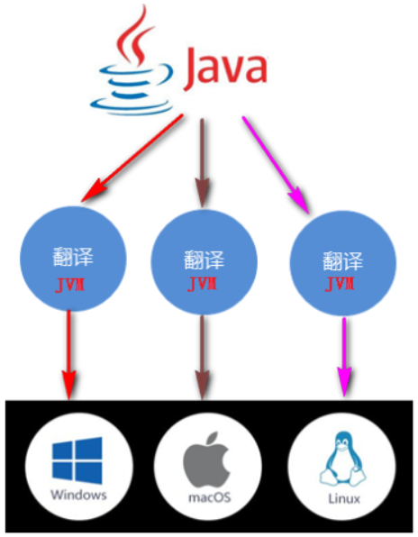
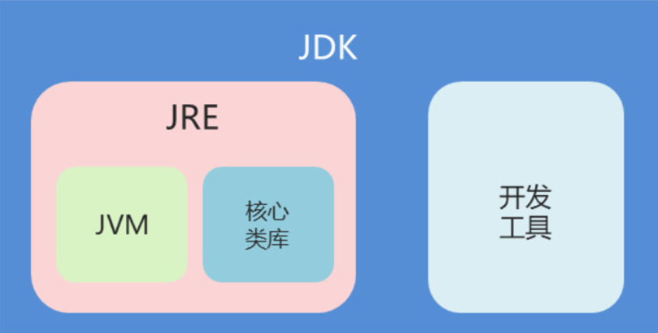
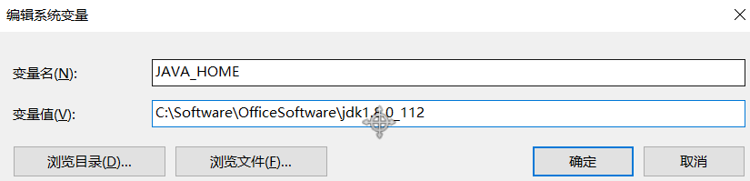
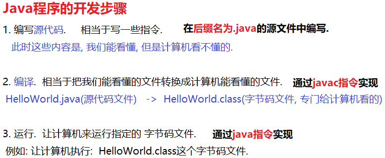

### 1. 计算机基本概念

#### 1.1 计算机组成

计算机由`计算机硬件`和`计算机软件`组成.

* 计算机硬件

  * 中央处理器(CPU)：由运算器和控制器组成.

  * 存储器
    * 内存：内存条(代数, 睿频).
    * 外存：硬盘(SSD: 固态硬盘, HSD: 混合盘, HDD: 机械硬盘), U盘.
  * 输入设备：键盘, 鼠标
  * 输出设备：显示器.

* 计算机软件

  * 系统软件：Windows操作系统, Mac操作系统, Linux操作系统.
  * 应用软件

#### 1.2 语言简介

* 计算机语言(Computer Language)：`人与计算机之间`进行交互的方式.

* 计算机语言的分类:

  1. 机器语言

     > 简单理解: 由二进制0, 1这样的指令组成.
     >
     > 例如: 10010表示 加法.

  2. 汇编语言

     > 简单理解: 用一些简单的字母表示二进制序列(0, 1)
     >
     > 例如: add表示 加法.
     >
     > 优点: 文件小, 执行速度快, **可以直接操作计算机的硬件**
     >
     > 弊端: 可读性和可移植性相对较差, 对程序员来讲, 门槛较高.

  3. 高级语言

     > 简单理解: 由一些纯英文字母(包含大小写) 和 一些特殊符号组成.
     >
     > 例如: +表示 加法.
     >
     > 优点: 语法相对简单, 可读性, 兼容性较强, 对程序员来讲, 门槛较低.
     >
     > 弊端: 种类繁多, 每种语言都有自己的语法, 每学一门语言, 都要学习新的语法.

     **分类**

     * 第一代高级语言:

       例如: C语言, 以`面向过程`为编程思想, **唯一一门可以直接操作计算机硬件的高级语言**

     * 第二代高级语言:

       例如: C++, 以`面向对象`为编程思想, 没有默认的垃圾回收机制.

     * 第三代高级语言:   **目前市场上应用最多的语言**

       例如: Java, C#, 以`面向对象`为编程思想, 而且有默认的垃圾回收机制(GC).

     * 第四代高级语言:  **未来的发展趋势, 现在还处于发展初期**

       简单理解: 以`面向问题编程思想为主`, 也就是说: 告诉计算机做什么, 而不是怎么做. 

       例如: `Siri语言交互`, `大数据云平台`,  这些势必肯定会用到`大数据框架等技术`.

#### 1.3 Java语言

**平台版本**

* J2SE: 标准版, 也是其他两个版本的基础. 在JDK1.5的时候正式更名为: JavaSE.
* J2ME: 小型版, 一般用来研发嵌入式程序. 已经被Android替代了. 在JDK1.5的时候正式更名为: JavaME.
* J2EE: 企业版, 一般开发企业级互联网程序. 在JDK1.5的时候正式更名为: JavaEE.

**特点**

- 开源

  > 指的是Java源代码是开放的. 

- 跨平台

  > 指的是: 用Java代码编写的程序, 可以在不同的操作系统上运行. 
  >
  > **原理:** 由JVM保证Java程序的跨平台性, 但是JVM本身并不能跨平台. 
  >
  > 图解: 
  >
  > 

- 多态

- 多线程

- 面向对象

### 2. JDK和JRE

#### 2.1 概述

* JDK: Java开发工具包(Java Development Kit), 包含开发工具 和 JRE.

  * 常用的开发工具:  javac,   java

* JRE: Java运行时环境(Java Runtime Environment), 包含运行Java程序时所需的核心类库和 JVM.

  * 核心类库: java.lang,  java.util, java.io

* JVM: Java虚拟机(Java Virtual Machine)

  * 作用: 用来保证Java程序跨平台性的, 但是JVM本身并不能跨平台.

#### 2.2 图解



#### 2.3 Java环境目录

* bin: 存放的是编译器和工具

- db: 存数数据
- include: 编译本地方法.
- jre: Java运行时文件
- lib: 存放类库文件
- src.zip: 存放源代码的.

### 3. 常用的DOS指令

#### 3.1 如何打开DOS窗口

windows徽标键 + 字母R -> 输入cmd -> 敲回车(enter键)

#### 3.2 常用的DOS指令

| 操作                    | 说明                              |
| ----------------------- | --------------------------------- |
| 盘符名称:               | 盘符切换。E:回车，表示切换到E盘。 |
| dir                     | 查看当前路径下的内容。            |
| cd 目录                 | 进入单级目录。cd itheima          |
| cd 目录1\目录2...       | 进入多级目录。cd itheima\JavaSE   |
| cd ..                   | 回退到上一级目录。                |
| cd \                    | 回退到盘符目录。                  |
| cls                     | 清屏。                            |
| exit                    | 退出命令提示符窗口。              |
| color /help             | 设置控制台颜色, 例如:  color 3f   |
| ipconfig /all           | 查看本机IP地址.                   |
| ping ip地址或者网址  -t | 测试网络连接是否通畅.             |
| shutdown -s -f -t  时间 | 设置电脑定时关机(时间单位: 秒)    |
| shutdown -a             | 取消电脑的自动关机计划            |
| java -version           | 查看你安装的JDK版本的.            |

### 4. Path环境变量配置

#### 4.1 目的

让我们可以在任意目录下都能使用**JDK提供的常用开发工具, 例如: javac, java**

#### 4.2 步骤

1. 新建一个系统变量: JAVA_HOME, 它的值就是你安装的JDK的路径(注意: 不要带bin这一级)

   

   > 注意: 变量值不要带`bin目录`.

2. 在path中配置你刚才设置好的JAVA_HOME环境变量.

   ```java
   格式:  %JAVA_HOME%\bin  
   ```

   > 解释: %JAVA_HOME%表示引入该系统变量的值, 即: C:\Software\OfficeSoftware\jdk1.8.0_112

3. 测试

   * 方式一: 在DOS窗口中输入"javac 或者 java", 能看到对应的一坨指令即可.
   * 方式二: 在DOS窗口中输入"java -version", 可以看到当前配置的JDK的版本. 

### 5. HelloWorld案例

#### 5.1 程序的开发步骤

Java程序的开发步骤一共3步, 分别是: 

* 编写
* 编译
* 执行

图解:




#### 5.2 编写源代码

1. 在`d:\BaseClass0215\day01\code`文件夹中创建`HelloWorld.java`文件.

2. 用记事本打开`HelloWorld.java`文件.

3. 在`HelloWorld.java`文件中编写如下内容:

   ```java
   public class HelloWorld {
   	public static void main(String[] args) {
   		System.out.println("Hello World!");
   		System.out.println("你好, 欢迎来到我的直播间, 记得刷礼物喲!");
   	}
   }
   ```

   > 注意: HelloWorld.java叫`源代码文件`, 是我们能看懂, 但是计算机看不懂的文件.

#### 5.3 编译

通过`javac`指令将`HelloWorld.java`文件编译成`HelloWorld.class`字节码文件.

**格式**

```java
//在DOS窗口中输入如下内容: 
javac HelloWorld.java
```

#### 5.4 执行

通过`java`指令, 让计算机执行`HelloWorld.class`字节码文件.

**格式**

```java
//在DOS窗口中输入如下内容: 
java HelloWorld
```

> 注意: 直接写文件名即可, 不需要写文件后缀名, 即: `.class`

#### 5.5 可能会遇到的问题

**Bug**

* 概述

  在电脑系统或程序中，隐藏着的一些未被发现的缺陷或问题统称为bug（漏洞）

* 解决方案

  多看, 多思考, 多尝试, 多总结

**遇到的问题**

1. 非法字符.

   > 注意: 我们使用的符号全部都是**英文状态下的符号**

2. 注意字母的大小写.

   > 注意: Java是严格区分大小写的. 也就是说: A和a不是一回事儿.

3. 文件后缀名的问题.

   > 千万不要出现  HelloWorld.java.txt 这种情况

4. 在编译或者运行时, 指令及文件名不要写错了.

   ```java
   //编译的格式
   javac HelloWorld.java
   //运行的格式
   java HelloWorld
   ```

### 6. 注释

#### 6.1 分类

* 单行注释

  ```java
  //单行注释
  ```

* 多行注释

  ```java
  /*
  	多行注释
  	多行注释
  */
  ```

* 文档注释

  ```java
  /**
  	文档注释
  	文档注释
  */
  ```

### 7. 关键字

#### 7.1 概述

就是被Java语言赋予了特殊含义的单词.   

#### 7.2 特点

* 关键字是由纯英文字母组成的, 而且`全部都是小写`的.
* 常用的开发工具(Notepad++, IDEA)针对于关键字都会`高亮显示`.

#### 7.3 常用的关键字

* public:   公共的权限, 目前先了解即可.
* class: 表示在创建一个类.
* static: 表示静态的意思.
* void: 表示方法的返回值类型.

#### 7.4 补充: 保留字

* 概述: 

  >  现在还不是关键字的单词, 但是却具有关键字的意义, 在以后的JDK升级版本中, 可能会被升级为关键字的单词.

* 常见的保留字: 

  > goto, const

### 8. 常量

#### 8.1 概述

指的是`在程序的执行过程中, 其值不能发生改变的量`.

#### 8.2 分类

* 自定义常量

* 字面值常量

  > 解释: 根据字面意思就可以划分的常量.

  1. 整数常量.

     > 例如: 1, 2, 3, 11, 22, 521

  2. 小数常量.

     > 例如: 5.21,  13.14

  3. 字符常量.

     > 解释: 字符的意思是说只能有一个值, 而且要用`单引号括起来`
     >
     > 例如: 'A', 'B', 'c',  '10'(这样写会报错, 因为10是由1和0两个值组成的)

  4. 字符串常量.

     > 解释: 字符串常量值都要用`双引号括起来`
     >
     > 例如: "abc", "传智播客", "黑马程序员", "大数据"

  5. 布尔常量

     > 解释: 比较特殊, 值只有两个
     >
     > * true, 相当于`正确`
     > * false, 相当于`不正确`

  6. 空常量

     > 解释: 比较特殊, 值只有一个: null, 表示什么都没有.
     >
     > 注意: 空常量不能通过输出语句直接打印. 