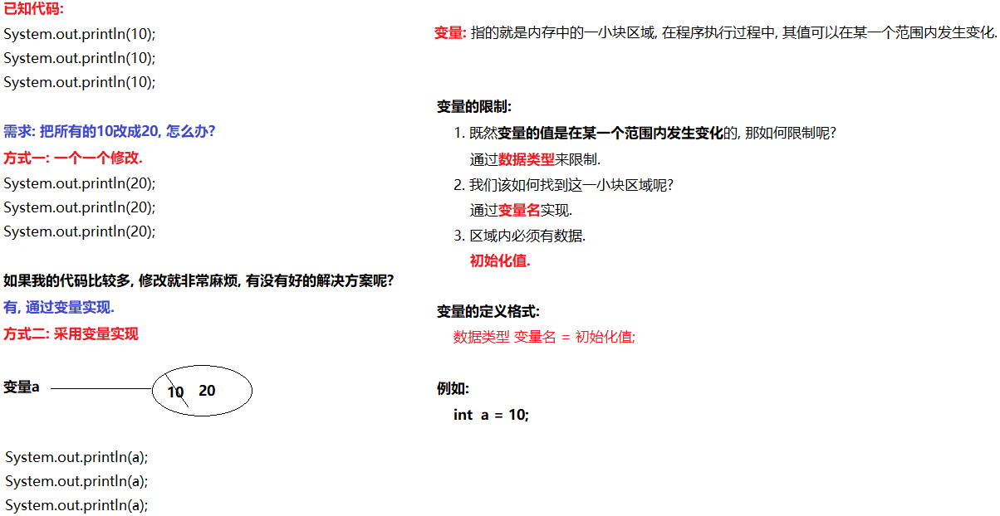
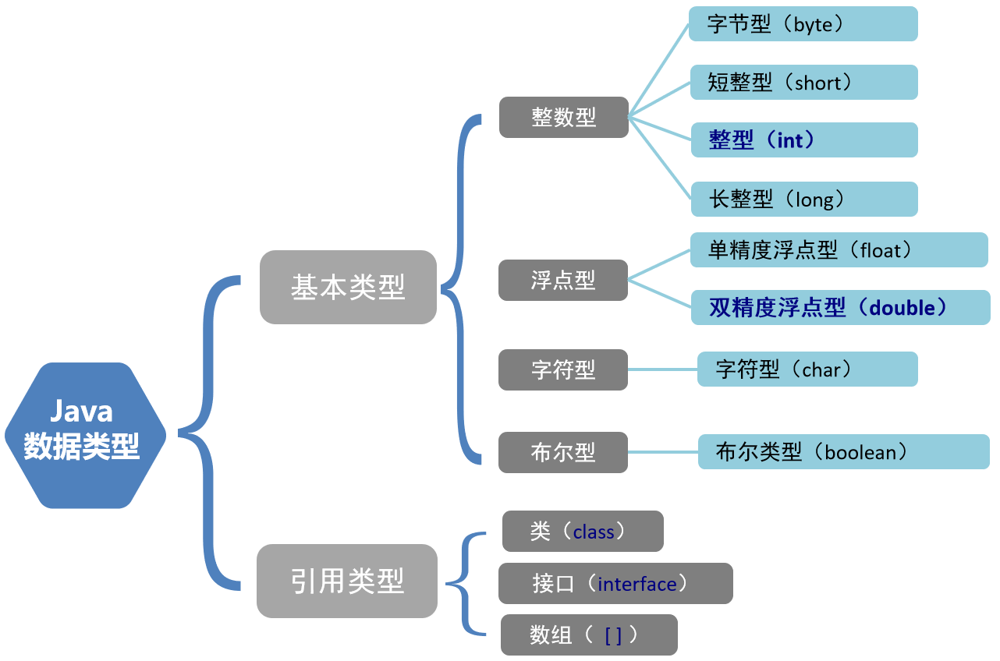
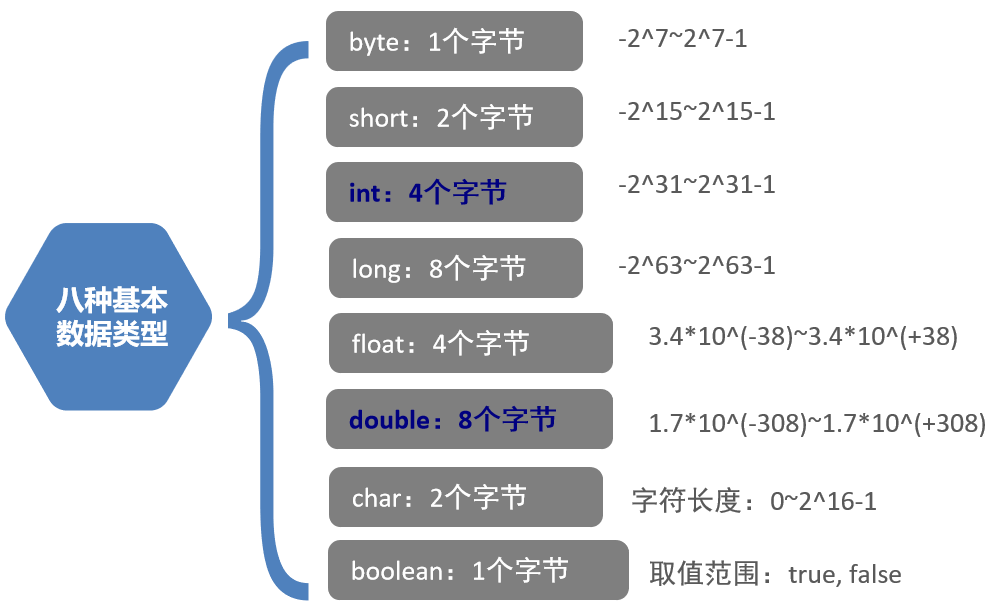
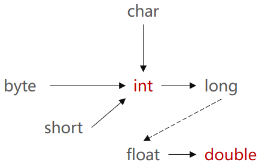

### 1. 计算机中的进制与字节

#### 1.1 进制

##### 1.1.1 关于进制

| 进制名称 | 数据组成规则                                                 | 示例                    |
| -------- | ------------------------------------------------------------ | ----------------------- |
| 二进制   | 数据以0b(大小写均可)开头, 由数字0和1组成                     | 0b10001001, 0b00101010  |
| 八进制   | 数据以0开头, 由数字0~7组成                                   | 064,  011       110 100 |
| 十进制   | 数据直接写即可,  无特殊开头, 由数字0~9组成                   | 10, 20, 333             |
| 十六进制 | 数据以0x(大小写均可)开头,  由数字0~9, 字母A-F组成(大小写均可) | 0x123F, 0x66ABC         |

> 注意:
>
> ​	关于二进制的数据,  最前边的那一位叫: 符号位, 0表示正数, 1表示负数.  其他位叫: 数值位.
>
> ​	例如: 0b10001001 结果就是一个: 负数,   0b00101010 结果就是一个:  正数.
>
> ​        
>
> ​        计算机最基本的存储单位是: 字节, 1字节(byte) =  8个比特位(bit), 所以当你看到的比特位不够8的倍数时, 前边会自动用0补齐. 
>

##### 1.1.2 关于整数的原反补码计算规则

所谓的原反补码, 其实指的都是二进制数据, 把十进制的数据转成其对应的二进制数据, 该二进制数据即为: 原码.

> 注意: 计算机底层存储, 操作和运算数据, 都是采用`数据的二进制补码形式`来实现的. 

- 正数
  - 正数的原码, 反码, 补码都一样, 不需要特殊计算.
- 负数
  - 负数的反码计算规则:  原码的符号位不变, 数值位按位取反(以前为0现在为1, 以前为1现在为0)
  - 负数的补码计算规则:  反码 + 1

#### 1.2 字节

**概述**

> 1. 计算机存储数据的最基本的单位是: 字节(byte).
> 2. **1字节(byte) = 8比特位(bit)**, 一个比特位就是一个二进制数据, 即: 0或者1.

**单位换算**

- 1 B = 8 bit

- 1 KB = 1024 B

- 1 MB = 1024 KB

- 1 GB = 1024 MB 

- 1 TB = 1024 GB 

- 1 PB = 1024 TB

- 1 EB = 1024 PB

- 1 ZB = 1024 EB

- 1 YB = 1024 ZB

- 1 BB = 1024 YB

- 1 NB = 1024 BB

- 1 DB = 1024 NB


### 2. 变量

#### 2.1 概述

* 在程序的执行过程中, 其值可以在某个范围内发生改变的量就叫`变量`. 

* 从本质上讲, 变量其实是内存中的一小块区域. 

* Java中要求一个变量每次只能保存一个数据，而且必须要明确保存数据的数据类型。

  

  > **解释:**
  >
  > * **数据类型：**变量变化的范围就是数据类型
  > * **变量名：**每个变量都有一个名字，方便存取。
  > * **初始化值：**使用变量前，需要给变量赋值。

#### 2.2 数据类型

Java是一种`强类型语言`,  针对于每一个数据都给出了明确的数据类型.

> 解释:
>
> 区分一门语言到底是强类型语言还是弱类型语言的依据是: 看这门语言对数据的数据类型划分是否精细.
>
> 如果精细, 则是强类型语言,  如果不精细, 则是弱类型语言. 

##### 2.2.1 数据类型的分类

* 基本数据类型(简称: 基本类型)
  * byte, short, char, int, long, float, double, boolean
* 引用数据类型(简称: 引用类型)
  * `String, 数组, 类, 接口`

##### 2.2.2 数据类型的分类图解



##### 2.2.3 数据类型的取值范围图解



**记忆**

> 1. `byte类型`的取值范围是: **-128 ~ 127**,` char类型`的取值范围是: **0 ~ 65535**
> 2. 默认的整形是: `int类型`, 默认的浮点型(即: 小数类型)是: `double类型.`
> 3. 定义long类型的数据时, 数据后边要`加字母L(大小写均可), 建议加L`
> 4. 定义float类型的数据时, 数据后边要`加字母F(大小写均可), 建议加F`
> 5. char类型在底层JVM中使用utf16编码，所以会有一个码点需要两个代码单元（即两个char）表示

#### 2.3 格式

* 方式一: 声明变量并赋值. 

  ```java
  数据类型 变量名 = 初始化值;
  
  //示例: 声明(定义)一个int类型的变量, 变量名叫a, 初始化值为: 10
  int a = 10;
  ```

* 方式二: 先声明, 后赋值.

  ```java
  数据类型 变量名;
  变量名 = 初始化值;
  
  //示例
  //1. 声明(定义)一个int类型的变量, 变量名叫a
  int a;						
  //2. 把数字10赋值给变量a	  
  a = 10;						
  ```

#### 2.5 注意事项

1. 变量未赋值，不能使用.
2. 变量只在它所属的范围内有效.
3. 一行上可以定义多个变量，但是不建议.

```java
//1. 定义一个类, 类名叫: VariableDemo04
public class VariableDemo04 {
    //2. 定义main方法, 作为程序的主入口.
    public static void main(String[] args) {
        //3. 变量未赋值，不能使用.
        int a;
        //a = 10;
        System.out.println(a);      //这样写, 代码会报错, 因为变量a没有赋值.

        //4. 变量只在它所属的范围内有效.
        {
            //大括号包裹起来的代码叫: 代码块.
            //作用: 让变量尽可能早的从内存消失, 从而节约资源, 提高效率.
            double d = 5.21;
            System.out.println(d);
        }
        //下边这行代码会报错, 出了上述的大括号, 变量d就已经从内存中消失了, 无法访问.
        System.out.println(d);
        //5. 一行上可以定义多个变量，但是不建议.
        int e = 10, f = 20, g = 30;
        System.out.println(e);
        System.out.println(f);
        System.out.println(g);
    }
}
```

### 3. 标识符

#### 3.1 概述

标识符就是用来给`类, 接口, 方法, 变量, 包`等起名字的规则. 

#### 3.2 命名规则

1. 标识符只能包含`Java字符(区分大小写)`、`0 ~ 9数字` 、`$（美元符号）`和`_（下划线）`。

2. 标识符不能以数字开头。

3. 标识符不能和Java中的关键字重名。

4. 最好做到`见名知意`.

   > 例如: name表示姓名, age表示年龄. 

#### 3.3 命名规范

1. 类, 接口的命名规范:  每个单词的首字母都大写, 其他字母全部小写.(大驼峰命名法)

   > 例如: HelloWorld,   VariableDemo.

2. 变量, 方法的命名规范: 从第二个单词开始, 每个单词的首字母都大写, 其他字母全部小写(小驼峰命名法).

   > 例如: zhangSanAge, studentName

3. 常量(指的是: 自定义常量)的命名规范:  所有字母都大写, 单词之间用`_(下划线)`隔开.

   > 例如: MAX_VALUE, MIN_VALUE, PI
   >
   > 注意: 目前先了解即可, 面向对象部分详细解释.

4. 包的命名规范: 所有字母全部小写, 多级包之间用`.(点符号)`隔开, 一把是公司的域名反写.

   > 例如: cn.itcast,   com.itheima.

### 4. 数据类型转换

#### 4.1 概述

不同类型的数据之间可能会进行运算，而这些数据取值范围不同，存储方式不同，直接进行运算可能会造成数据损失，所以需要将一种类型转换成另外一种类型再进行运算。

> 即: Java程序中要求参与计算的数据，必须保证数据类型的一致性，如果数据类型不一致将发生`类型转换`。

#### 4.2 分类

* 自动（隐式）类型转换
* 强制（显式）类型转换

#### 4.3 自动(隐式)类型转换

指的是**小类型转大类型，会自动提升为大类型，运算结果是大类型.**

**转换规则为:** 

1. 范围小的类型向范围大的类型提升，`byte、short、char` 运算时直接提升为`int` 。
2. boolean类型的数据只有`true和false这两个`, 所以boolean类型的数据不参与类型转换.

> 即: byte、short、char-->int-->long-->float-->double
>
> 图解: 
>
> 

#### 4.4 强制(显式)类型转换

指的是**手动将大类型转换成小类型，运算结果是小类型.** 

```java
数据类型 变量名 = （数据类型）要被转换的数据值；

//示例: 将1.5赋值给int类型，代码修改为：
int a = (int)1.5;
```

#### 4.5 思考题

下述代码会不会报错, 如果会, 哪一行会报错, 为什么? 怎么修改代码? 

```java
public class DataTypeDemo03 {
    public static void main(String[] args) {
        short s = 11;
        s = s + 3; // 会
        System.out.println(s);
    }
}
```

### 5. ASCII码表

- **编码表**：就是将人类的文字和一个十进制数进行对应起来组成一张表格。
- **存储字符时**：需要查找ASCII码表,找到字符对应的数字,将数字转换为二进制数存放到计算机中
- **使用字符时**：将对应的二进制数转换为十进制 找到ASCII表中对应的字符显示出来
- 将所有的英文字母，数字，符号都和十进制进行了对应，因此产生了世界上第一张编码表`ASCII码表`.
- ASCII（American Standard Code for Information Interchange 美国标准信息交换码）, 规则如下: 

| 字符 | 数值 |
| :--: | :--: |
|  0   |  48  |
|  9   |  57  |
|  A   |  65  |
|  Z   |  90  |
|  a   |  97  |
|  z   | 122  |

> 注意：
>
> 在char类型和int类型计算的过程中，char类型的字符先查询编码表，得到97，再和1求和，结果为98。
>
> char类型提升为了int类型。char类型内存2个字节，int类型内存4个字节。

### 6.  运算符

#### 6.1 概述

- 运算符和表达式

  - 运算符：用来连接常量或者变量的符号, 就叫`运算符`.
  - 表达式：用运算符把常量或者变量连接起来`符合java语法的式子`就称之为表达式。

- 不同运算符连接的表达式体现的是不同类型的表达式。

  >  例如: 
  >
  > * `+(加号)` 是运算符，并且是算术运算符。
  > * a + b：是表达式，由于+是算术运算符，所以这个表达式叫算术表达式。

#### 6.2 分类

* 算术运算符

* 赋值运算符

* 比较(关系)运算符

* 逻辑运算符

* 三元(三目)运算符


#### 6.3 算数运算符

算术运算符指的是用来对变量或者常量进行`算术操作的`, 例如: 加减乘除等. 

##### 6.3.1 分类

| 算数运算符包括： | 作用                         |
| ---------------- | ---------------------------- |
| `+`              | 加法运算，字符串连接运算     |
| `-`              | 减法运算                     |
| `*`              | 乘法运算                     |
| `/`              | 除法运算                     |
| `%`              | 取模运算，两个数字相除取余数 |
| ++               | 自增运算符, 相当于自身 + 1   |
| --               | 自减运算符, 相当于自身 - 1   |

##### 6.3.2 注意

* Java中, 整数相除, 结果还是整数. 

- `+` 符号在字符串中的操作：
  - `+` 符号在遇到字符串的时候，表示**连接、拼接**的含义。
  - "a"+"b"的结果是“ab”，连接含义

```java
public static void main(String[] args){
 	System.out.println("5+5="+5+5);//输出5+5=55
}
```

#### 6.4 赋值运算符

| 符号 | 作用       | 说明                  |
| ---- | ---------- | --------------------- |
| `=`  | 赋值       | a=10，将10赋值给变量a |
| `+=` | 加后赋值   | a+=b，将a+b的值给a    |
| `-=` | 减后赋值   | a-=b，将a-b的值给a    |
| `*=` | 乘后赋值   | a*=b，将a×b的值给a    |
| `/=` | 除后赋值   | a/=b，将a÷b的商给a    |
| `%=` | 取余后赋值 | a%=b，将a÷b的余数给a  |

- 赋值运算符，就是将符号右边的值，赋给左边的变量。

```java
public static void main(String[] args){
    int i = 5;
    i+=5;//计算方式 i=i+5 变量i先加5，再赋值变量i
    System.out.println(i); //输出结果是10 
}
```

- +=符号的扩展

下面的程序有问题吗？

```java
public static void main(String[] args){
  short s = 1;
  s+=1;
  System.out.println(s);
}
```

分析： `s += 1` 逻辑上看作是`s = s + 1` 计算结果被提升为int类型，再向short类型赋值时发生错误，因为不能将取值范围大的类型赋值到取值范围小的类型。但是，`s=s+1进行两次运算`，`+=` 是一个运算符，只运算一次，并带有强制转换的特点，也就是说`s += 1` 就是`s = (short)(s + 1)`，因此程序没有问题编译通过，运行结果是2.

#### 6.5 自增自减运算符

| 符号 | 作用 | 说明        |
| ---- | ---- | ----------- |
| ++   | 自增 | 变量的值加1 |
| --   | 自减 | 变量的值减1 |

- `++`  **运算，变量自己增长1**。反之，`--` **运算，变量自己减少1**，用法与`++` 一致。

  - 独立运算：

    - 变量在独立运算时，`前++`和`后++`没有区别 。
    - 变量`前++`   ：例如 `++i` 。
    - 变量`后++`   ：例如 `i++` 。

  - 混合运算：

    - 和其他变量放在一起，`前++`和`后++`就产生了不同。
    - 变量`前++` ：变量a自己加1，将加1后的结果赋值给b，也就是说a先计算。a和b的结果都是2。

    ```java
    public static void main(String[] args) {
        int a = 1;
        int b = ++a;
        System.out.println(a);//计算结果是2
        System.out.println(b);//计算结果是2
    }
    ```

    - 变量`后++` ：变量a先把自己的值1，赋值给变量b，此时变量b的值就是1，变量a自己再加1。a的结果是2，b的结果是1。

    ```java
    public static void main(String[] args) {
        int a = 1;
        int b = a++;
        System.out.println(a);//计算结果是2
        System.out.println(b);//计算结果是1
    }
    ```
