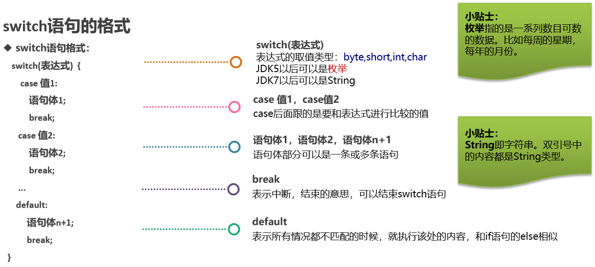

### 1. 流程控制

#### 1.1 分类

* 顺序结构
* 选择结构(if语句, switch.case语句)
* 循环结构(for循环, while循环, do.while循环)

#### 1.2 顺序结构

**顺序结构**指的是代码是按照**从上往下, 从左往右**的顺序, 依次逐行执行的, 且**顺序结构也是Java程序的默认结构**.

### 2. 选择结构之if语句

#### 2.1 分类

1. if语句(也叫: 单分支)
2. if.else语句(也叫: 双分支)
3. if.else if语句(也叫: 多分支)

#### 2.2 单分支

```java
if(关系表达式) {
    //语句体;
}
```

#### 2.3 双分支

```java
if(关系表达式) {	//if的意思: 如果
    //语句体1;
} else {	   //否则...
    //语句体2;
}
```

**记忆**

1. if语句控制的语句体如果只有一行代码, 则该大括号可以省略不写.

   > 例如:
   >
   >  if(5 > 3)
   >
   > ​    System.out.println("夯哥最纯洁!");

2. if语句控制的语句体如果只有一行代码, 则该大括号可以省略不写, 定义变量的语法除外.

   > 例如:
   >
   >  if(5 > 3)
   >
   >    int a = 10;   //这样写会报错, jvm会识别这样代码为两行:  int a; a = 10;
   >
   > 上述的代码就相当于:
   >
   >  if(5 > 3) {
   >
   > ​    int a;
   >
   > }
   >
   > a = 10;    //这样写肯定会报错.

3. 你省略if后边的大括号时, 有个问题一定要注意, 不要乱写`分号`.

   >例如: 
   >
   >if(5 > 3) ;    //这里如果写分号了, 就意味着if语句结束了.
   >
   >   System.out.println("本意: 这行代码只有条件成立才会被执行");

#### 2.4 多分支

```java
if(关系表达式1) {
    //语句体1;
} else if(关系表达式2){
    //语句体2;
} else if(关系表达式3){	//这里可以根据需求, 有多个else if语句
    //语句体3;
} else {
    //语句体n;
}
```

### 3. 选择结构之switch语句

#### 3.1 格式

```java
switch(表达式) {
    case 值1: 	
        语句体1;
        break;
    case 值2:
        语句体2;
        break;
    case 值3:
        语句体3;
        break;
    ...    //根据需求, 可以写多组case.
    default:	
        语句体n;
        break;
}
```

#### 3.2 格式详解



#### 3.3 执行流程

1. 先计算表达式的值, 然后**按照从上往下的顺序**依次和每一个case对应的值相匹配.

2. 如果能匹配成功, 则执行该case对应的语句体, 然后执行break, 至此, 整个switch语句结束.

3. 如果和所有的case值都不匹配, 则执行**default**对应的语句体, 然后执行break, 至此, 整个switch语句结束.

   > 解释: default语句就类似于`if. else语句中的else`, 当所有条件都不满足时才会执行. 
   >

#### 3.4 case穿透

**概述**

在switch语句中，如果case的后面不写break，将出现**case穿透**现象，也就是不会在判断下一个case的值，直接向后运行，直到遇到break，或者整体switch结束。

**格式**

```java
switch(表达式) {
    case 值1: 	
        语句体1;	//假设表达式的值 = 值1, 则执行完语句体1后, 不会判断第二个case, 直接执行语句体2;
        break;
    case 值2:
        语句体2;
        break;
    case 值3:
        语句体3;
        break;
    ...    //根据需求, 可以写多组case.
    default:	
        语句体n;
        break;
}
```

#### 3.5 思考题

1. switch语句的小括号中, 可以放什么?  byte、short、int、char、String、枚举
2. default语句必须放到switch语句的最后吗?  不必须
3. break关键字可以省略吗? 对执行结果是否有影响? 视情况，有影响
