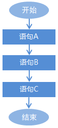
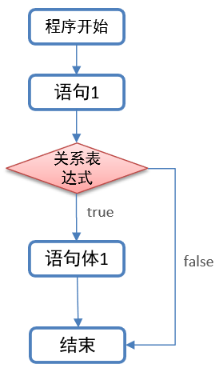
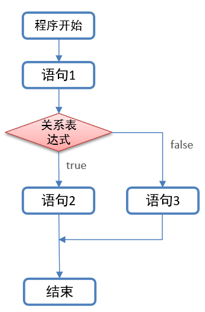
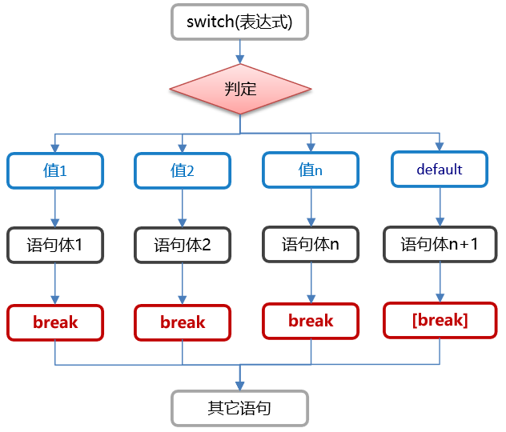

### 1. 流程控制

#### 1.1 概述

在一个程序执行的过程中，各条语句的执行顺序对程序的结果是有直接影响的。所以，我们必须清楚每条语句的执行流程。而且，很多时候要通过控制语句的执行顺序来实现我们想要的功能。

例如: 某些代码是满足特定条件的情况下, 才会被执行.  而有些代码, 在满足某些条件的情况下, 需要重复执行, 这些, 都需要用到流程控制语句.

#### 1.2 分类

* 顺序结构
* 选择结构(if语句, switch.case语句)
* 循环结构(for循环, while循环, do.while循环)

#### 1.3 顺序结构

**概述**

**顺序结构**指的是代码是按照**从上往下, 从左往右**的顺序, 依次逐行执行的, 且**顺序结构也是Java程序的默认结构**.

**图解**



**需求**

定义类OrderDemo01, 在类中定义main方法, 打印如下数据:

```java
//start
//HelloWorld1
//HelloWorld2
//HelloWorld3
//end
```

**参考代码**

```java
public class OrderDemo01 {
    public static void main(String[] args) {
        //打印指定的数据
        System.out.println("start");
        System.out.println("HelloWorld1");
        System.out.println("HelloWorld2");
        System.out.println("HelloWorld13");
        System.out.println("end");
    }
}
```


### 2. 选择结构之if语句

#### 2.1 概述

如果我们想某些代码是在满足条件的情况下, 才能被执行, 此时就需要用到选择结构了, 选择结构也叫分支结构, 主要分为以下两种:

* if语句
* switch.case语句

#### 2.2 分类

if语句一般用于`范围`的判断, 例如: 如果当前时间是`0~8点, 小黑就和你说: 早上好`, 如果当前时间是`9 ~12点, 小黑就和你说: 中午好`. 根据应用场景的不同(即: 分支个数不同), if语句的格式主要分为以下三种:

1. if语句(也叫: 单分支)
2. if.else语句(也叫: 双分支)
3. if.else if语句(也叫: 多分支)

#### 2.3 单分支

单分支结构一般用来`判断一种情况`, 格式如下:

**格式**

```java
if(关系表达式) {
    //语句体;
}
```

**执行流程**

1. 先执行关系表达式, 看其结果是true还是false.
2. 如果是true, 则执行`大括号`中的语句体.
3. 如果是false, 则`大括号`中的语句体不执行.

**图解**



**需求**

定义变量time表示时间, 如果它的范围是在[0,8]之间, 就打印`早上好`, 否则不操作.

> 解释: [0, 8], 意思是说 0~8之间, 包含0, 也包含8, 这种写法属于"前闭后闭".
>
> [0, 8), 意思是: 0~8之间, 包含0, 不包含8, 这种写法属于"前闭后开", 也叫: 包左不包右.

**参考代码**

```java
public class IfDemo01 {
    public static void main(String[] args) {
        int time = 5;
        if(time >= 0 && time <= 8) {
            System.out.println("早上好");
        }
    }
}
```


#### 2.4 双分支

双分支结构指的是**if. else语句**, 一般用来`判断两种情况`, 格式如下:

##### 2.4.1 格式

```java
if(关系表达式) {	//if的意思: 如果
    //语句体1;
} else {	   //否则...
    //语句体2;
}
```

##### 2.4.2 执行流程

1. 先执行关系表达式, 看其结果是true还是false.
2. 如果是true, 则执行语句体1.
3. 如果是false, 则执行语句体2.

##### 2.4.3 图解



##### 2.4.5 案例一: if格式二入门

**需求**

定义变量time表示时间, 如果它的范围是在0~8之间, 就打印`早上好`, 否则就打印`中午好`.

**参考代码**

```java
public class IfDemo02 {
    public static void main(String[] args) {
        int time = 5;
        if(time >= 0 && time <= 8) {
            System.out.println("早上好");
        } else {
            System.out.println("中午好");
        }
    }
}
```


##### 2.4.6 案例二: 判断奇偶数

**需求**

1. 提示用户键盘录入一个数据并接收.
2. 判断该数据是奇数还是偶数, 并将结果打印到控制台上.

**参考代码**

```java
public class IfDemo03 {
    public static void main(String[] args) {
        Scanner sc = new Scanner(System.in);
        System.out.println("请录入一个整数: ");
        int num = sc.nextInt();
        if (num % 2 == 0) {
            System.out.println(num + "是偶数");
        } else {
            System.out.println(num + "是奇数");
        }
    }
}
```

**记忆**

1. if语句控制的语句体如果只有一行代码, 则该大括号可以省略不写.

   > 例如:
   >
   >  if(5 > 3)
   >
   > ​    System.out.println("夯哥最纯洁!");

2. if语句控制的语句体如果只有一行代码, 则该大括号可以省略不写, 定义变量的语法除外.

   > 例如:
   >
   >  if(5 > 3)
   >
   >    int a = 10;   //这样写会报错, jvm会识别这样代码为两行:  int a; a = 10;
   >
   > 上述的代码就相当于:
   >
   >  if(5 > 3) {
   >
   > ​    int a;
   >
   > }
   >
   > a = 10;    //这样写肯定会报错.

3. 你省略if后边的大括号时, 有个问题一定要注意, 不要乱写`分号`.

   >例如: 
   >
   >if(5 > 3) ;    //这里如果写分号了, 就意味着if语句结束了.
   >
   >   System.out.println("本意: 这行代码只有条件成立才会被执行");

#### 2.5 多分支

多分支结构指的是**if. else if语句**, 一般用来`判断多种情况`, 格式如下:

##### 2.5.1 格式

```java
if(关系表达式1) {
    //语句体1;
} else if(关系表达式2){
    //语句体2;
} else if(关系表达式3){	//这里可以根据需求, 有多个else if语句
    //语句体3;
} else {
    //语句体n;
}
```

##### 2.4.2 执行流程

1. 先执行关系表达式1, 看其结果是true还是false.
2. 如果是true, 则执行语句体1, 整个if语句结束.
3. 如果是false, 则判断关系表达式2, 看其结果是true还是false.
4. 如果是true, 则执行语句体2, 整个if语句结束.
5. 如果是false, 则判断关系表达式3, ...以此类推.
6. 如果所有的关系表达式都不成立, 则执行else语句的语句体n, 整个if语句结束.

##### 2.4.3 图解


##### 2.4.4 案例一: 打印星期

**需求**

1. 提示用户录入[1, 7]之间的数字, 并接收.
2. 根据用户录入的数字, 打印对应的星期, 格式如下:
   * 用户录入1, 打印"星期一"
   * 用户录入2, 打印"星期二"
   * ...以此类推
   * 用户录入非法数字, 打印"没有这样的日期"

**参考代码**

```java
import java.util.Scanner;

public class IfDemo04 {
    public static void main(String[] args) {
        Scanner sc = new Scanner(System.in);
        System.out.println("请录入一个1 - 7之间的整数: ");
        int week = sc.nextInt();
        if (week == 1) {
        } else if(week == 2) {
            System.out.println("星期二");
        } else if(week == 3) {
            System.out.println("星期三");
        } else if(week == 4) {
            System.out.println("星期四");
        } else if(week == 5) {
            System.out.println("星期五");
        } else if(week == 6) {
            System.out.println("星期六");
        } else if(week == 7) {
            System.out.println("星期日");
        } else {
            System.out.println("没有这样的日期, 你是从火星来的吧!");
        }
    }
}
```


##### 2.4.5 案例二: 发放奖励

**需求**

1. 小明快要期末考试了，小明爸爸对他说，会根据他的考试成绩，送他不同的礼物.
2. 假如你可以控制小明的得分，请用程序实现小明到底该获得什么样的礼物，并在控制台输出。
3. 礼物标准如下:
   * 95~100		山地自行车一辆
   * 90~94		游乐场玩一次
   * 80~89		变形金刚玩具一个
   * 80以下		胖揍一顿

**参考代码**

```java
import java.util.Scanner;

public class IfDemo05 {
    public static void main(String[] args) {
        Scanner sc = new Scanner(System.in);
        System.out.println("请录入小明的考试成绩: ");
        int score = sc.nextInt();
        if (score >= 95 && score <= 100) {
            System.out.println("奖励小明: 山地自行车一辆");
        } else if(score >= 90 && score < 95) {
            System.out.println("奖励小明: 游乐场玩儿一次");
        } else if(score >= 80 && score < 90) {
            System.out.println("奖励小明: 变形金刚玩具一个");
        } else if(score >= 0 && score < 80){
            System.out.println("奖励小明: 男女双混组合拳 + 扫帚棒法");
        } else {
            System.out.println("考试成绩录入有误.");
        }
    }
}
```


##### 2.4.6 案例三: 获取最大值

**需求**

1. 提示用户录入3个整数, 并接收.
2. 通过if语句获取这三个整数的最大值.
3. 将结果打印到控制台上. 

**参考代码**

```java
import java.util.Scanner;

public class IfDemo06 {
    public static void main(String[] args) {
        Scanner sc = new Scanner(System.in);
        System.out.println("请录入第一个整数: ");
        int a = sc.nextInt();
        System.out.println("请录入第二个整数: ");
        int b = sc.nextInt();
        System.out.println("请录入第三个整数: ");
        int c = sc.nextInt();

        //方式一: if嵌套实现.
        int max = a;
        int max2 = a;
        if (a > b) {
            if (a > c) {
                max = a;
            } else {
                max = c;
            }
        } else {
            if(b > c) {
                max = b;
            } else {
                max = c;
            }
        }
        System.out.println("最大值: " + max);
        //方式二: if. else.if语句实现
        if (a > b && a > c) {
            max2 = a;
        } else if(b > a && b > c) {
            max2 = b;
        } else {
            max2 = c;
        }
        System.out.println("最大值: " + max2);
    }
}
```


### 3. 选择结构之switch语句

#### 3.1 概述

switch语句, 一般是用于做`固定值`判断的, 在实际开发中, 用到的频率也非常高, 所以也是要求大家掌握的知识点.

#### 3.2 格式

```java
switch(表达式) {
    case 值1: 	
        语句体1;
        break;
    case 值2:
        语句体2;
        break;
    case 值3:
        语句体3;
        break;
    ...    //根据需求, 可以写多组case.
    default:	
        语句体n;
        break;
}
```

#### 3.4 格式详解


#### 3.5 执行流程

1. 先计算表达式的值, 然后**按照从上往下的顺序**依次和每一个case对应的值相匹配.

2. 如果能匹配成功, 则执行该case对应的语句体, 然后执行break, 至此, 整个switch语句结束.

3. 如果和所有的case值都不匹配, 则执行**default**对应的语句体, 然后执行break, 至此, 整个switch语句结束.

   > 解释: default语句就类似于`if. else语句中的else`, 当所有条件都不满足时才会执行. 
   >
   >

#### 3.6 执行流程图解



#### 3.7 示例一: 春夏秋冬

**需求**

1. 一年有12个月, 分属于春夏秋冬4个季节, 键盘录入一个月份, 请用程序实现判断该月份属于哪个季节, 并输出。
2. 具体标准如下:
   * 输入： 1、2、12	输出：冬季
   * 输入： 3、4、5	输出：春季
   * 输入： 6、7、8	输出：夏季
   * 输入： 9、10、11	输出：秋季
   * 输入：其它数字	输出：数字有误

**参考代码**

```java
import java.util.Scanner;

public class SwitchDemo07 {
    public static void main(String[] args) {
        Scanner sc = new Scanner(System.in);
        System.out.println("请录入一个月份: ");
        int month = sc.nextInt();
        switch (month) {
            case 12:
                System.out.println("冬季");
                break;
            case 1:
                System.out.println("冬季");
                break;
            case 2:
                System.out.println("冬季");
                break;
            case 3:
                System.out.println("春季");
                break;
            case 4:
                System.out.println("春季");
                break;
            case 5:
                System.out.println("春季");
                break;
            case 6:
                System.out.println("夏季");
                break;
            case 7:
                System.out.println("夏季");
                break;
            case 8:
                System.out.println("夏季");
                break;
            case 9:
                System.out.println("秋季");
                break;
            case 10:
                System.out.println("秋季");
                break;
            case 11:
                System.out.println("秋季");
                break;
            default:
                System.out.println("没有这样的日期");
                break;
        }
    }
}
```


#### 3.8 case穿透

**概述**

在switch语句中，如果case的后面不写break，将出现**case穿透**现象，也就是不会在判断下一个case的值，直接向后运行，直到遇到break，或者整体switch结束。

**格式**

```java
switch(表达式) {
    case 值1: 	
        语句体1;	//假设表达式的值 = 值1, 则执行完语句体1后, 不会判断第二个case, 直接执行语句体2;
        break;
    case 值2:
        语句体2;
        break;
    case 值3:
        语句体3;
        break;
    ...    //根据需求, 可以写多组case.
    default:	
        语句体n;
        break;
}
```

**需求**
通过`case穿透`, 优化刚才的`春夏秋冬`案例.

**参考代码**

```java
import java.util.Scanner;

public class SwitchDemo08 {
    public static void main(String[] args) {
        Scanner sc = new Scanner(System.in);
        System.out.println("请录入一个月份: ");
        int month = sc.nextInt();
        switch (month) {
            case 12:
            case 1:
            case 2:
                System.out.println("冬季");
                break;
            case 3:
            case 4:
            case 5:
                System.out.println("春季");
                break;
            case 6:
            case 7:
            case 8:
                System.out.println("夏季");
                break;
            case 9:
            case 10:
            case 11:
                System.out.println("秋季");
                break;
            default:
                System.out.println("没有这样的日期");
                break;
        }
    }
}
```

#### 3.9 思考题

1. switch语句的小括号中, 可以放什么?
2. default语句必须放到switch语句的最后吗?
3. break关键字可以省略吗? 对执行结果是否有影响?

#### 3.10 案例二: 发放奖励

**需求**

1. 小明快要期末考试了，小明爸爸对他说，会根据他的考试成绩，送他不同的礼物.
2. 假如你可以控制小明的得分，请用程序实现小明到底该获得什么样的礼物，并在控制台输出。
3. 礼物标准如下:
   - 90~100		山地自行车一辆
   - 80~89		游乐场玩一次
   - 70~79		变形金刚玩具一个
   - 70以下		胖揍一顿

**参考代码**

```java
import java.util.Scanner;

public class SwitchDemo09 {
    public static void main(String[] args) {
        Scanner sc = new Scanner(System.in);
        System.out.println("请录入小明的考试成绩: ");
        int score = sc.nextInt();
        if (score >= 0 && score <= 100) {
            //合法成绩
            switch (score / 10) {
                case 10:
                case 9:
                    System.out.println("奖励小明: 山地自行车一辆");
                    break;
                case 8:
                    System.out.println("奖励小明: 游乐场玩儿一次");
                    break;
                case 7:
                    System.out.println("奖励小明: 变形金刚玩具一个");
                    break;
                default:
                    System.out.println("奖励小明: 男女双混组合拳 + 扫帚棒法");
                    break;
            }
        } else {
            //非法成绩
            System.out.println("您录入的成绩有误!");
        }
    }
}
```


### 4 练习题

#### 4.1 案例一: 涨工资.

**需求**

1. 根据工龄(整数)给员工涨工资(整数), 工龄和基本工资通过键盘录入

2. 涨工资的条件如下：

   * [10-15)     +5000
   * [5-10)      +2500
   * [3~5)       +1000
   * [1~3)       +500
   * [0~1)       +200

3. 打印格式如下:

   > 您目前工作了10年，基本工资为 3000元, 应涨工资 5000元,涨后工资 8000元

**参考代码**

```java
public static void main(String[] args) {
    // 1.创建键盘录入对象
		Scanner sc = new Scanner(System.in);
		// 2.定义变量age表示工龄（假设为int类型），定义变量salary表示基本工资（假设为int类型）
//		int age,salary;
		// 3.通过键盘录入给工龄age赋值和基本工资salary赋值
//		age = sc.nextInt();
//		salary = sc.nextInt();
		int age = sc.nextInt();
		int salary = sc.nextInt();
		int addSalary = 0;
		// 4.对工龄进行逻辑判断，根据不同的工龄区间，进行涨工资salary+=n；（n表示：涨工资的数量）
		if(age>=15||age<0) {
			System.out.println("您输入的工龄不合法~");
			return ;
		}
		//[10-15)     +5000
		if(age>=10&&age<15) {
			addSalary = 5000;
		} else if(age>=5&&age<10){//[5-10)      +2500
			addSalary = 2500;
		} else if(age>=3&&age<5) {//[3~5)       +1000
			addSalary = 1000;
		} else if(age>=1&&age<3) {//[1~3)       +500
			addSalary = 500;
		} else if(age>=0&&age<1) {//[0~1)       +200
			addSalary = 200;
		} 				
		// 5.按照格式进行打印
		System.out.println("您目前工作了"+age+"年，基本工资为 "+salary+"元, 应涨工资 "+addSalary+"元,涨后工资 "+(salary+addSalary)+"元");
}

```


#### 4.2 案例二: 定义计算器

- 需求:

  1.功能描述：模拟计算器功能，对键盘录入的两个int类型的数据进行加、减、乘、除的运算，并打印运算结果

  2.要求：

  ```
  (1)键盘录入三个整数,其中前两个整数代表参加运算的数据，
  
  	第三个整数为要进行的运算(0:表示加法运算,1:表示减法运算,2:表示乘法运算,3:表示除法运算)
  
  (2)使用今天所学知识完成功能
  
  (3)演示格式如下:
  
  	请输入第一个整数:30
  
  	请输入第二个整数:40
  
  	请输入您要进行的运算(0:表示加法运算,1:表示减法运算,2:表示乘法运算,3:表示除法运算):0
  
  	控制台输出:30+40=70
  ```

- 实现步骤:

- 代码:

```java
public static void main(String[] args) {
		Scanner sc = new Scanner(System.in);
		System.out.println("请输入第一个数据");
		int a = sc.nextInt();
		System.out.println("请输入第二个数据");
		int b = sc.nextInt();
		System.out.println("请输入您要进行的运算(0:表示加法运算,1:表示减法运算,2:表示乘法运算,3:表示除法运算):");
		int type = sc.nextInt();
		//定义变量用于接收结果
		double result = 0;
		switch(type) {
			case 0://做加法
				result = a + b;
				System.out.println(a+"+"+b+"="+result);
				break;
			case 1:
				result = a - b;
				System.out.println(a+"-"+b+"="+result);
				break;
			case 2:
				result = a * b;
				System.out.println(a+"*"+b+"="+result);
				break;
			case 3:
				result = a / (b + 0.0);
				System.out.println(a+"/"+b+"="+result);
				break;
			default:
				System.out.println("您输入有误");
		}
	}
```


#### 4.3 案例三: 水仙花数

- 需求:

  键盘录入一个三位数字,输出该三位数字是否是水仙花数字?

  水仙花数字要求: 指的是一个三位数，个位、十位、百位的数字立方和等于原数

  例如 `153 3*3*3 + 5*5*5 + 1*1*1 = 27 + 125 + 1 = 153`

- 实现步骤:

  1.创建键盘录入对象

  2.获取一个int数字

  3.获取个位,十位,百位

  4.求个位,十位,百位的立方和

  5.利用if语句判断立方和是否等于该数字本身,并输出结果

- 代码实现:

```java
public static void main(String[] args) {
    //1.创建键盘录入对象
    Scanner sc = new Scanner(System.in);
    //2.获取一个int数字
    System.out.println("请输入一个三位整数");
    int num = sc.nextInt();
        
    //3.获取个位,十位,百位
    int ge = num%10;
    int shi = num/10%10;
    int bai = num/100%10;
    //4.求个位,十位,百位的立方和
    int sum = ge*ge*ge + shi*shi*shi + bai*bai*bai;
        
    //5.利用if语句判断立方和是否等于该数字本身,并输出结果
    if(sum == num) {
        System.out.println(num+"是水仙花数字 ");
    } else {
        System.out.println(num+"不是水仙花数字 ");
    }
}
```


