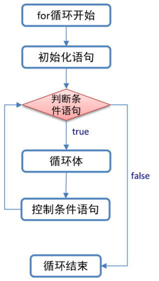
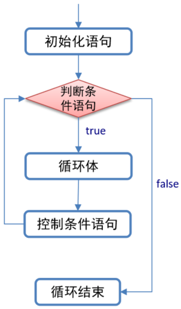
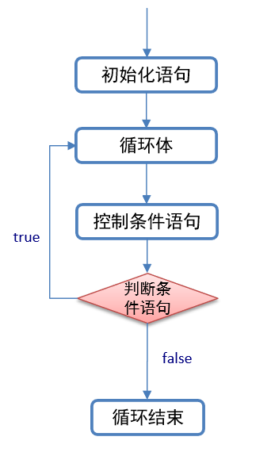

### 1. 循环结构

#### 1.1 概述

循环，即事物周而复始的变化。循环结构指的是，使一部分代码按照次数或一定的条件反复执行的一种代码结构. 有些时候, 我们想代码是在满足某些条件的情况下, 重复(循环)执行的, 就需要用到循环结构了. 

例如: 打印100次`HelloWorld`. 如果不用循环实现的话, 输出语句我们就需要写100次, 我们发现这样做是非常繁琐的. 于是, 我们可以通过循环来优化它. 

#### 1.2 组成

1. 初始化条件.

   > 假设用`int类型的变量x记录循环次数`,x从1开始数, 数到100刚好100次,  **1在这里充当的角色就是: 初始化条件.**

2. 判断条件.

   > 变量x从1开始数, 数到100结束. 即: x <= 100, 这就是判断条件, 用来决定循环是否继续执行的. 

3. 控制条件.

   > 用来控制变量x变化的. 每循环一次, 变量x的值+1. 即: x++就是控制条件. 

4. 循环体.

   > 指的是需要重复执行的代码, 例如:  System.out.println("Hello World!");

#### 1.3 分类

* for循环

  > 一般适用于`循环次数固定`的情况.

* while循环

  > 一般适用于`循环次数不固定`的情况.

* do.while循环

  > 我们在实际开发中, 基本不用. 适用于`先执行一次, 然后判断`的情况.


### 2. for循环

for循环是我们在实际开发中应用到的最多的循环, 它一般适用于`循环次数固定`的情况. 

#### 2.1 格式

```java
for(初始化条件1; 判断条件2; 控制条件3) {
    //循环体4;
}
```

> 解释:
>
> 1. 初始化条件: 用来记录 循环的初始状态的. 即: 从哪开始循环.
> 2. 判断条件: 用来决定循环是否继续执行的, 条件成立, 则循环继续执行, 条件不成立, 整个循环就结束了.
> 3. 控制条件: 用来控制初始化条件变化的, 一般是每循环一次, 初始化条件+1. 
> 4. 循环体: 需要用来重复做的事情(代码). 

#### 2.2 执行流程

1. 先执行初始化条件.
2. 然后执行判断条件, 看其结果是true, 还是false.
3. 如果是false, 则整个循环结束.
4. 如果是true, 则执行循环体.
5. 执行控制条件.
6. 返回第2步, 继续往下重复执行. 

> 简单理解:
>
> 1. 第一次执行: 1, 2, 4, 3.      `假设判断条件成立.`
> 2. 重复执行: 2, 4, 3.
> 3. 最后一次执行: 2                `判断条件不成立, 循环结束.`

#### 2.3 图解



#### 2.4 案例一: for循环入门

**需求**
通过for循环, 打印10次"Hello World!".

**参考代码**

```java
//需求: 打印10次HelloWorld
public class ForDemo01 {
    public static void main(String[] args) {
        for (int i = 0; i < 10; i++) {
            System.out.println("Hello World!");
        }
    }
}
```


#### 2.5 案例二: 打印数字

**需求**

1. 通过for循环, 打印1~5之间的数字.
2. 通过for循环, 打印5~1之间的数字.

**参考代码**

```java
public class ForDemo02 {
    public static void main(String[] args) {
        //1. 通过for循环, 打印1~5之间的数字.
        for (int i = 1; i <= 5 ; i++) {
            System.out.println(i);
        }
        System.out.println("--------------");

        //2. 通过for循环, 打印5~1之间的数字.
        //ritar
        for (int i = 5; i >= 1; i--) {
            System.out.println(i);
        }
    }
}
```


#### 2.6 案例三: 求和案例

**需求**

通过for循环, 获取1 ~ 5之间的数字之和.

**参考代码**

```java
public class ForDemo03 {
    public static void main(String[] args) {
        //1. 定义变量sum, 用来记录数据和.
        int sum = 0;
        //2. 通过for循环, 依次获取到1~5之间的数字.
        for (int i = 1; i <= 5; i++) {
            //3. 将获取到的数字, 累加给变量sum.
            sum += i;
        }
        System.out.println("1 - 5之间的数字之和是: " + sum);
    }
}
```

> 细节: 求和变量必须定义到for循环的外边, 如果定义到for循环的内容, 则每次循环都会被重置.


#### 2.7 案例四: 求偶数和

**需求**
求1-100之间的偶数和，并把求和结果打印到控制台上.

**参考代码**

```java
public class ForDemo04 {
    public static void main(String[] args) {
        //1. 定义变量sum, 用来记录数据和.
        int sum = 0;
        //2. 通过for循环, 依次获取到1 - 100之间的数字.
        for (int i = 1; i <= 100; i++) {
            //3. 判断当前遍历到的数字是否是偶数.
            if (i % 2 == 0) {
                //4. 走到这里, 说明是偶数, 累加给变量sum.
                sum += i;
            }
        }
        //5. 打印结果.
        System.out.println("1 - 100之间的偶数之和是: " + sum);
    }
}
```


#### 2.8 案例五: 获取水仙花数

**需求**

获取到所有的水仙花数, 并将结果打印到控制台上.

> 解释:
>
> 1. 水仙花数是一个3位数的整数.
> 2. 该数字的各个位数立方和相加等于它本身. 
> 3. 例如: 153就是水仙花数, 153 = 1 * 1 * 1 + 5 * 5 * 5 + 3 * 3 * 3 = 153

**参考代码**

```java
public class ForDemo05 {
    public static void main(String[] args) {
        int ge, shi, bai;
        for (int i = 100; i < 1000; i++) {
            ge = i / 1 % 10;
            shi = i / 10 % 10;
            bai = i / 100 % 10;
            if (i == ge * ge * ge + shi * shi * shi + bai * bai * bai)
                System.out.println(i);
        }
    }
}
```


#### 2.9 案例六: 计数思想

**需求**

统计所有水仙花数的个数, 并将其打印到控制台上.

**参考代码**

```java
public class ForDemo06 {
    public static void main(String[] args) {
        int ge, shi, bai,count = 0;
        for (int i = 100; i < 1000; i++) {
            ge = i / 1 % 10;
            shi = i / 10 % 10;
            bai = i / 100 % 10;
            if (i == ge * ge * ge + shi * shi * shi + bai * bai * bai)
                count++;
        }
        System.out.println("水仙花数的个数为: " + count);
    }
}
```


#### 2.10 案例七: 求和 + 计数

**需求**

获取1 - 100之间的奇数和, 以及奇数的个数.

**参考代码**

```java
//需求: 获取1 - 100之间的奇数和, 以及奇数的个数.
public class ForDemo07 {
    public static void main(String[] args) {
        int count = 0;
        int sum = 0;
        for (int i = 1; i <= 100 ; i++) {
            if (i % 2 != 0) {
                sum += i;
                count++;
            }
        }
        System.out.println("1-100之间的奇数个数为: " + count + ", 这些奇数的总和为: " + sum);
    }
}
```


#### 2.11 案例八: 换行输出

**需求**

把1~100之间的数字, 按照6个一行的格式进行输出.

**参考代码**

```java
public class ForDemo08 {
    public static void main(String[] args) {
        int flag = 6;
        int count = 0;
        for (int i = 1; i <= 100 ; i++) {
            System.out.print(i + "\t");
            if (++count % flag == 0)
                System.out.println();
        }
    }
}
```


### 3. while循环

while循环也是我们在实际开发中应用到的比较多的循环, 它一般适用于`循环次数不固定`的情况. 

#### 3.1 格式

```java
初始化条件1;
while(判断条件2) {
    //循环体3;
    //控制条件4;
}
```

> 解释:
>
> 1. 初始化条件: 用来记录 循环的初始状态的. 即: 从哪开始循环.
> 2. 判断条件: 用来决定循环是否继续执行的, 条件成立, 则循环继续执行, 条件不成立, 整个循环就结束了.
> 3. 控制条件: 用来控制初始化条件变化的, 一般是每循环一次, 初始化条件+1. 
> 4. 循环体: 需要用来重复做的事情(代码). 

#### 3.2 执行流程

1. 先执行初始化条件.
2. 然后执行判断条件, 看其结果是true, 还是false.
3. 如果是false, 则整个循环结束.
4. 如果是true, 则执行循环体.
5. 执行控制条件.
6. 返回第2步, 继续往下重复执行. 

> 简单理解:
>
> 1. 第一次执行: 1, 2, 3, 4.      `假设判断条件成立.`
> 2. 重复执行: 2, 3, 4.
> 3. 最后一次执行: 2                `判断条件不成立, 循环结束.`

#### 3.3 图解



#### 3.4 案例一: while循环入门

**需求**

在控制台打印10次`HelloWorld`.

**参考代码**

```java
public class WhileDemo01 {
    public static void main(String[] args) {
        int i = 0;
        while(i < 10) {
            System.out.println("Hello World!");
            i++;
        }
    }
}
```


#### 3.5 案例二: 求和

**需求**

获取1~100之间所有偶数和, 并将结果打印到控制台上.

**参考代码**

```java
//需求: 获取1 - 100之间的偶数和.
public class WhileDemo02 {
    public static void main(String[] args) {
        int sum = 0;
        int i = 1;
        while (i <= 100) {
            if (i % 2 == 0)
                sum += i;
            i++;
        }
        System.out.println("1-100之间的偶数和为: " + sum);
    }
}
```


#### 3.6 案例三: 珠穆朗玛峰

**需求**

1. 已知世界最高山峰是珠穆朗玛峰(8844.43米=8844430毫米).

2. 假如我有一张足够大的纸，它的厚度是0.1毫米.

3. 请问，我折叠多少次，可以折成珠穆朗玛峰的高度?

   > 即: 纸张的厚度 >= 珠穆朗玛峰的高度

**参考代码**

```java
//案例: 珠穆朗玛峰
public class WhileDemo03 {
    public static void main(String[] args) {
        //1. 定义变量, 记录纸张的厚度.
        double paper = 0.1;
        //2. 定义变量, 记录珠峰的高度.
        int zf = 8844430;
        //3. 定义变量, 记录纸张的折叠次数.
        int count = 0;
        //4. 通过while循环实现, 获取折叠次数.
        while (paper < zf) {
            paper *= 2;
            count++;
        }
        //5. 打印结果.
        System.out.println("折叠次数为: " + count);
    }
}
```


### 4. do.while循环

do.while循环在实际开发中应用到的并不是特别多, 所以我们简单的了解下它的用法即可.

#### 4.1 格式

```java
初始化条件;
do {
    循环体;
    控制条件;
} while(判断条件);
```

> 解释:
>
> 1. 初始化条件: 用来记录 循环的初始状态的. 即: 从哪开始循环.
> 2. 判断条件: 用来决定循环是否继续执行的, 条件成立, 则循环继续执行, 条件不成立, 整个循环就结束了.
> 3. 控制条件: 用来控制初始化条件变化的, 一般是每循环一次, 初始化条件+1. 
> 4. 循环体: 需要用来重复做的事情(代码). 

#### 4.2 执行流程

1. 先执行初始化条件.
2. 再执行循环体.
3. 再执行控制条件.
4. 执行判断条件, 看其结果是true还是false.
5. 如果是false, 则整个循环结束.
6. 如果是true, 则返回第2步重复往下执行.

> 简单理解:
>
> 1. 第一次执行: 1, 2, 3, 4.      `假设判断条件成立.`
> 2. 重复执行: 2, 3, 4.
> 3. 最后一次执行: 2                `判断条件不成立, 循环结束.`


#### 4.3 图解




#### 4.4 案例: 打印HelloWorld

**需求**
通过do.while循环, 在控制台打印10次`Hello World!`

**参考代码**

```java
public class DoWhileDemo01 {
    public static void main(String[] args) {
        int i = 1;
        do{
            System.out.println("Hello World! " + i);
            i++;
        }while(i <= 10);
    }
}
```


### 5. 循环扩展

#### 5.1 三种循环之间的区别

1.  do.while循环和其他两个循环之间的区别
   * do.while循环是先执行一次, 后判断.
   * 而其他两个循环都是先执行判断条件, 然后决定是否执行循环体.
2. for循环和其他两个循环之间的区别
   * for循环执行结束后, 初始化条件就不能继续使用了.
   * 而其他两个循环执行结束后, 初始化条件还可以继续使用.


#### 5.2 死循环

##### 5.2.1 概述

所谓的死循环指的是` 永不会结束的循环, 也就是循环的判断条件永远为true, `

在后期的开发中，会出现使用死循环的场景，例如：我们需要读取用户输入的输入，但是用户输入多少数据我们并不清楚，也只能使用死循环，当用户不想输入数据了，就可以结束循环了，如何去结束一个死循环呢，就需要使用到跳出语句了。

##### 5.2.2 分类

在Java中, 死循环的写法格式主要有以下3种:

* for(;;) { }
* while(true){ }
* do { }  while(true)

##### 5.2.3 参考代码

```java
public class DeadLoop {
    public static void main(String[] args) {
        /*for(;;) {
            System.out.println("Hello World!");
        }*/

        /*while(true) {
            System.out.println("Hello World!");
        }*/

        do {
            System.out.println("Hello World!");
        } while(true);
    }
}
```


### 6. 练习

#### 6.1 案例一

**需求**

1. 按照从大到小的顺序输出四位数中的个位+百位=十位+千位(3553,2332,1166,8228,3773)的数字及个数.

2. 每行输出5个满足条件的数，之间用空格分隔

3. 如：9999 9988 9977 9966 9955

**参考代码**

```java

```


#### 6.2 案例二

**需求**

从键盘上录入一个大于100的三位数,求出100到该数字之间满足如下要求的数字之和, 要求如下:

1. 数字的个位数不为7;
2. 数字的十位数不为5;
3. 数字的百位数不为3;

**参考代码**

```java

```

