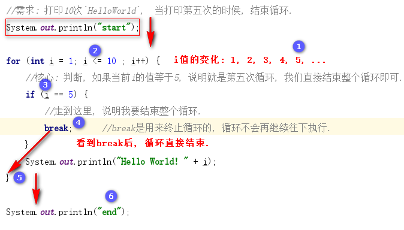
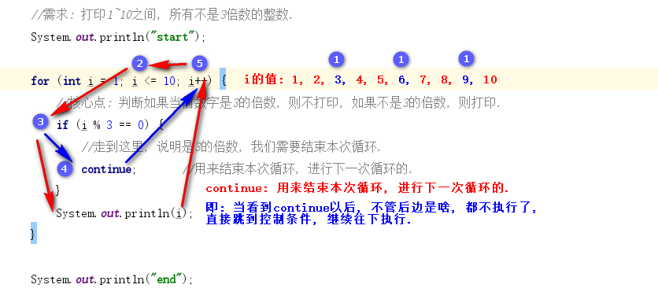

### 1. 循环跳转

#### 1.1 分类

* break: 是用来终止循环的, 循环不再继续执行.
* continue: 用来结束本次循环, 进行下一次循环的, 循环还会继续执行.

#### 1.2 break



#### 1.3 continue



### 2. 循环嵌套

所谓的循环嵌套指的是**循环结构中还包裹着循环结构**, 外边的循环结构叫**外循环**, 里边的循环结构叫**内循环**.

#### 2.1 格式

循环嵌套用的最多的就是`for循环的嵌套`, 具体格式如下: 

```java
for(初始化条件; 判断条件; 控制条件) {		//外循环, 例如: 5   1      2
   for(初始化条件; 判断条件; 控制条件) {		//内循环, 例如: 3   1,2,3  1,2,3
   	  //循环体;
   }
}
```

#### 2.2 执行流程

1. 外循环执行一次, 内循环执行一圈.
2. 循环嵌套的总执行次数 = 外循环的次数 * 内循环的次数.

### 3. 带标号的循环操作

#### 3.1 break用法

```java
// 1行2列
public class ForForDemo10 {
    public static void main(String[] args) {
        A: for (int i = 1; i <= 5; i++) {      //外循环, 控制行.
            B: for (int j = 1; j <= 5 ; j++) { //内循环, 控制列.
                if (j == 3) {
                    break A;   //这个break, 是用来结束哪个循环呢?
                }
                System.out.print("*");
            }
            System.out.println();
        }
    }
}
```

#### 3.2 continue用法

```java
public class ForForDemo10 {
    public static void main(String[] args) {
        //打印1~100之间所有的质数, 并按照3个一行的形式进行输出.
        //定义变量, 用来记录1-100之间的 质数个数.
        int count = 0;
        //定义变量, 用来记录一行打印几个数.
        int flag = 3;
        a: for (int i = 2; i < 100; i++) {
            for (int j = 2; j < i ; j++) {
                if (i % j == 0) {
                    //走到这里, 说明i不是质数.
                    continue a;
                }
            }
            System.out.print(i + (++count % flag == 0 ? "\r\n" : "\t"));
        }
    }
}
```

### 4. 生成随机数

#### 4.1 使用步骤

1. 导入包

   ```java
   import java.util.Random;
   ```

2. 创建随机数Random对象.

   ```java
   Random r = new Random();
   ```

3. 调用方法, 产生随机数

   ```java
   int num = r.nextInt(10);	//小括号中可以传入任意的正整数
   ```

   >  解释： 
   >
   > 1. 小括号中写的整数是生成的随机数的上限.
   > 2. 例如: 小括号中写10 , 说明生成0~10之间的随机数, 包含0, 但是不包含10, 即: 包左不包右.
   > 3. 小括号中必须传入正整数, 否则会报`IllegalArgumentException(非法参数异常)`.
