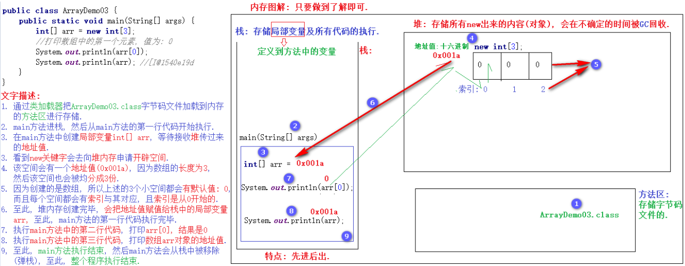
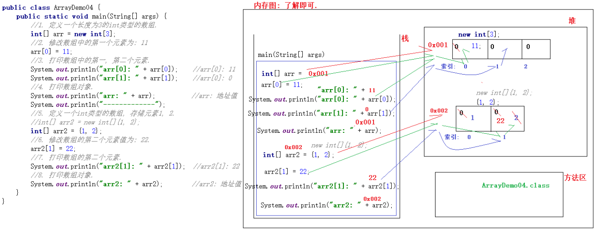
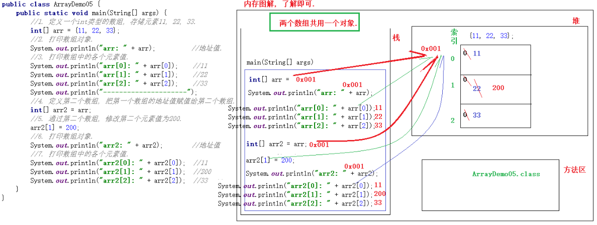
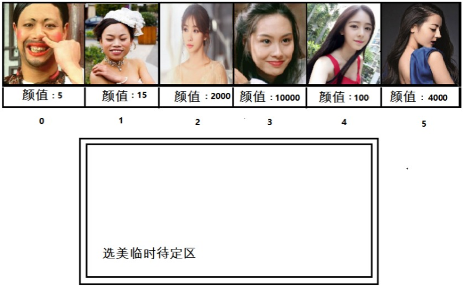

### 1. 数组简介  

#### 1.1 概述

我们之前学习的变量或者是常量, 只能用来存储一个数据, 例如: 存储一个整数, 小数或者字符串等. 如果需要同时存储多个同类型的数据, 用变量或者常量来实现的话, 非常的繁琐. 针对于这种情况, 我们就可以通过**数组**来实现了.

例如: 假设某公司有50名员工, 现在需要统计该公司员工的工资情况, 例如计算平均工资、获取最高工资等。针对于这个需求，如果用前面所学的知识实现，程序首先需要声明50个变量来分别记住每位员工的工资，然后在进行操作，这样做非常繁琐，而且错误率也会很高。因此我们可以使用容器进行操作。将所有的数据全部存储到一个容器中，统一操作。**数组, 就是一种容器**.

> 解释:
>
> 1. 容器: 就是将多个数据存储到一起, 每个数据都是该容器的元素.
> 2. 现实生活中的容器: 水杯, 衣柜, 教室等...

**数组概述**

数组就是用来存储多个同类型元素的容器, 例如: 存储5个整数, 或者存储10个小数, 亦或者存储3个字符串等...


#### 1.2 格式

* 动态初始化: 我们给定长度, 由系统给出默认初始化值.

  ```java
  //格式一
  数据类型[] 数组名 = new 数据类型[长度];
  
  //格式二
  数据类型 数组名[] = new 数据类型[长度];
  ```

  > 解释: 上述两种定义方式只是写法不同, 并无其他区别. 

* 静态初始化: 我们给定初始化值, 由系统指定长度. 

  ```java
  //格式一
  数据类型[] 数组名 = new 数据类型[]{元素1, 元素2, 元素3};		//这里可以有多个元素.
  
  //格式二 语法糖.
  数据类型[] 数组名 = {元素1, 元素2, 元素3};
  ```

  > 解释: 上述两种定义方式只是写法不同, 并无其他区别. 


#### 1.3 示例: 定义数组

**需求**

1. 创建int类型的数组, 用来存储3个元素.
2. 创建int类型的数组, 存储数据`11, 22, 33`.

**参考代码**

```java
public class ArrayDemo01 {
    public static void main(String[] args) {
        //1. 创建int类型的数组, 用来存储3个元素.
        //我们制定长度, 由系统给出默认值.
        //格式一:
        int[] arr1 = new int[3];		//推荐.
        //格式二:
        int arr2[] = new int[3];

        //2. 创建int类型的数组, 存储数据`11, 22, 33`.
        //我们直接传入元素, 由系统指定长度.
        //格式1
        int[] arr3 = new int[]{11, 22, 33};
        //格式2
        int[] arr4 = {11, 22, 33};		//推荐.
    }
}
```


#### 1.4 数组各部分解释

**此处以动态初始化举例:**

```java
数据类型[] 数组名 = new 数据类型[长度];

//例如:
int[] arr = new int[3];
```

**解释:**

* 数据类型: 指的是数组中存储元素的数据类型

  > 例如: 如果是int, 说明数组中只能存储int类型的数据, 如果是String, 则说明数组中只能存储字符串.

* []: 表示是一个数组.

* 数组名: 类似于之前定义的变量名, 要符合命名规范, 我们可以通过`数组名`来操作数组.

* new: 它是一个关键字, 表示用来创建数组对象的. 

* [长度]: 表示数组中最多能存储几个元素.


#### 1.5 数组的特点及基本用法

##### 1.5.1 特点

1. 数组中的每个元素都是有编号的, 且编号是从0开始的. 可以方便我们快速操作数组中的元素. 

   > 解释: 编号也叫索引(这个是最常见的念法), 下标, 角标. 

2. 数组中每个元素都有默认值. 

   > 例如:
   >
   > 1. int类型数组, 元素默认值是: 0
   > 2. double类型的数组, 元素默认值是: 0.0
   > 3. boolean类型的数组, 元素默认值是: false
   > 4. String类型的数组, 元素默认值是: null


##### 1.5.2 基本用法

1. 通过`数组名[索引]`的形式, 可以快速获取数组中的指定元素.

   ```java
   //格式
   数组名[索引]
   
   //例如:
   int[] arr = {11, 22, 33};
   System.out.println(arr[0]);	//打印结果是: 11
   ```

2. 通过`数组名[索引] = 值;`的方式, 可以修改数组中的指定元素值. 

   ```java
   //格式
   数组名[索引] = 值;
   
   //例如:
   int[] arr = {11, 22, 33};
   System.out.println(arr[1]);	//打印结果是: 22
   arr[1] = 222;
   System.out.println(arr[1]);	//打印结果是: 222
   ```

3. 通过`数组名.length`的方式, 可以获取数组的长度.

   ```java
   //格式
   数组名.length
   
   //例如:
   int[] arr = {11, 22, 33};
   System.out.println(arr.length);	//打印结果是: 3
   ```

##### 1.5.3 示例: 数组的基本用法

**需求**

1. 定义一个长度为5的int类型的数组.
2. 打印数组中的第3个元素.
3. 设置数组中的第一个元素值为11.
4. 获取数组中的第一个元素值, 并将其赋值给变量a, 然后打印.
5. 打印数组的长度. 

**参考代码**

```java
public class ArrayDemo02 {
    public static void main(String[] args) {
        //1. 定义一个长度为5的int类型的数组.
        int[] arr = new int[5];
        //2. 打印数组中的第3个元素.
        System.out.println(arr[2]);
        //3. 设置数组中的第一个元素值为11.
        arr[0] = 11;
        //4. 获取数组中的第一个元素值, 并将其赋值给变量a, 然后打印.
        int a = arr[0];
        System.out.println(a);
        //5. 打印数组的长度.
        System.out.println(arr.length);
    }
}
```


### 2. 数组的内存图

#### 2.1 内存解释

内存是计算机中的重要原件，也是临时存储区域，作用是运行程序。我们编写的程序是存放在硬盘中的，在硬盘中的程序是不会运行的，必须放进内存中才能运行，运行完毕后会清空内存。

即: Java虚拟机要运行程序，必须要对内存进行空间的分配和管理。为了提高运算效率，就对空间进行了不同区域的划分，因为每一片区域都有特定的处理数据方式和内存管理方式。

**JVM的内存划分**

1. 栈: 存储局部变量以及所有代码执行的. 

   > 局部变量: 指的是定义在方法中, 或者方法声明上的变量. 
   >
   > 特点: 先进后出. 

2. 堆: 存储所有new出来的内容(即: 对象).

   > 特点: 堆中的内容会在不确定的时间, 被GC回收. 

3. 方法区: 存储字节码文件的.

   > 字节码文件: 指的是后缀名为.class的文件. 

4. 本地方法区:

   > 和系统相关, 了解即可. 

5. 寄存器

   > 和CPU相关, 了解即可.


#### 2.2 案例一: 一个数组内存图

查看如下代码:

```java
public class ArrayDemo03 {
    public static void main(String[] args) {
        int[] arr = new int[3];
        System.out.println(arr[0]);	//打印数组中的第一个元素, 值为: 0
        System.out.println(arr);    //[I@1540e19d
    }
}
```

其中**[I@1540e19d是arr数组的地址值**, 那这段代码在内存中的执行流程是怎样的呢? 我们一块儿来看下:

**图解**



#### 2.3 案例二: 两个数组内存图

**需求**

1. 定义一个长度为3的int类型的数组.
2. 修改数组中的第一个元素为: 11
3. 打印数组中的第一, 第二个元素.
4. 打印数组对象.
5.  定义一个int类型的数组, 存储元素1, 2.
6. 修改数组的第二个元素值为: 22.
7. 打印数组的第二个元素.
8. 打印数组对象.

**参考代码**

```java
public class ArrayDemo04 {
    public static void main(String[] args) {
        //1. 定义一个长度为3的int类型的数组.
        int[] arr1 = new int[3];
        //2. 修改数组中的第一个元素为: 11
        arr1[0] = 11;
        //3. 打印数组中的第一, 第二个元素.
        System.out.println(arr1[0]);
        System.out.println(arr1[1]);
        //4. 打印数组对象.
        System.out.println(arr1);
        //5. 定义一个int类型的数组, 存储元素1, 2.
        int[] arr2 = {1, 2};
        //6. 修改数组的第二个元素值为: 22.
        arr2[1] = 22;
        //7. 打印数组的第二个元素.
        System.out.println(arr2[1]);
        //8. 打印数组对象.
        System.out.println(arr2);
    }
}
```

上述代码的内存图解又是怎样的呢? 我们一块儿来看下:

**图解**



#### 2.4 案例三: 两个数组指向同一个对象

**需求**

1. 定义一个int类型的数组, 存储元素11, 22, 33.
2. 打印数组对象.
3. 打印数组中的各个元素值.
4. 定义第二个数组, 把第一个数组的地址值赋值给第二个数组.
5. 通过第二个数组, 修改第二个元素值为200.
6. 打印数组对象.
7. 打印数组中的各个元素值. 

**参考代码**.

```java
public class ArrayDemo05 {
    public static void main(String[] args) {
        //1. 定义一个int类型的数组, 存储元素11, 22, 33.
        int[] arr1 = {11, 22, 33};
        //2. 打印数组对象.
        System.out.println("arr1: " + arr1);
        //3. 打印数组中的各个元素值.
        System.out.println("arr1[0]: " + arr1[0]);
        System.out.println("arr1[1]: " + arr1[1]);
        System.out.println("arr1[2]: " + arr1[2]);
        //4. 定义第二个数组, 把第一个数组的地址值赋值给第二个数组.
        int[] arr2 = arr1;
        //5. 通过第二个数组, 修改第二个元素值为200.
        arr2[1] = 200;
        //6. 打印数组对象.
        System.out.println("arr2: " + arr2);
        //7. 打印数组中的各个元素值.
        System.out.println("arr2[0]: " + arr2[0]);
        System.out.println("arr2[1]: " + arr2[1]);
        System.out.println("arr2[2]: " + arr2[2]);
    }
}
```

上述代码的内存图解又是怎样的呢? 我们一块儿来看下:

**图解**



### 3. 两个小问题

数组是我们在实际开发中用到的比较多的容器, 在使用它的时候, 很可能会遇到如下的两个问题:

1. 数组索引越界异常(ArrayIndexOutOfBoundsException)
2. 空指针异常(NullPointerException)

#### 3.1 数组索引越界异常

**产生原因**
访问了数组中不存在的索引. 

**解决方案**

访问数组中存在的索引即可.

**示例**

1. 定义int类型的数组, 存储元素11, 22.
2. 打印数组中的第2个元素. 
3. 尝试打印数组中的第3个元素.

**参考代码**

```java
public class ArrayDemo06 {
    public static void main(String[] args) {
        //1. 定义int类型的数组, 存储元素11, 22.
        int[] arr = {11, 22};
        //2. 打印数组中的第2个元素.
        System.out.println("arr[1]: " + arr[1]);
        //3. 尝试打印数组中的第3个元素.
        System.out.println("arr[2]: " + arr[2]);
    }
}
```


#### 3.2 空指针异常

**产生原因**

访问了空对象. 即: 对象为空, 你还去调用它的一些方法, 肯定不行. 

**解决方案**

对对象赋具体的值即可.

**示例**

1. 定义int类型的数组, 存储元素11, 22.
2. 将null(空常量)赋值给数组.
3. 尝试打印数组的第一个元素. 

**参考代码**

```java
public class ArrayDemo07 {
    public static void main(String[] args) {
        //1. 定义int类型的数组, 存储元素11, 22.
        int[] arr = {11, 22};
        //2. 将null(空常量)赋值给数组.
        arr = null;
        //3. 尝试打印数组的第一个元素.
        System.out.println("arr[0]: " + arr[0]);
    }
}
```


### 4. 数组的常见操作

数组是我们在实际开发中用到的比较多的一种容器, 它的常见操作如下:

1. 遍历数组.
2. 获取数组的最值(最大值, 或者最小值).
3. 反转数组.


#### 4.1 案例一: 遍历数组

**需求**

1. 定义int类型的数组arr, 存储元素11, 22, 33, 44, 55.
2. 通过for循环, 遍历数组. 

**参考代码**

```java
public class ArrayDemo08 {
    public static void main(String[] args) {
        //1. 定义int类型的数组arr, 存储元素11, 22, 33, 44, 55.
        int[] arr = {11, 22, 33, 44, 55};
        //2. 通过for循环, 遍历数组. 
        for (int i = 0; i < arr.length; i++) {
            System.out.println(arr[i]);
        }
    }
}
```


#### 4.2 案例二: 获取数组的最大值

**需求**

已知各位美女的颜值如下图, 请求出下图中, 颜值最高的数字, 并打印到控制台上.

> 即:求数组int[] arr = {5, 15, 2000, 10000, 100, 4000};的最大值.



**参考代码**

```java
public class ArrayDemo09 {
    public static void main(String[] args) {
        //需求: 求数组int[] arr = {5, 15, 2000, 10000, 100, 4000};的最大值.
        int[] arr = {5, 15, 2000, 10000, 100, 4000};
        int max = arr[0];
        for (int i = 0; i < arr.length; i++) {
            if (max < arr[i])
                max = arr[i];
        }
        System.out.println("颜值最高的人的颜值为: " + max);
    }
}
```


#### 4.3 案例三: 反转数组

**需求**

1. 定义int类型的数组, 存储数据: 11, 33, 22, 55, 44.
2. 反转数组, 并打印反转后的结果. 

**参考代码**

```java
public class ArrayDemo10 {
    public static void main(String[] args) {
        //1. 定义数组.
        int[] arr = {11, 33, 22, 55, 44};
        //2. 反转数组.
        for (int i = 0; i < arr.length / 2; i++) {
            int temp = arr[i];
            arr[i] = arr[arr.length - 1 - i];
            arr[arr.length - 1 - i] = temp;
        }
        //3. 打印数组.
        for (int i = 0; i < arr.length; i++) {
            System.out.println(arr[i]);;
        }
    }
}
```


### 5. 练习题

#### 5.1 案例四: 评委打分

**需求**

1. 在编程竞赛中, 有6个评委为参赛的选手打分, 分数在0~100之间[
2. 选手的最后得分为: 去掉(一个最高分 + 去掉一个) , 然后和4取余即可.

**参考代码**

```jav
略.
```


#### 5.2 案例五:不死神兔

**需求**

已知序列1, 1, 2, 3, 5, 8, 13..., 求第12个数字是多少.

**参考代码**

```java
略. 
```


