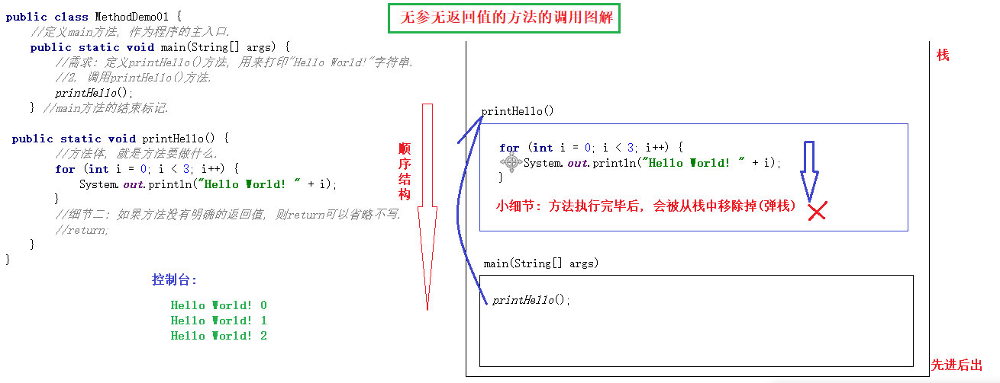

### 1. 方法简介

#### 1.1 概述

方法(method)，也叫函数，是将具有独立功能的代码块组织成为一个整体，使其成为具有特殊功能的代码集.

#### 1.2 定义格式

```java
修饰符 返回值的数据类型 方法名(参数类型 参数名1, 参数类型 参数名2) { //这里可以写多个参数
    //方法体;
    return 具体的返回值;	//加工好的饲料
}

public static void main(String[] args) {
   
}
```

#### 1.3 格式解释

* 修饰符: 目前记住这里是固定格式**public static**

* 返回值的数据类型: 用于限定返回值的数据类型的.

  > 注意: 
  >
  > 1. 返回值的数据类型是int类型, 则说明该方法只能返回int类型的整数.
  > 2. 如果方法没有具体的返回值, 则返回值的数据类型要用**void**来修饰.

* 方法名: 方便我们调用方法.

* 参数类型: 用于限定调用方法时传入的数据的数据类型.

  > 例如: 参数类型是String类型, 说明我们调用方法时, 只能传入字符串.

* 参数名: 用于接收调用方法时传入的数据的变量. 

* 方法体: 完成特定功能的代码.

* return 返回值: 用来结束方法的, 并把返回值返回给调用者. 

  > 解释: 如果方法没有明确的返回值, 则return关键字可以省略不写. 


#### 1.4 注意事项

1. 方法与方法之间是平级关系, 不能嵌套定义.

2. 方法必须先创建才可以使用, 该过程称为: 方法定义.

3. 方法自身不会直接运行, 而是需要我们手动调用方法后, 它才会执行, 该过程称为方法调用.

4. 方法的功能越单一越好. 

5. 定义方法的时候写在参数列表中的参数, 都是: 形参.  

   > 形参: 形容调用方法的时候, 需要传入什么类型的参数.

6. 调用方法的时候, 传入的具体的值(变量或者常量都可以), 叫实参. 

   > 实参: 调用方法时, 实际参与运算的数据.


### 2. 无参无返回值的方法

#### 2.1 定义无参无返回值的方法

定义方法时, 要做到三个明确, 这样定义方法就会变得非常简单了:

1. 明确方法名, 即: 方法名要符合小驼峰命名法, 且要见名知意, 方便我们调用.
2. 明确方法的参数列表.  即: 调用方法时, 我们需要给它(方法)什么数据.
3. 明确方法的返回值类型, 即: 调用方法完毕后, 方法会返回给我们一个什么类型的数据. 

**具体格式**

```java
public static void 方法名() {
    //方法体;
}
```

#### 2.2 调用无参无返回值的方法

**格式**

```java
方法名();
```

> 解释: 通过`方法名();`的形式, 可以直接根据方法名调用指定的方法. 

#### 2.3 方法调用图解



#### 2.4 方法的好处

当一些代码被反复使用时，可以把它们提取出来，放到一个方法里，以方法的形式来使用这些代码。

### 3. 有参无返回值的方法

**具体定义格式**

```java
public static void 方法名(参数类型 参数名1, 参数类型 参数名2) {	//这里可以写多个参数
    //方法体;
}
```

**具体调用格式**

```java
方法名(参数值1, 参数值2);	//注意: 参数的个数, 以及对应的参数类型都要和定义方法的参数列表保持一致. 
```

### 4. 无参有返回值的方法

**具体定义格式**

```java
public static 返回值的数据类型 方法名() {
    //方法体;
    return 具体的返回值;
}
```

**具体调用格式**

```java
//直接调用, 无意义. 
方法名();

//输出调用, 在课堂上我可能会经常用, 因为简单. 
System.out.println(方法名());

//赋值调用,  实际开发中推荐使用.
数据类型 变量名 = 方法名();
```

### 5. 有参有返回值的方法

**具体定义格式**

```java
public static 返回值的数据类型 方法名(参数类型 参数1, 参数类型 参数2) {
    //方法体;
    return 具体的返回值;
}
```

**具体调用格式**

```java
//直接调用
方法名(参数值1, 参数值2);	//参数的个数, 及对应参数的类型要和定义方法时的参数列表保持一致.

//输出调用
System.out.println(方法名());

//赋值调用
数据类型 变量名 = 方法名();
```

### 6. 思考题

1. 方法与方法之间可以嵌套定义吗? 不可以
2. 方法没有具体的返回值时, 返回值的数据类型可以不写吗? 不可以
3. 方法体中的`return`关键字可以省略吗? 返回空时可省
