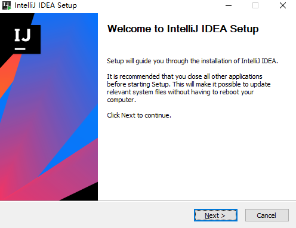
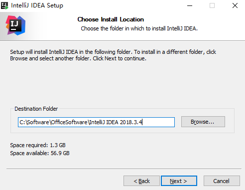
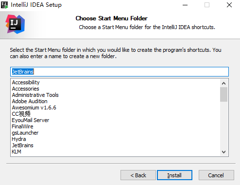
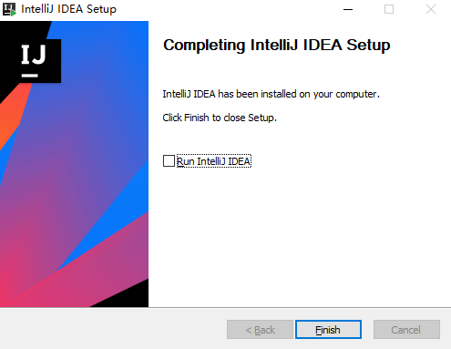

### 今日目标

* 掌握运算符的用法
* 掌握键盘录入功能
* 独立完成IDEA的安装和配置
* 掌握纸牌案例


### 1. 关系运算符

#### 1.1 概述

关系运算符就是用来描述`两个变量或者常量之间的关系的.`主要分为以下6种: 

| 符号 | 说明                                                    |
| ---- | ------------------------------------------------------- |
| ==   | a==b，判断a和b的值是否相等，成立为true，不成立为false   |
| !=   | a!=b，判断a和b的值是否不相等，成立为true，不成立为false |
| >    | a>b，判断a是否大于b，成立为true，不成立为false          |
| >=   | a>=b，判断a是否大于等于b，成立为true，不成立为false     |
| <    | a<b，判断a是否小于b，成立为true，不成立为false          |
| <=   | a<=b，判断a是否小于等于b，成立为true，不成立为false     |

#### 1.2 注意事项

* 关系运算符的结果都是boolean类型，要么是true，要么是false。
* 千万不要把`==`写成了`=`, 否则结果可能不是你想要的. 

#### 1.3 案例

**需求**

1. 定义两个int类型的变量a和b, 分别赋值为10和5.
2. 通过`关系运算符`比较这两个变量之间的关系, 并打印结果.

**参考代码**

```java
public class OperatorDemo01 {
    public static void main(String[] args) {
        //定义两个int类型的变量a和b, 分别赋值为10和5.
        int a = 10;
        int b = 5;
        //通过`关系运算符`比较这两个变量之间的关系, 并打印结果.
        System.out.println(a > b);
        System.out.println(5 >= 5);
        System.out.println(a < b);
        System.out.println(5 <= 5);
        System.out.println(a != b);
        System.out.println(a == b);
        System.out.println(a = b);
        
        //关系运算符的最终结果是boolean类型, 所以我们也可以用boolean类型的变量接收.
        boolean flag = 10 < 5;
        System.out.println(flag);
    }
}
```


### 2. 逻辑运算符

#### 2.1 概述

* 逻辑运算符是用来判断**并且, 或者, 除非**等逻辑关系的符号. 

* 该符号两端一般连接值为布尔类型的关系表达式

  > 例如: 某企业招工, 要求年龄必须在 20 ~ 65岁之间. 

#### 2.2 分类

> 注意: 假设下表中的a和b, 都是boolean类型的值. 

| 符号 | 作用     | 说明                                                         |
| ---- | -------- | ------------------------------------------------------------ |
| &    | 逻辑与   | a&b，并且的意思. 有false则整体为false,  都为true, 则整体为true. |
| \|   | 逻辑或   | a\|b，或者的意思, 有true则整体为true, 都为false, 则整体为false. |
| !    | 逻辑非   | !a，取反的意思, 以前为true, 取反后为false, 以前为false, 取反后为true. |
| ^    | 逻辑异或 | a^b，异同的意思, 相同为false, 不同为true.                    |

> 小技巧:
>
>  对一个布尔数据, 偶数次取反, 该数据值不变.
>
> !true = false

#### 2.3 示例: 逻辑运算符入门

**需求**

1. 定义三个int类型的变量a, b, c, 它们的初始化值分别为10, 20, 30.
2. 通过上述的三个变量, 演示各个逻辑运算符.

**参考代码**

```java
public class OperatorDemo02 {
    public static void main(String[] args) {
        int a = 10, b = 20, c = 30;
        //&: 逻辑与, 并且的意思, 有false则整体为false.
        //相当于: 班长找女朋友, 要求长得漂亮, 并且身材好.
        System.out.println((a > b) & (a > c)); //false & false
        System.out.println((a < b) & (a > c)); //true & false
        System.out.println((a > b) & (a < c)); //false & true
        System.out.println((a < b) & (a < c)); //true & true
        System.out.println("-----------------");

        //|: 逻辑或, 或者的意思, 有true则整体为true.
        //相当于: 降低条件了, 要么长得漂亮, 要么身材好.
        System.out.println((a > b) | (a > c)); //false | false
        System.out.println((a < b) | (a > c)); //true | false
        System.out.println((a > b) | (a < c)); //false | true
        System.out.println((a < b) | (a < c)); //true | true
        System.out.println("-----------------");

        //!: 逻辑非, 取反的意思
        //相当于: 只要不是男的就行.
        System.out.println(!(a > b));   //!false
        System.out.println(!(a < b));   //!true
        System.out.println("-----------------");

        //逻辑异或, 异同的意思, 相同为false, 不同为true.
        //相当于: 最后还是找了个男的, 但是领不了证.
        //法律规定: 一夫一妻, 一男一女, 必须是异性才能领证.
        System.out.println((a > b) ^ (a > c)); //false ^ false
        System.out.println((a < b) ^ (a > c)); //true ^ false
        System.out.println((a > b) ^ (a < c)); //false ^ true
        System.out.println((a < b) ^ (a < c)); //true ^ true
    }
}
```


#### 2.4 短路逻辑运算符

在实际开发中, `并且, 或者`这样的操作是非常多的, 但是上述的`&(逻辑与), !(逻辑或)`运算符`没有短路效应`, 所以效率相对较低, 针对这种情况, 我们可以使用`&&(短路与), ||(短路或)`来优化.

##### 2.4.1 格式

| 符号 | 作用   | 说明                                                    |
| ---- | ------ | ------------------------------------------------------- |
| &&   | 短路与 | 作用和&相同，但是有短路效果, 前边出现false, 后边不执行. |
| \|\| | 短路或 | 作用和\|相同，但是有短路效果, 前边出现true, 后边不执行. |

##### 2.4.2 解释

* 在**短路与**运算中，只要有一个表达式的值为false，那么结果就可以判定为false了，没有必要将所有表达式的值都计算出来，短路与运算符就有这样的效果，可以提高效率。
* 同理在**短路或**运算中，一旦发现值为true，右边的表达式将不再参与运算。

##### 2.4.3 短路和非短路之间的区别

* 逻辑与 和 短路与之间的区别
  * 逻辑与&(也叫单与):    无论左边真假，右边都要执行。
  * 短路与&&(也叫双与): 如果左边为真，右边执行；如果左边为假，右边不执行。

* 逻辑或 和 短路或之间的区别
  * 逻辑或|(也叫单或):   无论左边真假，右边都要执行。
  * 短路或||(也叫双或): 如果左边为假，右边执行；如果左边为真，右边不执行。
* 记忆: 在实际开发中, **我们用的最多的逻辑运算符就是: &&, ||, !**

##### 2.4.4 案例

**需求**

**参考代码**

```java
public class OperatorDemo03 {
    public static void main(String[] args) {
        //1. 定义两个int类型的变量a和b, 初始化值分别为: 2, 5
        int a = 2, b = 5;
        //2. 演示逻辑与(&)
       /* System.out.println((a++ > 2) & (b++ < 7)); //两个表达式都会执行.
        System.out.println(a);
        System.out.println(b);*/
        System.out.println("------------------");

        //3. 演示短路与(&&)
        System.out.println((a++ > 2) && (b++ < 7)); //左边表达式结果为false, 右边不执行.
        System.out.println(a);
        System.out.println(b);
    }
}
```


### 3. 三元运算符

#### 3.1 格式

三元运算符也叫`三目运算符`，即由三部分组成，格式如下：

```java
(关系表达式) ? 表达式1：表达式2； 
```

#### 3.2 执行流程

1. 先执行关系表达式, 看其结果是true还是false.
2. 如果是`true`, 则执行`表达式1`
3. 如果是`false`, 则执行`表达式2`

#### 3.3 案例一: 入门案例

**需求**

1. 定义两个int类型的变量a. b, 初始化值分别为10, 20
2. 通过三元运算符, 获取变量a和b的最大值.
3. 将结果(最大值)打印到控制台上.

**参考代码**

```java
public class OperatorDemo04 {
    public static void main(String[] args) {
        //1. 定义两个int类型的变量a. b, 初始化值分别为10, 20
        int a = 10, b = 20;
        //2. 通过三元运算符, 获取变量a和b的最大值.
        int max = a < b ? b : a;
        //3. 将结果(最大值)打印到控制台上.
        System.out.println(max);
    }
}
```


#### 3.4 案例二: 判断老虎体重

**需求**

动物园里有两只老虎，已知两只老虎的体重分别为180kg、200kg，请用程序实现判断两只老虎的体重是否相同。

**参考代码**

```java
public class OperatorDemo05 {
    public static void main(String[] args) {
        //1：定义两个变量用于保存老虎的体重，单位为kg，这里仅仅体现数值即可。
        int weight1 = 180;
        int weight2 = 200;
        //2：用三元运算符实现老虎体重的判断，体重相同，返回true，否则，返回false。
        boolean flag = weight1 == weight2 ? true : false;
        //3：输出结果
        System.out.println("flag:" + flag);
    }
}
```


#### 3.5  案例三: 获取和尚的最高身高

**需求**

1. 一座寺庙里住着三个和尚，已知他们的身高分别为150cm、210cm、165cm.

2. 请用程序实现获取这三个和尚的最高身高。

**参考代码**

```java
public class OperatorDemo06 {
    public static void main(String[] args) {
        //1：定义三个变量用于保存和尚的身高，单位为cm，这里仅仅体现数值即可。
        int h1 = 150;
        int h2 = 210;
        int h3 = 165;
        //2：用三元运算符获取前两个和尚的较高身高值，并用临时身高变量保存起来。
        int temp = h1 > h2 ? h1 : h2;
        //3：用三元运算符获取临时身高值和第三个和尚身高较高值，并用最大身高变量保存。
        int max = temp > h3 ? temp : h3;
        //4：输出结果
        System.out.println("这三个和尚中身高最高的是：" + max +"cm");
    }
}
```


### 4. 键盘录入

#### 4.1 概述

之前我们涉及到的数据都是`写死的, 固定的数据`, 这样做用户体验并不好, 我们就想着, 能不能让用户录入数据, 我们通过特定的代码来接收, 这样做就非常好玩儿了, 针对于这种情况, 我们可以通过`键盘录入`来实现.

> 即: Java中键盘录入功能指的就是Scanner类, 我们可以通过它的一些方法, 来获取用户录入的数据.

#### 4.2 使用步骤

1. 导包.    包就是文件夹.

   > 注意: 
   >
   > * Scanner类是java.util包下的类, 使用之前必须要先导包.
   >
   > * 导包的语句是定义在类的上面的, 格式如下:
   >
   >   ```java
   >   import java.util.Scanner;
   >   ```

2. 创建Scanner类的对象, 格式为:

   ```java
   //暂时先理解为固定格式, 也就是必须这么写.
   Scanner sc = new Scanner(System.in);
   ```

3. 通过`Scanner类的nextInt()方法`接收用户录入的数据.

   ```java
   int a = sc.nextInt();
   ```

#### 4.3 案例一: Scanner入门

**需求**

1. 提示用户录入他/她的年龄.
2. 通过键盘录入功能, 接收用户录入的年龄.
3. 将用户录入的数据(年龄)打印到控制台上.

**参考代码**

```java
//导包
import java.util.Scanner;

public class ScannerDemo01 {
    public static void main(String[] args) {
        //1. 提示用户录入他/她的年龄.
        System.out.println("请录入您的年龄: ");
        //2. 通过键盘录入功能, 接收用户录入的年龄.
        Scanner sc = new Scanner(System.in);
        int age = sc.nextInt();
        //3. 将用户录入的数据(年龄)打印到控制台上.
        System.out.println("age: " + age);
    }
}
```


#### 4.4 案例二: 键盘录入版和尚身高

**需求**

1. 提示用户录入第一个和尚的身高, 并接收
2. 提示用户录入第二个和尚的身高, 并接收
3. 提示用户录入第三个和尚的身高, 并接收.
4. 通过三元运算符, 获取三个和尚中身高最矮的那个和尚的身高.
5. 将结果(最低身高)打印到控制台上. 

**参考代码**

```java
import java.util.Scanner;

public class ScannerDemo02 {
    public static void main(String[] args) {
        //身高未知，采用键盘录入实现。首先导包，然后创建对象。
        Scanner sc = new Scanner(System.in);
        //键盘录入三个身高分别赋值给三个变量。
        System.out.println("请输入第一个和尚的身高：");
        int h1 = sc.nextInt();
        System.out.println("请输入第二个和尚的身高：");
        int h2 = sc.nextInt();
        System.out.println("请输入第三个和尚的身高：");
        int h3 = sc.nextInt();
        //用三元运算符获取前两个和尚的较低身高值，并用临时身高变量保存起来。
        int temp = h1 < h2 ? h1 : h2;
        //用三元运算符获取临时身高值和第三个和尚身高较低值，并用最低身高变量保存。
        int min = temp < h3 ? temp : h3;
        //输出结果。
        System.out.println("这三个和尚中身高最低的是：" + min +"cm");
    }
}
```


### 5. 开发工具

#### 5.1 概述

开发工具指的就是我们用来编写代码的软件, 常用的主要有以下几类: 

* windows操作系统自带的记事本

  > 缺点: 没有行号, 关键字不能高亮显示, 代码不能折叠.

* 高级记事本(Notepad++, Editplus)

  > 优点: 有行号, 关键字能高亮显示, 代码能折叠.
  >
  > 缺点: 不方便我们调试, 不适合开发大型项目.

* 集成开发工具(IDE: Integrated Development Environment)

  * 集成开发工具指的是**集代码的编写, 编译, 运行, 调试, 重构等一系列功能于一体**的软件.
  * 常用的`IDE`如下:
    * Eclipse
    * MyEclipse
    * IDEA

#### 5.2 IDEA的下载和安装

##### 5.2.1 概述

IDEA 全称 IntelliJ IDEA，是Java编程语言开发的集成环境。IntelliJ在业界被公认为最好的java开发工具，尤其在智能代码助手、代码自动提示、重构、J2EE支持、各类版本工具(git、svn等)、JUnit、CVS整合、代码分析、 创新的GUI设计等方面的功能可以说是超常的。IDEA是`JetBrains公司`的产品，这家公司总部位于`捷克共和国的首都布拉格`，开发人员以严谨著称的东欧程序员为主。它的旗舰版本还支持HTML，CSS，PHP，MySQL，Python等。免费版只支持Python等少数语言。

> 总结: IDEA这个软件是用ava语言开发的, 所以想使用IDEA, 你电脑上必须安装JRE. 

##### 5.2.2 下载

JetBrains公司官网: www.jetbrains.com

直接下载地址: <https://www.jetbrains.com/idea/download/other.html>

##### 5.2.3 安装

1. 双击安装包`ideaIU-2018.3.4.exe`进行安装, 选择`next`进行下一步.

   

2. 修改`安装路径`, 然后选择`next`.

   

3. 选择`64bit(64位)`, 然后选择`next`.

   

4. 直接选择`next`, 然后开始安装即可(这个过程需要点时间, 请耐心等待).

   

5. 安装成功.



##### 5.2.4 首次启动

详见`IDEA安装详解.pdf`文档.


##### 5.2.5 创建包和类

略.

##### 5.2.6 字体设置

IDEA工具的默认字体非常小，代码编辑器和控制台的输出字体都需要进行调整。

- 点击菜单栏上的`File->Settings->Editor->Font`修改字体。


##### 5.2.7 IDEA的项目目录

- 我们创建的项目，在d:\ideawork目录的demo下

  - `out`目录是存储编译后的.class文件
  - `src` 目录是存储我们编写的.java源文件

  

##### 5.2.8 IDEA常用快捷键

| 快捷键               | 功能                                   |
| -------------------- | -------------------------------------- |
| `Alt+Enter`          | 导入包，自动修正代码                   |
| `Ctrl+Y`             | 删除光标所在行                         |
| `Ctrl+D`             | 复制光标所在行的内容，插入光标位置下面 |
| `Ctrl+Alt+L`         | 格式化代码                             |
| `Ctrl+/`             | 单行注释                               |
| `Ctrl+Shift+/`       | 选中代码注释，多行注释，再按取消注释   |
| `Alt+Shift+上下箭头` | 移动当前代码行                         |


##### 5.2.9 IDEA修改快捷键

在IDEA工具中，`Ctrl+空格`的快捷键，可以帮助我们补全代码，但是这个快捷键和Windows中的输入法切换快捷键冲突，需要修改IDEA中的快捷键。

`File->Settings->keymap->Main menu->code->Completion->Basic`


双击`Basic->remove->Ctrl+空格`


再次双击`Basic->Add Keyboard->键入 Alt+/->点击OK`


##### 5.2.10 IDEA导入和关闭项目

关闭IDEA中已经存在的项目，`File->Close Project`


`File->Close Project `这时IDEA回到了刚启动界面，点击项目上的`X`，IDEA中就没有这个项目了


在IDEA的启动界面上，点击`OPEN` ，选择项目目录即可


> 小贴士：
>
> 课后若想通过IDEA同时开启多个项目，点击OPEN打开项目时，点击New Window按钮


### 6. 练习

#### 6.1 练习1

**需求**

* 小明左、右手中分别拿两张纸牌（比如：黑桃10和红桃8，数字10和8可通过键盘录入），

* 要求编写代码交换小明手中的牌.

**运行效果**

```java
请输入小明左手中的纸牌：
10
请输入小明右手中的纸牌：
8

互换前小明手中的纸牌：
左手中的纸牌：10
右手中的纸牌：8

互换后小明手中的纸牌：
左手中的纸牌：8
右手中的纸牌：10
```

**实现步骤**

1. 创建键盘录入对象
2. 定义int类型的变量left和right，并通过nextInt()方法给left和right赋值
3. 定义临时变量temp实现left和right变量值得交换
4. 按格式打印交换后的结果

**参考代码**

```java
public class Task01 {
	public static void main(String[] args) {		
		//创建键盘录入对象
		Scanner sc = new Scanner(System.in);
		//录入左手中的纸牌数字
		System.out.print("请输入小明左手中的纸牌：");
		int left = sc.nextInt();
		//录入右手中的纸牌数字
		System.out.print("请输入小明右手中的纸牌：");
		int right = sc.nextInt();
		//打印互换前的纸牌
		System.out.println();
		System.out.println("互换前小明手中的纸牌：");
		System.out.println("左手中的纸牌："+left);
		System.out.println("右手中的纸牌："+right);
		System.out.println();
		// 定义一个临时变量temp,保存left的值
		int temp = left;
		// 将right的值赋值给left
		left = right;
		// 将临时变量temp的值赋值给right 
		right = temp;
		// 打印交换后纸牌
		System.out.println("互换后小明手中的纸牌：");
		System.out.println("左手中的纸牌："+left);
		System.out.println("右手中的纸牌："+right);
	}
}

```


#### 6.2 练习2

**需求**

* 提示用户键盘录入一个三位数, 并接收.
* 求这个数的个位,十位,百位分别是多少.
* 并将结果打印到控制台上.

**参考代码**

* 略


#### 6.3 练习3

**需求**

键盘录入一个三位数字,输出该三位数字是否是水仙花数字?

> 提示:
>
> 1. 水仙花数是一个三位数字.
> 2. 该数字的各个位数的立方和等于该数字本身.
> 3. 例如: 153 = 1 * 1 * 1 + 5 * 5 * 5 + 3 * 3 * 3 = 27 + 125 + 1 = 153

**思路分析**

1. 创建键盘录入对象
2. 获取一个int数字
3. 获取个位,十位,百位
4. 求个位,十位,百位的立方和
5. 利用三元运算符求立方和是否等于该数字本身
6. 打印结果

**参考代码**

```java
public class Task03 {
	public static void main(String[] args) {
		//1.创建键盘录入对象
        Scanner sc = new Scanner(System.in);
		//2.获取一个int数字
        System.out.println("请输入一个三位整数");
        int num = sc.nextInt();
        
		//3.获取个位,十位,百位
		int ge = num%10;
        int shi = num/10%10;
        int bai = num/100%10;
        //4.求个位,十位,百位的立方和
        int sum = ge*ge*ge + shi*shi*shi + bai*bai*bai;
        
		//5.利用三元运算符求立方和是否等于该数字本身
		boolean flag = (sum==num)?true:false;
        
        //6.打印结果
        System.out.println(num+"是水仙花数字吗? "+flag);
	}
}

```

