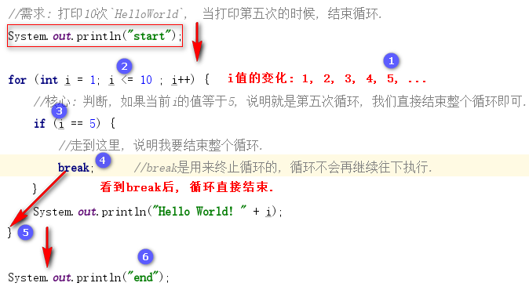

### 今日目标

* 掌握循环跳转语句break和continue的用法
* 掌握循环嵌套相关案例
* 掌握Random类的用法
* 掌握猜数字案例

---

### 1. 循环跳转

#### 1.1 概述

有些时候, 我们想提前**终止循环**的执行, 或者**跳过循环的某一次执行**, 例如:  打印1~10之间, 所有不是3倍数的数字, 或者采用死循环让用户不断的录入他/她的账号和密码, 直到用户录入正确, 再终止循环. 这些都要用到`循环控制跳转`知识点.

#### 1.2 分类

* break: 是用来终止循环的, 循环不再继续执行.
* continue: 用来结束本次循环, 进行下一次循环的, 循环还会继续执行.

#### 1.3 案例一: break入门

**需求**
打印10次`HelloWorld`,  当打印第五次的时候, 结束循环.

**参考代码**

```java
//案例: 打印10次`HelloWorld`,  当打印第五次的时候, 结束循环.
public class BreakDemo01 {
    public static void main(String[] args) {
        System.out.println("start");
        //1. 定义for循环, 打印10次HelloWorld
        for (int i = 1; i <= 10 ; i++) {
            //2.当i等于5的时候, 结束循环
            if (i == 5)
                break;
            System.out.println("Hello World! " + i);
        }
        System.out.println("end");
    }
}
```

**图解**




#### 1.4 案例二: continue入门

**需求**

打印1~10之间, 所有不是3倍数的整数.

**参考代码**

```java
//案例; 打印1~10之间, 所有不是3倍数的整数.
public class ContinueDemo02 {
    public static void main(String[] args) {
        System.out.println("start");
        //1. 通过for循环, 获取1 - 10之间所有的整数
        for (int i = 1; i <= 10; i++) {
            //2. 判断该数字是否是3的倍数.
            if (i % 3 == 0)
                //3. 如果是, 就结束本次循环
                continue;
            //4. 如果不是, 就打印该数字的值.
            System.out.println(i);
        }
        System.out.println("end");
    }
}
```

**图解**


#### 1.5 思考题

已知代码如下:

```java
//思考题
public class BreakDemo03 {
    public static void main(String[] args) {
        for (int i = 1; i <= 10; i++) {
            if (i % 3 == 0) {
                //这里加入什么???
            }
            System.out.println("Hello World! " + i);
        }
    }
}
```

问: 在注释的地方填充什么代码, 分别可以实现**该循环共计打印: 2次, 7次, 13次"Hello World!"字符串?**


### 2. 循环嵌套

所谓的循环嵌套指的是**循环结构中还包裹着循环结构**, 外边的循环结构叫**外循环**, 里边的循环结构叫**内循环**.

#### 2.1 格式

循环嵌套用的最多的就是`for循环的嵌套`, 具体格式如下: 

```java
for(初始化条件; 判断条件; 控制条件) {		//外循环, 例如: 5   1      2
   for(初始化条件; 判断条件; 控制条件) {		//内循环, 例如: 3   1,2,3  1,2,3
   	  //循环体;
   }
}
```

#### 2.2 执行流程

1. 外循环执行一次, 内循环执行一圈.
2. 循环嵌套的总执行次数 = 外循环的次数 * 内循环的次数.

> 例如:
>
> 1. 现实世界中的**年月**关系,  即: 1年 = 12个月
> 2. 现实世界中的**时分, 分秒**关系,  即: 1小时 = 60分钟, 1分钟=60秒.


#### 2.3 案例一: 打印年月

**需求**

打印2020年1月至2023年12月之间所有的月份, 格式为:  XXXX年XX月

**参考代码**

* 复杂写法

  ```java
  //案例: 打印年月
  public class ForForDemo04 {
      public static void main(String[] args) {
          //1. 定义循环, 打印2021年所有的月份
          for (int j = 1; j <= 12 ; j++) {
              System.out.print("2021年" + j + "月\t");
          }
          System.out.println();   //记得加换行
  
          //2. 定义循环, 打印2022年所有的月份
          for (int j = 1; j <= 12 ; j++) {
              System.out.print("2022年" + j + "月\t");
          }
          System.out.println();   //记得加换行
  
          //3. 定义循环, 打印2023年所有的月份
          for (int j = 1; j <= 12 ; j++) {
              System.out.print("2023年" + j + "月\t");
          }
          System.out.println();   //记得加换行
      }
  }
  ```

* 简单写法

  ```java
  //案例: 打印年月
  public class ForForDemo04 {
      public static void main(String[] args) {
          //1. 定义外循环, 控制年份的变化.
          for (int i = 2020; i <= 2023 ; i++) {       //外循环执行一次, 内循环执行一圈.
              System.out.println("start");
              //变量i的取值: 2021, 2022, 2023
              //2. 定义内循环, 控制月份的变化.
              for (int j = 1; j <= 12 ; j++) {
                  System.out.print(i + "年" + j + "月\t");
              }
              System.out.println();   //记得加换行
              System.out.println("end\r\n");
          }
      }
  }
  ```


#### 2.4 案例二: 打印时分

**需求**

打印1天内的所有时间, 格式:  13时14分.

**参考代码**

```java
public class ForForDemo05 {
    public static void main(String[] args) {
        //1. 定义外循环, 控制小时的变化.
        for (int hour = 0; hour <= 23 ; hour++) {
            //2. 定义内循环, 控制分钟的变换.
            for (int minute = 0; minute <= 59; minute++) {
                System.out.println(hour + "时" + minute + "分");
            }
        }
    }
}
```


#### 2.5 案例三: 打印矩形

**需求**

1. 在控制台打印一个3行5列的矩形星星序列, 具体格式如下:

   ```java
   *****
   *****
   *****
   ```

2. 要求: 一次只能打印一个"*"

**参考代码**

```java
public class ForForDemo06 {
    public static void main(String[] args) {
        for (int i = 0; i < 3; i++) {       //外循环控制行
            for (int j = 0; j < 5; j++) {   //内循环控制列
                System.out.print("*");      //每次打印一个"*"
            }
            System.out.println();           //内循环执行结束, 意味着一行打印完毕, 记得要换行.
        }
    }
}
```


#### 2.6 案例四: 打印正三角形

**需求**

1. 在控制台打印一个5行5列的正三角形星星序列, 具体格式如下:

   ```java
   *
   **
   ***
   ****
   *****
   ```

2. 要求: 一次只能打印一个"*"

**参考代码**

```java
public class ForForDemo07 {
    public static void main(String[] args) {
        for (int i = 1; i <= 5; i++) {       //外循环控制行
            for (int j = 1; j <= i; j++) {   //内循环控制列
                System.out.print("*");      //每次打印一个"*"
            }
            System.out.println();           //内循环执行结束, 意味着一行打印完毕, 记得要换行.
        }
    }
}
```

> 小技巧: 打印正三角形和打印矩形相比: 判断条件发生变化.


#### 2.7 案例五: 打印倒三角形

**需求**

1. 在控制台打印一个5行5列的正三角形星星序列, 具体格式如下:

   ```java
   *****
   ****
   ***
   **
   *
   ```

2. 要求: 一次只能打印一个"*"

**参考代码**

```java
public class ForForDemo08 {
    public static void main(String[] args) {
        for (int i = 1; i <= 5; i++) {       //外循环控制行
            for (int j = i; j <= 5; j++) {   //内循环控制列
                System.out.print("*");      //每次打印一个"*"
            }
            System.out.println();           //内循环执行结束, 意味着一行打印完毕, 记得要换行.
        }
    }
}
```

> 小技巧: 打印倒三角形和打印矩形相比: 初始化条件发生变化.


#### 2.8 案例六: 打印99乘法表

**需求**

打印99乘法表, 格式如下:

```java
1*1=1	
1*2=2	2*2=4	
1*3=3	2*3=6	3*3=9	
1*4=4	2*4=8	3*4=12	4*4=16	
1*5=5	2*5=10	3*5=15	4*5=20	5*5=25	
1*6=6	2*6=12	3*6=18	4*6=24	5*6=30	6*6=36	
1*7=7	2*7=14	3*7=21	4*7=28	5*7=35	6*7=42	7*7=49	
1*8=8	2*8=16	3*8=24	4*8=32	5*8=40	6*8=48	7*8=56	8*8=64	
1*9=9	2*9=18	3*9=27	4*9=36	5*9=45	6*9=54	7*9=63	8*9=72	9*9=81
```

**参考代码**

```java
public class ForForDemo09 {
    public static void main(String[] args) {
        for (int i = 1; i <= 9; i++) {       //外循环控制行
            for (int j = 1; j <= i; j++) {   //内循环控制列
                //1 * 3 = 3   2 * 3 = 6	 3 * 3 = 9
                System.out.print(j + " * " + i + " = " + i * j + "\t");     
            }
            System.out.println();           //内循环执行结束, 意味着一行打印完毕, 记得要换行.
        }
    }
}
```


### 3. 带标号的循环操作

来看一下下面的代码, 打印结果是什么呢? 

```java
public class ForForDemo10 {
    public static void main(String[] args) {
        for (int i = 1; i <= 5; i++) {      //外循环, 控制行.    i的值: 1, 	 
            for (int j = 1; j <= 5 ; j++) { //内循环, 控制列.    j的值: 1,2,3(整个循环结束)
                if (j == 3) {
                    break;   //这个break, 是用来结束哪个循环呢? 
                }
                System.out.print("*");
            }
            System.out.println();
        }
    }
}
```

上述的代码, 打印结果是一个`5行2列的矩形星星图案`,  而我的需求是获取一个`1行2列的星星图案`, 这就意味着, 上述代码中的break, 只要能直接结束外循环即可.  

实际开发中, 为了方便我们操作`循环嵌套`中的指定循环, 就需要用到`带标号的循环操作`了.

**格式**

```java
A: for(初始化条件; 判断条件; 控制条件) {		//外循环
    B: for(初始化条件; 判断条件; 控制条件) {	//内循环
      	循环体;
    }
}
```

#### 2.1 案例一: break用法

优化上述的代码, 改为打印一个`1行2列的星星图案`.

**参考代码**

```java
public class ForForDemo10 {
    public static void main(String[] args) {
        A: for (int i = 1; i <= 5; i++) {      //外循环, 控制行.
            B: for (int j = 1; j <= 5 ; j++) { //内循环, 控制列.
                if (j == 3) {
                    break A;   //这个break, 是用来结束哪个循环呢?
                }
                System.out.print("*");
            }
            System.out.println();
        }
    }
}
```


#### 2.9 案例二: continue用法

**需求**

打印1~100之间所有的质数, 并按照3个一行的形式进行输出.

> 解释: 
>
> 1. 质数指的是只能被1及它自身整除的数字. 例如: 2, 3, 5, 7, 11, 13
> 2. 最小的质数是2
> 3. 该题的目的是演示: 带标号的循环的continue操作.

**参考代码**

```java
public class ForForDemo10 {
    public static void main(String[] args) {
        //打印1~100之间所有的质数, 并按照3个一行的形式进行输出.
        //定义变量, 用来记录1-100之间的 质数个数.
        int count = 0;
        //定义变量, 用来记录一行打印几个数.
        int flag = 3;
        a: for (int i = 2; i < 100; i++) {
            for (int j = 2; j < i ; j++) {
                if (i % j == 0) {
                    //走到这里, 说明i不是质数.
                    continue a;
                }
            }
            System.out.print(i + (++count % flag == 0 ? "\r\n" : "\t"));
        }
    }
}
```


### 4. 生成随机数

#### 4.1 概述

Random类似Scanner，也是Java提供好的API(Application Programming Interface)，内部提供了产生随机数的功能. API后续课程详细讲解，现在可以简单理解为Java已经写好的代码, 我们可以直接拿来用.

#### 4.2 使用步骤

1. 导入包

   ```java
   import java.util.Random;
   ```

2. 创建随机数Random对象.

   ```java
   Random r = new Random();
   ```

3. 调用方法, 产生随机数

   ```java
   int num = r.nextInt(10);	//小括号中可以传入任意的正整数
   ```

   >  解释： 
   >
   > 1. 小括号中写的整数是生成的随机数的上限.
   > 2. 例如: 小括号中写10 , 说明生成0~10之间的随机数, 包含0, 但是不包含10, 即: 包左不包右.
   > 3. 小括号中必须传入正整数, 否则会报`IllegalArgumentException(非法参数异常)`.

#### 4.3 案例一: Random入门

**需求**

使用Random类，生成5个10以内的随机整数, 并将结果打印到控制台.

**参考代码**

```java
import java.util.Random;

public class RandomDemo01 {
    public static void main(String[] args) {
        //1. 创建Random对象.
        Random r = new Random();
        //2. 定义for循环, 用来获取3个随机数.
        int num;
        for (int i = 1; i <= 3; i++) {
            //3. 调用r.nextInt(数字)方法, 获取具体的随机数.
            num = r.nextInt(10);
            System.out.println(num);
        }
    }
}
```


#### 4.4 案例二: 随机职业

**需求**

1. 提示用户录入他/她的名字并接收.
2. 通过随机数, 来打印用户上辈子的职业. 
3. 0: 宰相, 1: 一品带刀侍卫, 2:皇帝, 3: 大内总管, 4: 店小二, 5: 江湖郎中

**参考代码**

```java
import java.util.Random;
import java.util.Scanner;

public class RandomDemo03 {
    public static void main(String[] args) {
        /*
            1. 提示用户录入他/她的名字并接收.
            2. 通过随机数, 来打印用户上辈子的职业.
            3. 0: 宰相, 1: 一品带刀侍卫, 2:皇帝, 3: 大内总管, 4: 店小二, 5: 江湖郎中
         */
        //1. 创建Random类的对象.
        Random r = new Random();
        //2. 提示用户录入他/她的名字并接收.
        Scanner sc = new Scanner(System.in);
        System.out.println("请录入您的姓名, 我来算一下您上辈子的职业: ");
        String name = sc.nextLine();

        //3. 生成一个0-5之间的随机数.
        int num = r.nextInt(6);
        String occupation = "";
        switch (num) {
            case 0:
                occupation = "宰相";
                break;
            case 1:
                occupation = "一品带刀侍卫";
                break;
            case 2:
                occupation = "皇帝";
                break;
            case 3:
                occupation = "大内总管";
                break;
            case 4:
                occupation = "店小二";
                break;
            case 5:
                occupation = "宰相";
                break;
            default:
                System.out.println("江湖郎中");
                break;
        }
        //4. 根据生成的随机数, 打印用户上辈子的职业.
        System.out.println("您好, " + name + ", 经过大数据分析, 您上辈子的职业是: " + occupation);
    }
}
```


#### 4.5 案例三: 猜数字

**需求**

1. 生成一个1-100之间的随机数, 让用户来猜. 
2. 如果猜的数字比生成的随机数大，提示你猜的数据大了
3. 如果猜的数字比生成的随机数小，提示你猜的数据小了
4. 如果猜的数字与生成的随机数相等，提示恭喜你猜中了

**参考代码**

```java
import java.util.Random;
import java.util.Scanner;

public class RandomDemo02 {
    public static void main(String[] args) {
        //1. 创建Random类的对象.
        Random r = new Random();
        //2. 生成一个随机数让用户来猜.
        int guessNum = r.nextInt(100) + 1;
        //3. 因为不知道用户多少次能猜对, 所以用while(true)死循环.
        int inputNum = 0;
        while (true) {
            //4. 提示用户录入猜的数据, 并接收.
            System.out.println("请录入您猜的数据(1-100): ");
            inputNum = new Scanner(System.in).nextInt();
            //5. 比较用户录入的数据 和 生成的随机数是否一致, 并提示.
            if (inputNum > guessNum)
                System.out.println("您猜的数字大了!");
            else if (inputNum < guessNum)
                System.out.println("您猜的数字小了");
            else {
                System.out.println("恭喜您, 猜对了, 请找班任领取奖品... 就业班晋级卡");
                break;
            }
        }
    }
}
```

