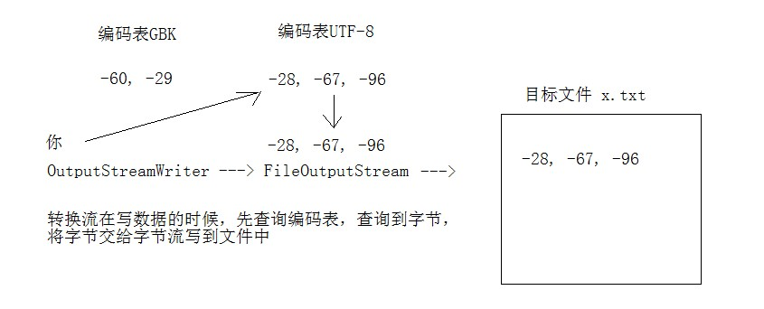
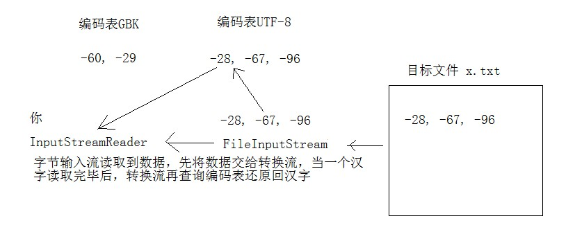

# day12【IO流】

## 今日内容

- 字符集
- 字符流
- 转换流
- 字符缓冲流
- 打印流
- 对象序列化
- commons-io

## 教学目标

- [ ] 能够说出常用的编码表
- [ ] 能够使用OutputStreamWriter写数据到文件
- [ ] 能够使用InputStreamReader读取数据
- [ ] 能够使用FileWirter写数据到文件
- [ ] 能够说出FileWriter中关闭和刷新方法的区别
- [ ] 能够使用FileWriter写数据实现换行和追加写
- [ ] 能够使用FileReader读数据
- [ ] 能够使用BufferedWriter写换行
- [ ] 能够使用BufferedReader读取文本行
- [ ] 能够说出打印流的特点

# 第一章 字符编码和字符集

## 1.1 字符编码

计算机中储存的信息都是用二进制数表示的，而我们在屏幕上看到的数字、英文、标点符号、汉字等字符是二进制数转换之后的结果。按照某种规则，将字符存储到计算机中，称为**编码** 。反之，将存储在计算机中的二进制数按照某种规则解析显示出来，称为**解码** 。比如说，按照A规则存储，同样按照A规则解析，那么就能显示正确的文本f符号。反之，按照A规则存储，再按照B规则解析，就会导致乱码现象。

编码: 字符转换为字节。

解码:字节转换为字符。

- **字符编码`Character Encoding`** : 就是一套自然语言的字符与二进制数之间的对应规则。

  生活中的文字和计算机文字的对应关系   a-->97-->0110 0001  

## 1.2 字符集

- **字符集 `Charset`**：也叫编码表。是一个系统支持的所有字符的集合，包括各国家文字、标点符号、图形符号、数字等。

计算机要准确的存储和识别各种字符集符号，需要进行字符编码，一套字符集必然至少有一套字符编码。常见字符集有ASCII字符集、GBK字符集、Unicode字符集等。


可见，当指定了**编码**，它所对应的**字符集**自然就指定了，所以**编码**才是我们最终要关心的。

- **ASCII字符集** ：
  - ASCII（American Standard Code for Information Interchange，美国信息交换标准代码）是基于拉丁字母的一套电脑编码系统，用于显示现代英语，主要包括控制字符（回车键、退格、换行键等）和可显示字符（英文大小写字符、阿拉伯数字和西文符号）。
  - 基本的ASCII字符集，使用7位（bits）表示一个字符，共128字符。ASCII的扩展字符集使用8位（bits）表示一个字符，共256字符，方便支持欧洲常用字符。
- **ISO-8859-1字符集**：
  - 拉丁码表，别名Latin-1，用于显示欧洲使用的语言，包括荷兰、丹麦、德语、意大利语、西班牙语等。
  - ISO-8859-1使用单字节编码，兼容ASCII编码。
- **GBxxx字符集**：
  - GB就是国标的意思，是为了显示中文而设计的一套字符集。
  - **GB2312**：简体中文码表。一个小于127的字符的意义与原来相同。但两个大于127的字符连在一起时，就表示一个汉字，这样大约可以组合了包含7000多个简体汉字，此外数学符号、罗马希腊的字母、日文的假名们都编进去了，连在ASCII里本来就有的数字、标点、字母都统统重新编了两个字节长的编码，这就是常说的"全角"字符，而原来在127号以下的那些就叫"半角"字符了。
  - **GBK**：最常用的中文码表。是在GB2312标准基础上的扩展规范，使用了双字节编码方案，共收录了21003个汉字，完全兼容GB2312标准，同时支持繁体汉字以及日韩汉字等。
    - 中文版操作系统使用的编码表就是GBK。
    - 中文汉字在2312和GBK编码表中均为两个字节表示，第一个字节为负数，第二个字节可能是负数也可能是正数。
  - **GB18030**：最新的中文码表。收录汉字70244个，采用多字节编码，每个字可以由1个、2个或4个字节组成。支持中国国内少数民族的文字，同时支持繁体汉字以及日韩汉字等。尚未正式启用。
- **Unicode字符集** ：
  - Unicode编码系统为表达任意语言的任意字符而设计，是业界的一种标准，也称为统一码、标准万国码。
  - 它最多使用4个字节的数字来表达每个字母、符号，或者文字。有三种编码实现方案，UTF-8、UTF-16和UTF-32。最为常用的UTF-8编码。
  - UTF-8编码，可以用来表示Unicode标准中任何字符，它是电子邮件、网页及其他存储或传送文字的应用中，优先采用的编码。互联网工程工作小组（IETF）要求所有互联网协议都必须支持UTF-8编码。所以，我们开发Web应用，也要使用UTF-8编码。它使用一至四个字节为每个字符编码，编码规则：
    1. 128个US-ASCII字符，只需一个字节编码。
    2. 拉丁文等字符，需要二个字节编码。 
    3. 大部分常用字（含中文），使用三个字节编码。
    4. 其他极少使用的Unicode辅助字符，使用四字节编码。
    5. UTF-8是变长编码表，汉字在UTF-8中均为负数。

## 1.3 String类getBytes()方法介绍

- byte[] getBytes() 使用平台的默认字符集将此 String编码为字节序列，将结果存储到新的字节数组中。 
  - 使用平台默认字符集，将字符串编码为字节数组。
  - 平台通常指的是操作系统平台，而中文版操作系统平台的默认字符集是GBK。

```java
public static void main(String[] args){
    byte[] bytes = "你".getBytes();
    System.out.println(Arrays.toString(bytes));
}
```

以上程序的执行结果为：[-28, -67, -96]，3个字节，而GBK字符集汉字占用2个字节，UTF-8字符集汉字占有3个字节。

**原因**：IDEA启动JVM的时候，添加了启动参数： java -Dfile.encoding=UTF-8，启动JVM的时候将默认的字符集设置为了UTF-8。

- byte[] getBytes(String charsetName )使用指定的字符集将此 String 编码为 byte 序列，并将结果存储到一个新的 byte 数组中。

```java
public static void main(String[] args)throws Exception{
    byte[]  bytes = "你".getBytes("UTF-8");
    System.out.println(Arrays.toString(bytes));

    bytes = "你".getBytes("GBK");
    System.out.println(Arrays.toString(bytes));

   /* bytes = "你".getBytes("UTF-16LE");
    System.out.println(Arrays.toString(bytes));

    bytes = "你".getBytes("UTF-16LE");
    System.out.println(Arrays.toString(bytes));    */  
}
```

**常用编码表**：GBK和UTF-8。

# 第二章 转换流

## 2.1 转换流OutputStreamWriter

`java.io.OutputStreamwriter`类，继承Writer类，他是字符输出流，只能操作文本文件，不能操作其他类型文件。OutputStreamwriter是字符流通向字节流的桥梁（字符流转成字节流），使用指定的字符集将字符编码为字节。它的字符集可以由名称指定，也可以接受平台的默认字符集。 



## 2.2 OutputStreamWriter常用方法

### 构造方法

- `OutputStreamWriter(OutputStream in)`: 创建一个使用默认字符集的字符流。 
- `OutputStreamWriter(OutputStream in, String charsetName)`: 创建一个指定字符集的字符流。

```java
OutputStreamWriter isr = new OutputStreamWriter(new FileOutputStream("out.txt"));
OutputStreamWriter isr2 = new OutputStreamWriter(new FileOutputStream("out.txt") , "GBK");
```

### 写出数据方法

- `void write(int c)`写出单个字符。
- `void write(char[] ch)`写出字符数组。
- `void write(char[] ch,int off,int len)`写出字符数组一部分，开始索引和写出的个数。
- `void write(String s)`写入字符串。
- `void flush()`刷新该流的缓冲，字符流写数据会先写在内存中，刷新后才会到达目的文件。

```java
 public static void main(String[] args) throws IOException {
     // 定义文件路径
     String FileName = "E:\\out.txt";
     // 创建流对象,默认UTF8编码
     OutputStreamWriter osw = new OutputStreamWriter(new FileOutputStream(FileName));
     // 写出数据
     osw.write("你好"); // 保存为6个字节
     osw.flush();
     osw.close();

    // 定义文件路径
    String FileName2 = "E:\\out2.txt";
    // 创建流对象,指定GBK编码
    OutputStreamWriter osw2 = new OutputStreamWriter(new FileOutputStream(FileName2),"GBK");
    // 写出数据
    osw2.write("你好");// 保存为4个字节
    osw2.flush();     
    osw2.close();
}
```

## 2.3 转换流InputStreamReader

`java.io.InputStreamReader`类，继承Reader类，他是字符输入流，只能操作文本文件，不能操作其他类型文件。InputStreamReader是字节流通向字符流的桥梁（字节流转成字符流），使用指定的字符集将字符编码为字节。它的字符集可以由名称指定，也可以接受平台的默认字符集。 



## 2.4 InputStreamReader常用方法

### 构造方法

- `InputStreamReader(InputStream in)`: 创建一个使用默认字符集的字符流。 
- `InputStreamReader(InputStream in, String charsetName)`: 创建一个指定字符集的字符流。

```java
InputStreamReader isr = new InputStreamReader(new FileInputStream("in.txt"));
InputStreamReader isr2 = new InputStreamReader(new FileInputStream("in.txt") , "GBK");
```

### 读取数据方法

- `int read()`读取单个字符，读取到文件末尾时返回-1。
- `int read(char[] ch)`读取字符存储到数组中个，返回读取到的字符个数，读取到文件末尾时返回-1。

```java
public static void main(String[] args) throws IOException {
    // 定义文件路径,文件为gbk编码
    String FileName = "E:\\file_gbk.txt";
    // 创建流对象,默认UTF8编码
    InputStreamReader isr = new InputStreamReader(new FileInputStream(FileName));
    // 创建流对象,指定GBK编码
    InputStreamReader isr2 = new InputStreamReader(new FileInputStream(FileName) , "GBK");
    // 定义变量,保存字符
    int read;
    // 使用默认编码字符流读取,乱码
    while ((read = isr.read()) != -1) {
    	System.out.print((char)read); 
    }
    isr.close();

    // 使用指定编码字符流读取,正常解析
    while ((read = isr2.read()) != -1) {
    	System.out.print((char)read);// 大家好
    }
    isr2.close();
}
```

# 第三章 字符流便捷类

## 3.1 概述

  使用转换流进行文本文件的读写可以进行编码表的设置，但是我们经常使用的是平台默认的编码表进行文本文件操作的，因此可以选择字符流的便捷类来使用。

- FileWriter继承OutputStreamWriter，使用平台默认编码表写出数据。

- FileReader继承InputStreamReader，使用平台默认编码表读取数据。

## 3.2 FileWriter类

### 构造方法

- `FileWriter(File file)`： 创建一个新的 FileWriter，给定要读取的File对象。   
- `FileWriter(String fileName)`： 创建一个新的 FileWriter，给定要读取的文件的名称。  

### 写出数据

```java
public static void main(String[] args) throws IOException {
    // 使用文件名称创建流对象
    FileWriter fw = new FileWriter("fw.txt");
    
    //写出单个字符
    fw.write(97),
    fw.flush();
    
    //写出字符数组
    char[] chs = "ABCDED".toCharArray();
    fw.write(chs);
    fw.flush();
    
    //写出字符数组的一部分，开始索引，写出个数
    fw.write(chs,1,3);
    fw.flush();
    
    //写出字符串
    fw.write("黑马程序员");
    fw.flush();
    fw.close();
}
```

**注意**：字符串输出数据，必须要使用flush()方法，否则数据在内存中，不会到达指定文件，close()方法在关闭前也会进行刷新，推荐写一次刷新一次，避免内存占用过多。

# 3.2 FileReader类

### 构造方法

- `FileWriter(File file)`： 创建一个新的 FileWriter，给定要读取的File对象。   
- `FileWriter(String fileName)`： 创建一个新的 FileWriter，给定要读取的文件的名称。  

### 读取数据

```java
 public static void main(String[] args) throws IOException {
     // 使用文件名称创建流对象
     FileReader fr = new FileReader("read.txt");
     // 定义变量，保存有效字符个数
     int len ；
     // 定义字符数组，作为装字符数据的容器
     char[] cbuf = new char[2];
     // 循环读取
     while ((len = fr.read(cbuf))!=-1) {
         System.out.println(new String(cbuf,0,len));
     }
     // 关闭资源
     fr.close();
 }
```

# 第四章 字符缓冲流

## 4.1 构造方法

- `public BufferedReader(Reader in)` ：创建一个 新的缓冲输入流。 
- `public BufferedWriter(Writer out)`： 创建一个新的缓冲输出流。

```java
// 创建字符缓冲输入流
BufferedReader br = new BufferedReader(new FileReader("br.txt"));
// 创建字符缓冲输出流
BufferedWriter bw = new BufferedWriter(new FileWriter("bw.txt"));
```

## 4.2 特有方法

字符缓冲流的基本方法与普通字符流调用方式一致，不再阐述，我们来看它们具备的特有方法。

- BufferedReader：`public String readLine()`: 读一行文字。 
- BufferedWriter：`public void newLine()`: 写一行行分隔符,由系统属性定义符号。 

## 4.3 newLine()方法写换行符

```java
public static void main(String[] args) throws IOException  {
    // 创建流对象
    BufferedWriter bw = new BufferedWriter(new FileWriter("out.txt"));
    // 写出数据
    bw.write("黑马");
    // 写出换行
    bw.newLine();
    bw.write("程序");
    bw.newLine();
    bw.write("员");
    bw.newLine();
    // 释放资源
    bw.close();
}
```

## 4.4 readLine()读取文本行

```java
public static void main(String[] args) throws IOException {
    // 创建流对象
    BufferedReader br = new BufferedReader(new FileReader("in.txt"));
    // 定义字符串,保存读取的一行文字
    String line  = null;
    // 循环读取,读取到最后返回null
    while ((line = br.readLine())!=null) {
    System.out.print(line);
    System.out.println("------");
    }
    // 释放资源
    br.close();
}
```

## 4.5 文本练习

请将文本信息恢复顺序。

```properties
3.侍中、侍郎郭攸之、费祎、董允等，此皆良实，志虑忠纯，是以先帝简拔以遗陛下。愚以为宫中之事，事无大小，悉以咨之，然后施行，必得裨补阙漏，有所广益。
8.愿陛下托臣以讨贼兴复之效，不效，则治臣之罪，以告先帝之灵。若无兴德之言，则责攸之、祎、允等之慢，以彰其咎；陛下亦宜自谋，以咨诹善道，察纳雅言，深追先帝遗诏，臣不胜受恩感激。
4.将军向宠，性行淑均，晓畅军事，试用之于昔日，先帝称之曰能，是以众议举宠为督。愚以为营中之事，悉以咨之，必能使行阵和睦，优劣得所。
2.宫中府中，俱为一体，陟罚臧否，不宜异同。若有作奸犯科及为忠善者，宜付有司论其刑赏，以昭陛下平明之理，不宜偏私，使内外异法也。
1.先帝创业未半而中道崩殂，今天下三分，益州疲弊，此诚危急存亡之秋也。然侍卫之臣不懈于内，忠志之士忘身于外者，盖追先帝之殊遇，欲报之于陛下也。诚宜开张圣听，以光先帝遗德，恢弘志士之气，不宜妄自菲薄，引喻失义，以塞忠谏之路也。
9.今当远离，临表涕零，不知所言。
6.臣本布衣，躬耕于南阳，苟全性命于乱世，不求闻达于诸侯。先帝不以臣卑鄙，猥自枉屈，三顾臣于草庐之中，咨臣以当世之事，由是感激，遂许先帝以驱驰。后值倾覆，受任于败军之际，奉命于危难之间，尔来二十有一年矣。
7.先帝知臣谨慎，故临崩寄臣以大事也。受命以来，夙夜忧叹，恐付托不效，以伤先帝之明，故五月渡泸，深入不毛。今南方已定，兵甲已足，当奖率三军，北定中原，庶竭驽钝，攘除奸凶，兴复汉室，还于旧都。此臣所以报先帝而忠陛下之职分也。至于斟酌损益，进尽忠言，则攸之、祎、允之任也。
5.亲贤臣，远小人，此先汉所以兴隆也；亲小人，远贤臣，此后汉所以倾颓也。先帝在时，每与臣论此事，未尝不叹息痛恨于桓、灵也。侍中、尚书、长史、参军，此悉贞良死节之臣，愿陛下亲之信之，则汉室之隆，可计日而待也。
```

### 案例分析

1. 使用流对象逐行读取原文本信息,把读取的信息保存到集合中。
2. 使用Collections集合工具类中的方法sort,对集合中的元素按照自定义规则排序。
3. 遍历集合,把集合中排序后的文本在写入到新的记事本中。

```java
public static void main(String[] args) throws IOException {
    //1.创建ArrayList集合,泛型使用String
    ArrayList<String> list = new ArrayList<>();
    //2.创建BufferedReader对象,构造方法中传递FileReader对象
    BufferedReader br = new BufferedReader(new FileReader("10_IO\\in.txt"));
    //3.创建BufferedWriter对象,构造方法中传递FileWriter对象
    BufferedWriter bw = new BufferedWriter(new FileWriter("10_IO\\out.txt"));
    //4.使用BufferedReader对象中的方法readLine,以行的方式读取文本
    String line = null;
    while((line = br.readLine())!=null){
    //5.把读取到的文本存储到ArrayList集合中
    	list.add(line);
    }
    //6.使用Collections集合工具类中的方法sort,对集合中的元素按照自定义规则排序
    Collections.sort(list, new Comparator<String>() {
        /*
        o1-o2:升序
        o2-o1:降序
        */
        @Override
        public int compare(String o1, String o2) {
        //依次比较集合中两个元素的首字母,升序排序
            return o1.charAt(0)-o2.charAt(0);
        }
    });
    //7.遍历ArrayList集合,获取每一个元素
    for (String s : list) {
    	//8.使用BufferedWriter对象中的方法wirte,把遍历得到的元素写入到文本中(内存缓冲区中)
    	bw.write(s);
    	//9.写换行
    	bw.newLine();
        bw.flush();
    }
    //10.释放资源
    bw.close();
    br.close();
}
```

# 第五章 打印流

## 5.1 概述

打印流是专门负责数据输出打印的流对象，我们经常使用的控制台输出语句`System.out.println()`，就是打印流实现的输出。`System.out`的运行结果就是PrintStream打印流对象。

- PrintStream继承OutputStream，本质上是字节输出流。
- PrintWriter继承Writer，本质上是字符输出流。

打印流的特点：

- 打印流指负责输出数据，不负责数据来源。
- 打印流永远不会抛出IOException。
- 使用PrintWriter打印流，可以开启自动刷新功能。
  - 调用println，printf，format三个方法中的一个才能自动刷新。

## 5.2 PrintWriter类

- `public PrintWriter(String fileName)  `： 使用指定的文件名创建一个新的打印流。
- `public PrintWriter(OutputStream out)`：使用指定的字节输出流构造打印流。
- `public PrintWriter(Writer writer)`：使用指定的字符输出流构造打印流。

```java
public static void main(String[] args) throws IOException {

    // 创建打印流,输出目的是字节输出流
    //PrintWriter pw = new PrintWriter(new FileOutputStream("a.txt"),true);
    //创建打印流,输出目的是字符
    PrintWriter pw = new PrintWriter(new FileWriter("a.txt"),true);
	pw.println(97);
    pw.println(98);
	pw.close();
}
```

**注意**：打印流输出数据是原样输出，打印97，结果看到就是97，而不是a。

# 第六章 对象序列化

## 6.1 概述

Java 提供了一种对象**序列化**的机制。用一个字节序列可以表示一个对象，该字节序列包含该`对象的数据`、`对象的类型`和`对象中存储的属性`等信息。字节序列写出到文件之后，相当于文件中**持久保存**了一个对象的信息。 

反之，该字节序列还可以从文件中读取回来，重构对象，对它进行**反序列化**。`对象的数据`、`对象的类型`和`对象中存储的数据`信息，都可以用来在内存中创建对象。

## 6.2 ObjectOutputStream类

`java.io.ObjectOutputStream ` 类，将Java对象的原始数据类型写出到文件,实现对象的持久存储。

### 构造方法

- `public ObjectOutputStream(OutputStream out) `： 创建一个指定OutputStream的ObjectOutputStream。

构造举例，代码如下：  

```java
FileOutputStream fileOut = new FileOutputStream("employee.txt");
ObjectOutputStream out = new ObjectOutputStream(fileOut);
```

### 序列化操作

- 一个对象要想序列化，必须满足两个条件:

- 该类必须实现`java.io.Serializable ` 接口，`Serializable` 是一个标记接口，不实现此接口的类将不会使任何状态序列化或反序列化，会抛出`NotSerializableException` 。
- 该类的所有属性必须是可序列化的。如果有一个属性不需要可序列化的，则该属性必须注明是瞬态(只是使用,不必存储进序列)的，使用`transient` 关键字修饰。

```java
public class Employee implements java.io.Serializable {
    public String name;
    public String address;
    public transient int age; // transient瞬态修饰成员,不会被序列化
    public void addressCheck() {
      	System.out.println("Address  check : " + name + " -- " + address);
    }
}
```

- `public final void writeObject (Object obj)` : 将指定的对象写出。

```java
public static void main(String [] args)   {
    Employee e = new Employee();
    e.name = "zhangsan";
    e.address = "beiqinglu";
    e.age = 20; 
    try {
        // 创建序列化流对象
        ObjectOutputStream out = new ObjectOutputStream(new FileOutputStream("employee.txt"));
        // 写出对象
        out.writeObject(e);
        // 释放资源
        out.close();
        fileOut.close();
    	System.out.println("Serialized data is saved"); // 姓名，地址被序列化，年龄没有被序列化。
    } catch(IOException i)   {
    	i.printStackTrace();
    }
}
```

## 6.3 ObjectInputStream类

ObjectInputStream反序列化流，将之前使用ObjectOutputStream序列化的原始数据恢复为对象。 

### 构造方法

- `public ObjectInputStream(InputStream in) `： 创建一个指定InputStream的ObjectInputStream。

### 反序列化操作1

如果能找到一个对象的class文件，我们可以进行反序列化操作，调用`ObjectInputStream`读取对象的方法：

- `public final Object readObject ()` : 读取一个对象。

```java
public static void main(String [] args)   {
    Employee e = null;
    try {		
        // 创建反序列化流
        FileInputStream fileIn = new FileInputStream("employee.txt");
        ObjectInputStream in = new ObjectInputStream(fileIn);
        // 读取一个对象
        e = (Employee) in.readObject();
        // 释放资源
        in.close();
        fileIn.close();
    }catch(IOException i) {
        // 捕获其他异常
        i.printStackTrace();
        return;
    }catch(ClassNotFoundException c)  {
        // 捕获类找不到异常
        System.out.println("Employee class not found");
        c.printStackTrace();
        return;
    }
    // 无异常,直接打印输出
    System.out.println("Name: " + e.name);	// zhangsan
    System.out.println("Address: " + e.address); // beiqinglu
    System.out.println("age: " + e.age); // 0
}
```

**对于JVM可以反序列化对象，它必须是能够找到class文件的类。如果找不到该类的class文件，则抛出一个 `ClassNotFoundException` 异常。**  

### **反序列化操作2**

**另外，当JVM反序列化对象时，能找到class文件，但是class文件在序列化对象之后发生了修改，那么反序列化操作也会失败，抛出一个`InvalidClassException`异常。**发生这个异常的原因如下：

- 该类的序列版本号与从流中读取的类描述符的版本号不匹配 
- 该类包含未知数据类型 
- 该类没有可访问的无参数构造方法 

`Serializable` 接口给需要序列化的类，提供了一个序列版本号。`serialVersionUID` 该版本号的目的在于验证序列化的对象和对应类是否版本匹配。

```java
public class Employee implements java.io.Serializable {
     // 加入序列版本号
     private static final long serialVersionUID = 1L;
     public String name;
     public String address;
     // 添加新的属性 ,重新编译, 可以反序列化,该属性赋为默认值.
     public int eid; 

     public void addressCheck() {
         System.out.println("Address  check : " + name + " -- " + address);
     }
}
```

# 第七章 Commons IO

## 7.1 Commons IO介绍

IO技术开发中，代码量很大，而且代码的重复率较高。如果我们要遍历目录，拷贝目录就需要使用方法的递归调用，也增大了程序的复杂度。

Apache软件基金会，开发了IO技术的工具类`commonsIO`，大大简化IO开发。

## 7.2 添加第三方jar包

Apahce软件基金会属于第三方，（Oracle公司第一方法，我们自己第二方吗，其他都是第三方）我们要使用第三方开发好的工具，需要添加jar包。

jar包：就是Java自己的压缩包，包中是开发好的功能，全部以class文件形态出现，我们添加直接使用即可。

- 在module下创建文件夹lib
- 将jar包文件复制到lib文件夹中
- lib文件夹上按鼠标右键，选择`Add as Library`
  - level选项：选择module

## 7.3 CommonsIO的使用

- IOUtils类
  - 静态方法：IOUtils.copy(InputStream in,OutputStream out)传递字节流，实现文件复制。
  - 静态方法：IOUtils.closeQuietly(任意流对象)悄悄的释放资源，自动处理close()方法抛出的异常。
- FileUtils类
  - 静态方法：FileUtils.copyDirectoryToDirectory(File src,File dest);传递File类型的目录，进行整个目录的复制，自动进行递归遍历。
  - 静态方法：writeStringToFile(File file,String str)写字符串到文本文件中。
  - 静态方法：readFileToString(File file)读取文本文件，返回字符串。