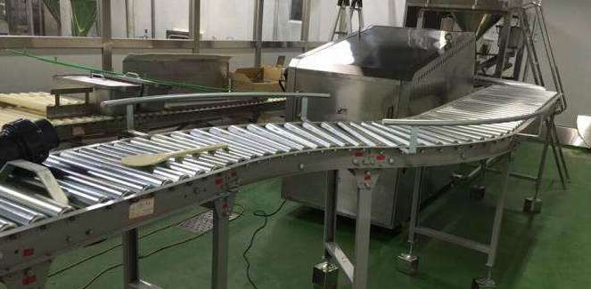

# day13 JDK8新特性【Lambda、函数式接口、Stream流】

## 主要内容

*   Properties集合
*   Lambda表达式
*   函数式接口
*   Stream流

## 教学目标

- [ ] 能够理解函数式编程相对于面向对象的优点
- [ ] 能够掌握Lambda表达式的标准格式
- [ ] 能够掌握Lambda表达式的省略格式与规则
- [ ] 能够使用Consumer<T>函数式接口
- [ ] 能够使用Predicate<T>函数式接口
- [ ] 能够理解流与集合相比的优点
- [ ]  能够掌握常用的流操作

# 第一章 Properties集合

## 1.1 概述

`java.util.Properties ` 继承于` Hashtable` ，来表示一个持久的属性集。它使用键值结构存储数据，每个键及其对应值都是一个字符串。该类也被许多Java类使用，比如获取系统属性时，`System.getProperties` 方法就是返回一个`Properties`对象。

## 1.2 Properties类

### 构造方法

- `public Properties()` :创建一个空的属性列表。

### 与流相关的方法

- `public void load(InputStream inStream)`： 从字节输入流中读取键值对。 
- `public void load(Reader reader)`： 从字符输入流中读取键值对。 

参数中使用了字节输入流，通过流对象，可以关联到某文件上，这样就能够加载文本中的数据了。文本数据格式:

```properties
filename=a.txt
length=209385038
location=D:\a.txt
```

加载代码演示：

```java
public static void main(String[] args) throws FileNotFoundException {
    // 创建属性集对象
    Properties pro = new Properties();
    // 加载文本中信息到属性集
    pro.load(new FileInputStream("read.txt"));
    // 遍历集合并打印
    Set<String> strings = pro.stringPropertyNames();
    for (String key : strings ) {
    	System.out.println(key+" -- "+pro.getProperty(key));
    }
}
```


# 第二章  Lambda表达式

## 2.1 函数式编程思想概述


在数学中，**函数**就是有输入量、输出量的一套计算方案，也就是“拿什么东西做什么事情”。相对而言，面向对象过分强调“必须通过对象的形式来做事情”，而函数式思想则尽量忽略面向对象的复杂语法——**强调做什么，而不是以什么形式做**。

**做什么，而不是怎么做**

我们真的希望创建一个匿名内部类对象吗？不。我们只是为了做这件事情而**不得不**创建一个对象。我们真正希望做的事情是：将`run`方法体内的代码传递给`Thread`类知晓。

**传递一段代码**——这才是我们真正的目的。而创建对象只是受限于面向对象语法而不得不采取的一种手段方式。那，有没有更加简单的办法？如果我们将关注点从“怎么做”回归到“做什么”的本质上，就会发现只要能够更好地达到目的，过程与形式其实并不重要。

## 2.2 Lambda的优化

当需要启动一个线程去完成任务时，通常会通过`java.lang.Runnable`接口来定义任务内容，并使用`java.lang.Thread`类来启动该线程。

**传统写法,代码如下：**

```java
public class Demo03Thread {
	public static void main(String[] args) {
		new Thread(new Runnable() {
			@Override
			public void run() {
				System.out.println("多线程任务执行！");
			}
		}).start();
	}
}
```

本着“一切皆对象”的思想，这种做法是无可厚非的：首先创建一个`Runnable`接口的匿名内部类对象来指定任务内容，再将其交给一个线程来启动。

**代码分析:**

对于`Runnable`的匿名内部类用法，可以分析出几点内容：

- `Thread`类需要`Runnable`接口作为参数，其中的抽象`run`方法是用来指定线程任务内容的核心；
- 为了指定`run`的方法体，**不得不**需要`Runnable`接口的实现类；
- 为了省去定义一个`RunnableImpl`实现类的麻烦，**不得不**使用匿名内部类；
- 必须覆盖重写抽象`run`方法，所以方法名称、方法参数、方法返回值**不得不**再写一遍，且不能写错；
- 而实际上，**似乎只有方法体才是关键所在**。


**Lambda表达式写法,代码如下：**

借助Java 8的全新语法，上述`Runnable`接口的匿名内部类写法可以通过更简单的Lambda表达式达到等效：

```java
public class Demo04LambdaRunnable {
	public static void main(String[] args) {
		new Thread(() -> System.out.println("多线程任务执行！")).start(); // 启动线程
	}
}
```

这段代码和刚才的执行效果是完全一样的，可以在1.8或更高的编译级别下通过。从代码的语义中可以看出：我们启动了一个线程，而线程任务的内容以一种更加简洁的形式被指定。

不再有“不得不创建接口对象”的束缚，不再有“抽象方法覆盖重写”的负担，就是这么简单！

## 2.3 Lambda的格式

### 标准格式:

Lambda省去面向对象的条条框框，格式由**3个部分**组成：

* 一些参数
* 一个箭头
* 一段代码

Lambda表达式的**标准格式**为：

```
(参数类型 参数名称) -> { 代码语句 }
```

**格式说明：**

* 小括号内的语法与传统方法参数列表一致：无参数则留空；多个参数则用逗号分隔。
* `->`是新引入的语法格式，代表指向动作。
* 大括号内的语法与传统方法体要求基本一致。

**匿名内部类与lambda对比:**

```java
new Thread(new Runnable() {
			@Override
			public void run() {
				System.out.println("多线程任务执行！");
			}
}).start();
```

仔细分析该代码中，`Runnable`接口只有一个`run`方法的定义：

- `public abstract void run();`

即制定了一种做事情的方案（其实就是一个方法）：

- **无参数**：不需要任何条件即可执行该方案。
- **无返回值**：该方案不产生任何结果。
- **代码块**（方法体）：该方案的具体执行步骤。

同样的语义体现在`Lambda`语法中，要更加简单：

```java
() -> System.out.println("多线程任务执行！")
```

- 前面的一对小括号即`run`方法的参数（无），代表不需要任何条件；
- 中间的一个箭头代表将前面的参数传递给后面的代码；
- 后面的输出语句即业务逻辑代码。

### 参数和返回值:

下面举例演示`java.util.Comparator<T>`接口的使用场景代码，其中的抽象方法定义为：

* `public abstract int compare(T o1, T o2);`

当需要对一个对象数组进行排序时，`Arrays.sort`方法需要一个`Comparator`接口实例来指定排序的规则。假设有一个`Person`类，含有`String name`和`int age`两个成员变量：

```java
public class Person { 
    private String name;
    private int age;
    
    // 省略构造器、toString方法与Getter Setter 
}
```

**传统写法**

如果使用传统的代码对`Person[]`数组进行排序，写法如下：

```java
public class Demo05Comparator {
    public static void main(String[] args) {
      	// 本来年龄乱序的对象数组
        Person[] array = { new Person("古力娜扎", 19),        	new Person("迪丽热巴", 18),       		new Person("马尔扎哈", 20) };

      	// 匿名内部类
        Comparator<Person> comp = new Comparator<Person>() {
            @Override
            public int compare(Person o1, Person o2) {
                return o1.getAge() - o2.getAge();
            }
        };
        Arrays.sort(array, comp); // 第二个参数为排序规则，即Comparator接口实例

        for (Person person : array) {
            System.out.println(person);
        }
    }
}
```

这种做法在面向对象的思想中，似乎也是“理所当然”的。其中`Comparator`接口的实例（使用了匿名内部类）代表了“按照年龄从小到大”的排序规则。

**代码分析**

下面我们来搞清楚上述代码真正要做什么事情。

- 为了排序，`Arrays.sort`方法需要排序规则，即`Comparator`接口的实例，抽象方法`compare`是关键；
- 为了指定`compare`的方法体，**不得不**需要`Comparator`接口的实现类；
- 为了省去定义一个`ComparatorImpl`实现类的麻烦，**不得不**使用匿名内部类；
- 必须覆盖重写抽象`compare`方法，所以方法名称、方法参数、方法返回值**不得不**再写一遍，且不能写错；
- 实际上，**只有参数和方法体才是关键**。

**Lambda写法**

```java
public class Demo06ComparatorLambda {
    public static void main(String[] args) {
        Person[] array = {
          	new Person("古力娜扎", 19),
          	new Person("迪丽热巴", 18),
          	new Person("马尔扎哈", 20) };

        Arrays.sort(array, (Person a, Person b) -> {
          	return a.getAge() - b.getAge();
        });

        for (Person person : array) {
            System.out.println(person);
        }
    }
}
```

### 省略格式:

**省略规则**

在Lambda标准格式的基础上，使用省略写法的规则为：

1. 小括号内参数的类型可以省略；
2. 如果小括号内**有且仅有一个参**，则小括号可以省略；
3. 如果大括号内**有且仅有一个语句**，则无论是否有返回值，都可以省略大括号、return关键字及语句分号。

> 备注：掌握这些省略规则后，请对应地回顾本章开头的多线程案例。

**可推导即可省略**

Lambda强调的是“做什么”而不是“怎么做”，所以凡是可以推导得知的信息，都可以省略。例如上例还可以使用Lambda的省略写法：

```java
Runnable接口简化:
1. () -> System.out.println("多线程任务执行！")
Comparator接口简化:
2. Arrays.sort(array, (a, b) -> a.getAge() - b.getAge());
```

## 2.4 Lambda的前提条件

Lambda的语法非常简洁，完全没有面向对象复杂的束缚。但是使用时有几个问题需要特别注意：

1. 使用Lambda必须具有接口，且要求**接口中有且仅有一个抽象方法**。
   无论是JDK内置的`Runnable`、`Comparator`接口还是自定义的接口，只有当接口中的抽象方法存在且唯一时，才可以使用Lambda。
2. 使用Lambda必须具有接口作为方法参数。
   也就是方法的参数或局部变量类型必须为Lambda对应的接口类型，才能使用Lambda作为该接口的实例。

> 备注：有且仅有一个抽象方法的接口，称为“**函数式接口**”。

# 第三章 函数式接口

## 3.1 概述

函数式接口在Java中是指：**有且仅有一个抽象方法的接口**。

函数式接口，即适用于函数式编程场景的接口。而Java中的函数式编程体现就是Lambda，所以函数式接口就是可以适用于Lambda使用的接口。只有确保接口中有且仅有一个抽象方法，Java中的Lambda才能顺利地进行推导。

> 备注:从应用层面来讲，Java中的Lambda可以看做是匿名内部类的简化格式，但是二者在原理上不同。

### 格式

只要确保接口中有且仅有一个抽象方法即可：

```java
修饰符 interface 接口名称 {
    public abstract 返回值类型 方法名称(可选参数信息);
    // 其他非抽象方法内容
}
```

由于接口当中抽象方法的`public abstract`是可以省略的，所以定义一个函数式接口很简单：

```java
public interface MyFunctionalInterface {	
	void myMethod();
}
```

### FunctionalInterface注解

与`@Override`注解的作用类似，Java 8中专门为函数式接口引入了一个新的注解：`@FunctionalInterface`。该注解可用于一个接口的定义上：

```java
@FunctionalInterface
public interface MyFunctionalInterface {
	void myMethod();
}
```

一旦使用该注解来定义接口，编译器将会强制检查该接口是否确实有且仅有一个抽象方法，否则将会报错。不过，即使不使用该注解，只要满足函数式接口的定义，这仍然是一个函数式接口，使用起来都一样。

## 3.2 常用函数式接口

JDK提供了大量常用的函数式接口以丰富Lambda的典型使用场景，它们主要在`java.util.function`包中被提供。前文的`MySupplier`接口就是在模拟一个函数式接口：`java.util.function.Supplier<T>`。其实还有很多，下面是最简单的几个接口及使用示例。

### Supplier接口

`java.util.function.Supplier<T>`接口，它意味着"供给" , 对应的Lambda表达式需要“**对外提供**”一个符合泛型类型的对象数据。

**抽象方法 : get** 

仅包含一个无参的方法：`T get()`。用来获取一个泛型参数指定类型的对象数据。

```java
public class Demo08Supplier {
    private static String getString(Supplier<String> function) {
      	return function.get();
    }

    public static void main(String[] args) {
        String msgA = "Hello";
        String msgB = "World";
        System.out.println(getString(() -> msgA + msgB));
    }
}
```

**求数组元素最大值**

使用`Supplier`接口作为方法参数类型，通过Lambda表达式求出int数组中的最大值。提示：接口的泛型请使用`java.lang.Integer`类。

**代码示例:**

```java
public class DemoIntArray {
    public static void main(String[] args) {
        int[] array = { 10, 20, 100, 30, 40, 50 };
        printMax(() -> {
            int max = array[0];
            for (int i = 1; i < array.length; i++) {
                if (array[i] > max) {              
                  	max = array[i];
                }
            }
            return max;
        });
    }

    private static void printMax(Supplier<Integer> supplier) {
        int max = supplier.get();
        System.out.println(max);
    }
}
```

### Consumer接口

`java.util.function.Consumer<T>`接口则正好相反，它不是生产一个数据，而是**消费**一个数据，其数据类型由泛型参数决定。

**抽象方法：accept**

`Consumer`接口中包含抽象方法`void accept(T t)`，意为消费一个指定泛型的数据。基本使用如：

```java
import java.util.function.Consumer;

public class Demo09Consumer {
    private static void consumeString(Consumer<String> function , String str) {
      	function.accept(str);
    }

    public static void main(String[] args) {
        consumeString(s -> System.out.println(s));
      
    }
}
```

### Function接口

`java.util.function.Function<T,R>`接口用来根据一个类型的数据得到另一个类型的数据，前者称为前置条件，后者称为后置条件。有进有出，所以称为“函数Function”。

**抽象方法：apply**

`Function`接口中最主要的抽象方法为：`R apply(T t)`，根据类型T的参数获取类型R的结果。使用的场景例如：将`String`类型转换为`Integer`类型。

```java
public class Demo11FunctionApply {
    private static void method(Function<String, Integer> function, Str str) {
        int num = function.apply(str);
        System.out.println(num + 20);
    }

    public static void main(String[] args) {
        method(s -> Integer.parseInt(s) , "10");
    }
}
```

### Predicate接口

有时候我们需要对某种类型的数据进行判断，从而得到一个boolean值结果。这时可以使用`java.util.function.Predicate<T>`接口。

**抽象方法：test**

`Predicate`接口中包含一个抽象方法：`boolean test(T t)`。用于条件判断的场景，条件判断的标准是传入的Lambda表达式逻辑，只要字符串长度大于5则认为很长。

```java
public class Demo15PredicateTest {
    private static void method(Predicate<String> predicate,String str) {
        boolean veryLong = predicate.test(str);
        System.out.println("字符串很长吗：" + veryLong);
    }

    public static void main(String[] args) {
        method(s -> s.length() > 5, "HelloWorld");
    }
}
```

# 第四章 Stream流

在Java 8中，得益于Lambda所带来的函数式编程，引入了一个**全新的Stream概念**，用于解决已有集合类库既有的弊端。

## 4.1 引言

**传统集合的多步遍历代码**

几乎所有的集合（如`Collection`接口或`Map`接口等）都支持直接或间接的遍历操作。而当我们需要对集合中的元素进行操作的时候，除了必需的添加、删除、获取外，最典型的就是集合遍历。例如：

```java
public class Demo10ForEach {
    public static void main(String[] args) {
        List<String> list = new ArrayList<>();
        list.add("张无忌");
        list.add("周芷若");
        list.add("赵敏");
        list.add("张强");
        list.add("张三丰");
        for (String name : list) {
          	System.out.println(name);
        }
    }  
}
```

这是一段非常简单的集合遍历操作：对集合中的每一个字符串都进行打印输出操作。

**循环遍历的弊端**

Java 8的Lambda让我们可以更加专注于**做什么**（What），而不是**怎么做**（How），这点此前已经结合内部类进行了对比说明。现在，我们仔细体会一下上例代码，可以发现：

- for循环的语法就是“**怎么做**”
- for循环的循环体才是“**做什么**”

为什么使用循环？因为要进行遍历。但循环是遍历的唯一方式吗？遍历是指每一个元素逐一进行处理，**而并不是从第一个到最后一个顺次处理的循环**。前者是目的，后者是方式。

试想一下，如果希望对集合中的元素进行筛选过滤：

1. 将集合A根据条件一过滤为**子集B**；
2. 然后再根据条件二过滤为**子集C**。

那怎么办？在Java 8之前的做法可能为：

这段代码中含有三个循环，每一个作用不同：

1. 首先筛选所有姓张的人；
2. 然后筛选名字有三个字的人；
3. 最后进行对结果进行打印输出。

```java
public class Demo11NormalFilter {
  	public static void main(String[] args) {
      	List<String> list = new ArrayList<>();
        list.add("张无忌");
        list.add("周芷若");
        list.add("赵敏");
        list.add("张强");
        list.add("张三丰");

        List<String> zhangList = new ArrayList<>();
        for (String name : list) {
            if (name.startsWith("张")) {
              	zhangList.add(name);
            }
        }

        List<String> shortList = new ArrayList<>();
        for (String name : zhangList) {
            if (name.length() == 3) {
              	shortList.add(name);
            }
        }

        for (String name : shortList) {
          	System.out.println(name);
        }
    }
}
```

每当我们需要对集合中的元素进行操作的时候，总是需要进行循环、循环、再循环。这是理所当然的么？**不是。**循环是做事情的方式，而不是目的。另一方面，使用线性循环就意味着只能遍历一次。如果希望再次遍历，只能再使用另一个循环从头开始。

那，Lambda的衍生物Stream能给我们带来怎样更加优雅的写法呢？

**Stream的更优写法**

下面来看一下借助Java 8的Stream API，什么才叫优雅：

```java
public class Demo12StreamFilter {
    public static void main(String[] args) {
        List<String> list = new ArrayList<>();
        list.add("张无忌");
        list.add("周芷若");
        list.add("赵敏");
        list.add("张强");
        list.add("张三丰");

        list.stream()
          	.filter(s -> s.startsWith("张"))
            .filter(s -> s.length() == 3)
            .forEach(s -> System.out.println(s));
    }
}
```

直接阅读代码的字面意思即可完美展示无关逻辑方式的语义：**获取流、过滤姓张、过滤长度为3、逐一打印**。代码中并没有体现使用线性循环或是其他任何算法进行遍历，我们真正要做的事情内容被更好地体现在代码中。

## 4.2 流式思想概述

**注意：请暂时忘记对传统IO流的固有印象！**

整体来看，流式思想类似于工厂车间的“**生产流水线**”。



当需要对多个元素进行操作（特别是多步操作）的时候，考虑到性能及便利性，我们应该首先拼好一个“模型”步骤方案，然后再按照方案去执行它。

s

这张图中展示了过滤、映射、跳过、计数等多步操作，这是一种集合元素的处理方案，而方案就是一种“函数模型”。图中的每一个方框都是一个“流”，调用指定的方法，可以从一个流模型转换为另一个流模型。而最右侧的数字3是最终结果。

## 4.3 获取流方式

`java.util.stream.Stream<T>`是Java 8新加入的最常用的流接口。（这并不是一个函数式接口。）

获取一个流非常简单，有以下几种常用的方式：

- 所有的`Collection`集合都可以通过`stream`默认方法获取流；
- `Stream`接口的静态方法`of`可以获取数组对应的流。

**方式1 : 根据Collection获取流**

首先，`java.util.Collection`接口中加入了default方法`stream`用来获取流，所以其所有实现类均可获取流。

```java
import java.util.*;
import java.util.stream.Stream;
/*
    获取Stream流的方式

    1.Collection中 方法
        Stream stream()
    2.Stream接口 中静态方法
        of(T...t) 向Stream中添加多个数据
 */
public class Demo13GetStream {
    public static void main(String[] args) {
        List<String> list = new ArrayList<>();
        // ...
        Stream<String> stream1 = list.stream();

        Set<String> set = new HashSet<>();
        // ...
        Stream<String> stream2 = set.stream();
    }
}
```


**方式2: 根据数组获取流**

如果使用的不是集合或映射而是数组，由于数组对象不可能添加默认方法，所以`Stream`接口中提供了静态方法`of`，使用很简单：

```java
import java.util.stream.Stream;

public class Demo14GetStream {
    public static void main(String[] args) {
        String[] array = { "张无忌", "张翠山", "张三丰", "张一元" };
        Stream<String> stream = Stream.of(array);
    }
}
```

> 备注：`of`方法的参数其实是一个可变参数，所以支持数组。

## 4.4 常用方法

流模型的操作很丰富，这里介绍一些常用的API。这些方法可以被分成两种：

- **终结方法**：返回值类型不再是`Stream`接口自身类型的方法，因此不再支持类似`StringBuilder`那样的链式调用。本小节中，终结方法包括`count`和`forEach`方法。
- **非终结方法**：返回值类型仍然是`Stream`接口自身类型的方法，因此支持链式调用。（除了终结方法外，其余方法均为非终结方法。）

> 备注：本小节之外的更多方法，请自行参考API文档。

### forEach : 逐一处理

虽然方法名字叫`forEach`，但是与for循环中的“for-each”昵称不同

```java
void forEach(Consumer<? super T> action);
```

该方法接收一个`Consumer`接口函数，会将每一个流元素交给该函数进行处理。例如：

```java
import java.util.stream.Stream;

public class Demo15StreamForEach {
    public static void main(String[] args) {
        Stream<String> stream =  Stream.of("大娃","二娃","三娃","四娃","五娃","六娃","七娃","爷爷","蛇精","蝎子精");
        //Stream<String> stream = Stream.of("张无忌", "张三丰", "周芷若");
        stream.forEach((String str)->{System.out.println(str);});
    }
}
```

在这里，lambda表达式`(String str)->{System.out.println(str);}`就是一个Consumer函数式接口的示例。

### filter：过滤

可以通过`filter`方法将一个流转换成另一个子集流。方法声明：

```java
Stream<T> filter(Predicate<? super T> predicate);
```

该接口接收一个`Predicate`函数式接口参数（可以是一个Lambda）作为筛选条件。

**基本使用**

Stream流中的`filter`方法基本使用的代码如：

```java
public class Demo16StreamFilter {
    public static void main(String[] args) {
        Stream<String> original = Stream.of("张无忌", "张三丰", "周芷若");
        Stream<String> result = original.filter((String s) -> {return s.startsWith("张");});
    }
}
```

在这里通过Lambda表达式来指定了筛选的条件：必须姓张。

### count：统计个数

正如旧集合`Collection`当中的`size`方法一样，流提供`count`方法来数一数其中的元素个数：

```java
long count();
```

该方法返回一个long值代表元素个数（不再像旧集合那样是int值）。基本使用：

```java
public class Demo17StreamCount {
    public static void main(String[] args) {
        Stream<String> original = Stream.of("张无忌", "张三丰", "周芷若");
        Stream<String> result = original.filter(s -> s.startsWith("张"));
        System.out.println(result.count()); // 2
    }
}
```

### limit：取用前几个

`limit`方法可以对流进行截取，只取用前n个。方法签名：

```java
Stream<T> limit(long maxSize):获取Stream流对象中的前n个元素,返回一个新的Stream流对象
```

参数是一个long型，如果集合当前长度大于参数则进行截取；否则不进行操作。基本使用：

```java
import java.util.stream.Stream;
public class Demo18StreamLimit {
    public static void main(String[] args) {
        Stream<String> original = Stream.of("张无忌", "张三丰", "周芷若");
        Stream<String> result = original.limit(2);
        System.out.println(result.count()); // 2
    }
}
```

### skip：跳过前几个

如果希望跳过前几个元素，可以使用`skip`方法获取一个截取之后的新流：

```java
Stream<T> skip(long n): 跳过Stream流对象中的前n个元素,返回一个新的Stream流对象
```

如果流的当前长度大于n，则跳过前n个；否则将会得到一个长度为0的空流。基本使用：

```java
import java.util.stream.Stream;

public class Demo19StreamSkip {
    public static void main(String[] args) {
        Stream<String> original = Stream.of("张无忌", "张三丰", "周芷若");
        Stream<String> result = original.skip(2);
        System.out.println(result.count()); // 1
    }
}
```

### concat：组合

如果有两个流，希望合并成为一个流，那么可以使用`Stream`接口的静态方法`concat`：

```java
static <T> Stream<T> concat(Stream<? extends T> a, Stream<? extends T> b): 把参数列表中的两个Stream流对象a和b,合并成一个新的Stream流对象
```

> 备注：这是一个静态方法，与`java.lang.String`当中的`concat`方法是不同的。

该方法的基本使用代码如：

```java
import java.util.stream.Stream;

public class Demo20StreamConcat {
    public static void main(String[] args) {
        Stream<String> streamA = Stream.of("张无忌");
        Stream<String> streamB = Stream.of("张翠山");
        Stream<String> result = Stream.concat(streamA, streamB);
    }
}
```

### collect：流转集合

从Stream流对象转成集合对象，使用`Stream`接口方法`collect:`

```java
public static void main(String[] args) {
    Stream stream = Stream.of("aa","bb","cc","dd","ee","ee");
    Set<String> list = ( Set<String> )stream.collect(Collectors.toSet());
    for (String s :list){
        System.out.println(s);
    }
}
```

## 4.5 Stream综合案例

现在有两个`ArrayList`集合存储队伍当中的多个成员姓名，要求使用传统的for循环（或增强for循环）**依次**进行以下若干操作步骤：

1. 第一个队伍只要名字为3个字的成员姓名；
2. 第一个队伍筛选之后只要前3个人；
3. 第二个队伍只要姓张的成员姓名；
4. 第二个队伍筛选之后不要前2个人；
5. 将两个队伍合并为一个队伍；
6. 打印整个队伍的姓名信息。

两个队伍（集合）的代码如下：

```java
public class Demo21ArrayListNames {
    public static void main(String[] args) {
        List<String> one = new ArrayList<>();
        one.add("迪丽热巴");
        one.add("宋远桥");
        one.add("苏星河");
        one.add("老子");
        one.add("庄子");
        one.add("孙子");
        one.add("洪七公");

        List<String> two = new ArrayList<>();
        two.add("古力娜扎");
        two.add("张无忌");
        two.add("张三丰");
        two.add("赵丽颖");
        two.add("张二狗");
        two.add("张天爱");
        two.add("张三");
		// ....
    }
}
```


**传统方式** 

使用for循环 , 示例代码:

```java
public class Demo22ArrayListNames {
    public static void main(String[] args) {
        List<String> one = new ArrayList<>();
        // ...

        List<String> two = new ArrayList<>();
        // ...

        // 第一个队伍只要名字为3个字的成员姓名；
        List<String> oneA = new ArrayList<>();
        for (String name : one) {
            if (name.length() == 3) {
                oneA.add(name);
            }
        }

        // 第一个队伍筛选之后只要前3个人；
        List<String> oneB = new ArrayList<>();
        for (int i = 0; i < 3; i++) {
            oneB.add(oneA.get(i));
        }

        // 第二个队伍只要姓张的成员姓名；
        List<String> twoA = new ArrayList<>();
        for (String name : two) {
            if (name.startsWith("张")) {
                twoA.add(name);
            }
        }

        // 第二个队伍筛选之后不要前2个人；
        List<String> twoB = new ArrayList<>();
        for (int i = 2; i < twoA.size(); i++) {
            twoB.add(twoA.get(i));
        }

        // 将两个队伍合并为一个队伍；
        List<String> totalNames = new ArrayList<>();
        totalNames.addAll(oneB);
        totalNames.addAll(twoB);        

        // 打印整个队伍的姓名信息。
        for (String name : totalNames) {
            System.out.println(name);
        }
    }
}
```

运行结果为：

```
宋远桥
苏星河
洪七公
张二狗
张天爱
张三
```

**Stream方式** 

等效的Stream流式处理代码为：

```java
public class Demo23StreamNames {
    public static void main(String[] args) {
        List<String> one = new ArrayList<>();
        // ...

        List<String> two = new ArrayList<>();
        // ...

        // 第一个队伍只要名字为3个字的成员姓名；
        // 第一个队伍筛选之后只要前3个人；
        Stream<String> streamOne = one.stream().filter(s -> s.length() == 3).limit(3);

        // 第二个队伍只要姓张的成员姓名；
        // 第二个队伍筛选之后不要前2个人；
        Stream<String> streamTwo = two.stream().filter(s -> s.startsWith("张")).skip(2);

        // 将两个队伍合并为一个队伍；
        // 根据姓名创建Person对象；
        // 打印整个队伍的Person对象信息。
        Stream.concat(streamOne, streamTwo).forEach(s->System.out.println(s));
    }
}
```

运行效果完全一样：

```
宋远桥
苏星河
洪七公
张二狗
张天爱
张三
```

## 4.6 函数拼接与终结方法

在上述介绍的各种方法中，凡是返回值仍然为`Stream`接口的为**函数拼接方法**，它们支持链式调用；而返回值不再为`Stream`接口的为**终结方法**，不再支持链式调用。如下表所示：

| 方法名  | 方法作用   | 方法种类 | 是否支持链式调用 |
| ------- | ---------- | -------- | ---------------- |
| count   | 统计个数   | 终结     | 否               |
| forEach | 逐一处理   | 终结     | 否               |
| filter  | 过滤       | 函数拼接 | 是               |
| limit   | 取用前几个 | 函数拼接 | 是               |
| skip    | 跳过前几个 | 函数拼接 | 是               |
| concat  | 组合       | 函数拼接 | 是               |

# 第五章 设计模式

## 5.1 设计模式概述

设计模式（Design pattern），是一套被反复使用、经过分类编目的、代码设计经验的总结，使用设计模式是为了可重用代码、保证代码可靠性、程序的重用性。

1995 年，GoF（Gang of Four，四人组/四人帮）合作出版了《设计模式：可复用面向对象软件的基础》一书，共收录了 23 种设计模式。

总体来说设计模式分为三大类：

创建型模式，共五种：工厂方法模式、抽象工厂模式、单例模式、建造者模式、原型模式。

结构型模式，共七种：适配器模式、装饰器模式、代理模式、外观模式、桥接模式、组合模式、享元模式。

行为型模式，共十一种：策略模式、模板方法模式、观察者模式、迭代子模式、责任链模式、命令模式、备忘录模式、状态模式、访问者模式、中介者模式、解释器模式。

## 5.2 单例设计模式

单例模式又叫做单态模式，保证一个类仅有一个实例。

### 饿汉式：

```java
public class Singleton {
    //在自己内部定义自己一个实例
    //注意这是private 只供内部调用
    private static Singleton instance = new Singleton();
    //如上面所述，将构造函数设置为私有
    private Singleton(){
    }
    //静态方法，提供了一个供外部访问得到对象的静态方法
    public static Singleton getInstance() {
    	return instance;
    }
}
```

### 懒汉式：

```java
public class Singleton {
    //和上面有什么不同？
    private static Singleton instance = null;
    //设置为私有的构造函数
    private Singleton(){
    }
    //静态工厂方法
    public static Singleton getInstance() {
    //这个方法比上面有所改进
    if (instance==null)
        	instance＝new Singleton();
        return instance;
    }
}
```

## 5.3 简单工厂设计模式

简单工厂模式又称静态工厂方法模式。名上就可以看出这个模式一定很简单。它存在的目的很简单：定义一个用于创建对象的接口。

```java
//抽象产品角色
public interface Car{
	public void drive();
}
//具体产品角色
public class Benz implements Car{
    public void drive() {
    	System.out.println("Driving Benz ");
    }
}
public class Bmw implements Car{
    public void drive() {
    	System.out.println("Driving Bmw ");
    }
}
```

```java
//工厂角色
public class CarFactory{
    //工厂方法.注意 返回类型为抽象产品角色
    public static Car createCar(String s) {
        //判断逻辑，返回具体的产品角色
        if(s.equalsIgnoreCase("Benz"))
        	return new Benz();
        else if(s.equalsIgnoreCase("Bmw"))
        	return new Bmw();
        return null;
}
```

```java
public class Magnate{
    public static void main(String[] args){
        Car car = CarFactory.createCar("benz");
        car.drive();
    }
}
```

## 5.4 工厂方法设计模式

工厂方法模式去掉了简单工厂模式中工厂方法的静态属性，使得它可以被子类继承。这样在简单工厂模式里集中在工厂方法上的压力可以由工厂方法模式里不同的工厂子类来分担。

```java
public interface Car{
    pubic void driver();
}

public class Benz implements Car{
    public void drive() {
    	System.out.println("Driving Benz ");
    }
}

//工厂角色
public interface Factory{
	public Car createCar();
}
//具体工厂角色
public class BenzFactory implements Factory{
    public Car createCar(){
    	return new Benz();
    }
}
public class BmFactory  implements Factory{
    public Car createCar() {
    	return new Bmw();
    }
}
```

```java
public class Magnate{
    public static void main(String[] args){
        Factory factory = new BenzFactory();
        Car car = factory.driverCar();
        car.drive();
    }
}
```

## 5.5 装饰者设计模式

装饰模式？肯定让你想起又黑又火的家庭装修来。其实两者在道理上还是有很多相像的地方。家庭装修无非就是要掩盖住原来实而不华的墙面，抹上一层华而不实的涂料，让生活多一点色彩。

动态地给一个对象添加一些额外的职责。

IO中的装饰者设计模式：BufferedReader

```java
//装饰类角色
public class MyBufferedReader extends Reader{
	//被装饰的对象
	private Reader r;
	public MyBufferedReader(Reader r){
		this.r = r;
	}
	//对象添加额外的方法
	public String readLine(){
		return null;
	}
}
```

## 5.6 模版方法设计模式

模板方法（Template Method）模式：定义一个操作中的算法的骨架，而将一些步骤延迟到子类中。

饭店中吃饭，点菜，吃菜和买单三个步骤。点菜和买单基本上一致的，但是点菜不同，吃法也不同。明确了一部分功能，而另一部分功能不明确。

```java
public abstract class Hotel{
	public void eat(){
		System.out.println("看菜单点菜");
		eatingMethod();
		System.out.println("扫描结账")
	}
	public abstract void eatingMethod();
}

public class ChengDuSnacksHotel extends Hotel{
	public void eatingMethod(){
		System.out.println();
	}
}

public class SeafoodHotel extends Hotel{
    public void eatingMethod(){
        System.out.println();
    }
}
```

```java
public class Diners{
	public static void main(String[] args){
		Hotel hotel = new ChengDuSnacksHotel();
		hotel.eat();
	}
}
```

