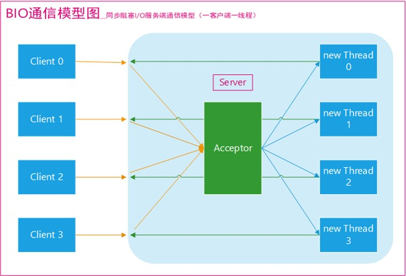
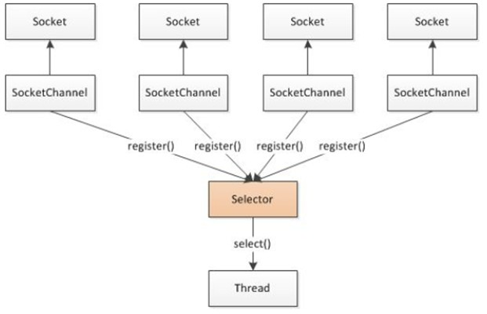

# day14 【网络编程】

## 今日内容

- 软件架构CS／BS
- 网络通信三要素
- TCP通信
- Socket套接字
- ServerSocket
- 文件上传
- 自定义服务器
- NIO非阻塞IO

## 教学目标

- [ ] 能够说出软件的结构
- [ ] 能够辨别UDP和TCP协议特点
- [ ] 能够说出TCP协议下两个常用类名称
- [ ] 能够编写TCP协议下字符串数据传输程序
- [ ] 能够理解TCP协议下文件上传案例
- [ ] 能够理解TCP协议下模拟B\S服务器案例

# 第一章 网络编程入门

## 1.1软件结构

- **C/S结构** ：全称为Client/Server结构，是指客户端和服务器结构。常见程序有ＱＱ、迅雷等软件。


- **B/S结构** ：全称为Browser/Server结构，是指浏览器和服务器结构。常见浏览器有谷歌、火狐等。


两种架构各有优势，但是无论哪种架构，都离不开网络的支持。**网络编程**，就是在一定的协议下，实现两台计算机的通信的程序。

## 1.2 网络通信协议

- **网络通信协议：**通信协议是对计算机必须遵守的规则，只有遵守这些规则，计算机之间才能进行通信。这就好比在道路中行驶的汽车一定要遵守交通规则一样，协议中对数据的传输格式、传输速率、传输步骤等做了统一规定，通信双方必须同时遵守，最终完成数据交换。

- **TCP/IP协议：** 传输控制协议/因特网互联协议( Transmission Control Protocol/Internet Protocol)，是Internet最基本、最广泛的协议。它定义了计算机如何连入因特网，以及数据如何在它们之间传输的标准。它的内部包含一系列的用于处理数据通信的协议，并采用了4层的分层模型，每一层都呼叫它的下一层所提供的协议来完成自己的需求


## 1.3 协议分类

通信的协议还是比较复杂的，`java.net` 包中包含的类和接口，它们提供低层次的通信细节。我们可以直接使用这些类和接口，来专注于网络程序开发，而不用考虑通信的细节。

`java.net` 包中提供了两种常见的网络协议的支持：

- **TCP**：传输控制协议 (Transmission Control Protocol)。TCP协议是**面向连接**的通信协议，即传输数据之前，在发送端和接收端建立逻辑连接，然后再传输数据，它提供了两台计算机之间可靠无差错的数据传输。
  - 三次握手：TCP协议中，在发送数据的准备阶段，客户端与服务器之间的三次交互，以保证连接的可靠。
    - 第一次握手，客户端向服务器端发出连接请求，等待服务器确认。
    - 第二次握手，服务器端向客户端回送一个响应，通知客户端收到了连接请求。
    - 第三次握手，客户端再次向服务器端发送确认信息，确认连接。整个交互过程如下图所示


  完成三次握手，连接建立后，客户端和服务器就可以开始进行数据传输了。由于这种面向连接的特性，TCP协议可以保证传输数据的安全，所以应用十分广泛，例如下载文件、浏览网页等。

- **UDP**：用户数据报协议(User Datagram Protocol)。UDP协议是一个**面向无连接**的协议。传输数据时，不需要建立连接，不管对方端服务是否启动，直接将数据、数据源和目的地都封装在数据包中，直接发送。每个数据包的大小限制在64k以内。它是不可靠协议，因为无连接，所以传输速度快，但是容易丢失数据。日常应用中,例如视频会议、QQ聊天等。

  每次发送的数据最大为64kb。

## 1.4 网络编程三要素

### 协议

- **协议：**计算机网络通信必须遵守的规则，已经介绍过了，不再赘述。

### IP地址

- **IP地址：指互联网协议地址（Internet Protocol Address）**，俗称IP。IP地址用来给一个网络中的计算机设备做唯一的编号。假如我们把“个人电脑”比作“一台电话”的话，那么“IP地址”就相当于“电话号码”。

**IP地址分类**

- IPv4：是一个32位的二进制数，通常被分为4个字节，表示成`a.b.c.d` 的形式，例如`192.168.65.100` 。其中a、b、c、d都是0~255之间的十进制整数，那么最多可以表示42亿个。

- IPv6：由于互联网的蓬勃发展，IP地址的需求量愈来愈大，但是网络地址资源有限，使得IP的分配越发紧张。有资料显示，全球IPv4地址在2011年2月分配完毕。

  为了扩大地址空间，拟通过IPv6重新定义地址空间，采用128位地址长度，每16个字节一组，分成8组十六进制数，表示成`ABCD:EF01:2345:6789:ABCD:EF01:2345:6789`，号称可以为全世界的每一粒沙子编上一个网址，这样就解决了网络地址资源数量不够的问题。

**常用命令**

- 查看本机IP地址，在控制台输入：

```
ipconfig
```

- 检查网络是否连通，在控制台输入：

```
ping 空格 IP地址
ping 220.181.57.216
ping www.baidu.com
```

**特殊的IP地址**

- 本机IP地址：`127.0.0.1`、`localhost` 。

### 端口号

网络的通信，本质上是两个进程（应用程序）的通信。每台计算机都有很多的进程，那么在网络通信时，如何区分这些进程呢？

如果说**IP地址**可以唯一标识网络中的设备，那么**端口号**就可以唯一标识设备中的进程（应用程序）了。

- **端口号：用两个字节表示的整数，它的取值范围是0~65535**。其中，0~1023之间的端口号用于一些知名的网络服务和应用，普通的应用程序需要使用1024以上的端口号。如果端口号被另外一个服务或应用所占用，会导致当前程序启动失败。

利用`协议`+`IP地址`+`端口号` 三元组合，就可以标识网络中的进程了，那么进程间的通信就可以利用这个标识与其它进程进行交互。

# 第二章 TCP通信协议

## 2.1 概述

TCP通信能实现两台计算机之间的数据交互，通信的两端，要严格区分为客户端（Client）与服务端（Server）。

**两端通信时步骤：**

1. 服务端程序，需要事先启动，等待客户端的连接。
2. 客户端主动连接服务器端，连接成功才能通信。服务端不可以主动连接客户端。

**在Java中，提供了两个类用于实现TCP通信程序：**

- 客户端：`java.net.Socket` 类表示。创建`Socket`对象，向服务端发出连接请求，服务端响应请求，两者建立连接开始通信。
- 服务端：`java.net.ServerSocket` 类表示。创建`ServerSocket`对象，相当于开启一个服务，并等待客户端的连接。

## 2.2 Socket类  

`Socket` 类：该类实现客户端套接字，套接字指的是两台设备之间通讯的端点。

#### 构造方法

- `public Socket(String host, int port)` :创建套接字对象并将其连接到指定主机上的指定端口号。如果指定的host是null ，则相当于指定地址为回送地址。 

```java
Socket client = new Socket("127.0.0.1", 6666);
```

#### 成员方法

- `public InputStream getInputStream()` ： 返回此套接字的输入流。
  - 如果此Scoket具有相关联的通道，则生成的InputStream 的所有操作也关联该通道。
  - 关闭生成的InputStream也将关闭相关的Socket。
- `public OutputStream getOutputStream()` ： 返回此套接字的输出流。
  - 如果此Scoket具有相关联的通道，则生成的OutputStream 的所有操作也关联该通道。
  - 关闭生成的OutputStream也将关闭相关的Socket。
- `public void close()` ：关闭此套接字。
  - 一旦一个socket被关闭，它不可再使用。
  - 关闭此socket也将关闭相关的InputStream和OutputStream 。 
- `public void shutdownOutput()` ： 禁用此套接字的输出流。   
  - 任何先前写出的数据将被发送，随后终止输出流。 

## 2.3 ServerSocket类

`ServerSocket`类：这个类实现了服务器套接字，该对象等待通过网络的请求。

#### 构造方法

- `public ServerSocket(int port)` ：使用该构造方法在创建ServerSocket对象时，就可以将其绑定到一个指定的端口号上，参数port就是端口号。

```
ServerSocket server = new ServerSocket(6666);
```

#### 成员方法

- `public Socket accept()` ：侦听并接受连接，返回一个新的Socket对象，用于和客户端实现通信。该方法会一直阻塞直到建立连接。

## 2.4 简单的TCP网络程序	

### TCP通信分析图解

1. 【服务端】启动,创建ServerSocket对象，等待连接。
2. 【客户端】启动,创建Socket对象，请求连接。
3. 【服务端】接收连接,调用accept方法，并返回一个Socket对象。
4. 【客户端】Socket对象，获取OutputStream，向服务端写出数据。
5. 【服务端】Scoket对象，获取InputStream，读取客户端发送的数据。
6. 【服务端】Socket对象，获取OutputStream，向客户端回写数据。
7. 【客户端】Scoket对象，获取InputStream，解析回写数据。
8. 【客户端】释放资源，断开连接。


## 2.5 简单的TCP通信案例

### 客户端向服务器发送数据--客户端程序

```java
public class ClientTCP {
	public static void main(String[] args) throws Exception {
		System.out.println("客户端 发送数据");
		// 1.创建 Socket ( ip , port ) , 确定连接到哪里.
		Socket client = new Socket("localhost", 6666);
		// 2.获取流对象 . 输出流
		OutputStream os = client.getOutputStream();
		// 3.写出数据.
		os.write("你好么? tcp ,我来了".getBytes());
		// 4. 关闭资源 .
		os.close();
		client.close();
	}
}
```

### 客户端向服务器发送数据--服务器端程序

```java
public class ServerTCP {
    public static void main(String[] args) throws IOException {
        System.out.println("服务端启动 , 等待连接 .... ");
        // 1.创建 ServerSocket对象，绑定端口，开始等待连接
        ServerSocket ss = new ServerSocket(6666);
        // 2.接收连接 accept 方法, 返回 socket 对象.
        Socket server = ss.accept();
        // 3.通过socket 获取输入流
        InputStream is = server.getInputStream();
        // 4.一次性读取数据
      	// 4.1 创建字节数组
        byte[] b = new byte[1024];
      	// 4.2 据读取到字节数组中.
        int len = is.read(b)；
        // 4.3 解析数组,打印字符串信息
        String msg = new String(b, 0, len);
        System.out.println(msg);
        //5.关闭资源.
        is.close();
        server.close();
    }
}
```

### 服务器向客户端回写数据--服务器端程序

```java
public class ClientTCP {
	public static void main(String[] args) throws Exception {
		System.out.println("客户端 发送数据");
		// 1.创建 Socket ( ip , port ) , 确定连接到哪里.
		Socket client = new Socket("localhost", 6666);
		// 2.通过Scoket,获取输出流对象 
		OutputStream os = client.getOutputStream();
		// 3.写出数据.
		os.write("你好么? tcp ,我来了".getBytes());
      	// ==============解析回写=========================
      	// 4. 通过Scoket,获取 输入流对象
      	InputStream in = client.getInputStream();
      	// 5. 读取数据数据
      	byte[] b = new byte[100];
      	int len = in.read(b);
      	System.out.println(new String(b, 0, len));
		// 6. 关闭资源 .
      	in.close();
		os.close();
		client.close();
	}
}
```

### 服务器向客户端回写数据--客户端程序

```java
public class ServerTCP {
    public static void main(String[] args) throws IOException {
        System.out.println("服务端启动 , 等待连接 .... ");
        // 1.创建 ServerSocket对象，绑定端口，开始等待连接
        ServerSocket ss = new ServerSocket(6666);
        // 2.接收连接 accept 方法, 返回 socket 对象.
        Socket server = ss.accept();
        // 3.通过socket 获取输入流
        InputStream is = server.getInputStream();
        // 4.一次性读取数据
      	// 4.1 创建字节数组
        byte[] b = new byte[1024];
      	// 4.2 据读取到字节数组中.
        int len = is.read(b)；
        // 4.3 解析数组,打印字符串信息
        String msg = new String(b, 0, len);
        System.out.println(msg);
      	// =================回写数据=======================
      	// 5. 通过 socket 获取输出流
      	 OutputStream out = server.getOutputStream();
      	// 6. 回写数据
      	 out.write("我很好,谢谢你".getBytes());
      	// 7.关闭资源.
      	out.close();
        is.close();
        server.close();
    }
}
```

# 第三章 文件上传案例

## 3.1 文件上传案例

### 文件上传分析图解

1. 【客户端】输入流，从硬盘读取文件数据到程序中。
2. 【客户端】输出流，写出文件数据到服务端。
3. 【服务端】输入流，读取文件数据到服务端程序。
4. 【服务端】输出流，写出文件数据到服务器硬盘中。

5. 【服务端】获取输出流，回写数据。
6. 【客户端】获取输入流，解析回写数据。


## 3.2 文件上传客户端实现

```java
public static void main(String[] args) throws IOException {
    // 1.创建流对象
    // 1.1 创建输入流,读取本地文件
    BufferedInputStream bis = new BufferedInputStream(new FileInputStream("test.jpg"));
    // 1.2 创建输出流,写到服务端
    Socket socket = new Socket("localhost", 6666);
    BufferedOutputStream bos = new BufferedOutputStream(socket.getOutputStream());

    //2.写出数据.
    byte[] b  = new byte[1024 * 8 ];
    int len ;
    while (( len  = bis.read(b))!=-1) {
    	bos.write(b, 0, len);
    }
    // 关闭输出流,通知服务端,写出数据完毕
    socket.shutdownOutput();
    System.out.println("文件发送完毕");
    // 3. =====解析回写============
    InputStream in = socket.getInputStream();
    byte[] back = new byte[20];
    in.read(back);
    System.out.println(new String(back));
    in.close();
    
    // 4.释放资源
    socket.close();
    bis.close();
}
```

## 3.3 文件上传单线程服务器实现

```java
public static void main(String[] args) throws IOException {
        System.out.println("服务器 启动.....  ");
        // 1. 创建服务端ServerSocket
        ServerSocket serverSocket = new ServerSocket(6666);
        // 2. 循环接收,建立连接
        Socket accept = serverSocket.accept();
            /*
             *3. socket对象进行读写操作  
             */
        try {
                //3.1 获取输入流对象
                BufferedInputStream bis = new BufferedInputStream(accept.getInputStream());
                //3.2 创建输出流对象, 保存到本地 .
                FileOutputStream fis = new FileOutputStream(System.currentTimeMillis() + ".jpg");
                BufferedOutputStream bos = new BufferedOutputStream(fis);
                // 3.3 读写数据
                byte[] b = new byte[1024 * 8];
                int len;
                while ((len = bis.read(b)) != -1) {
                    bos.write(b, 0, len);
                }

                // 4.=======信息回写===========================
                System.out.println("back ........");
                OutputStream out = accept.getOutputStream();
                out.write("上传成功".getBytes());
                out.close();
                //================================

                //5. 关闭 资源
                bos.close();
                bis.close();
                accept.close();
                System.out.println("文件上传已保存");
        } catch (IOException e) {
            e.printStackTrace();
        }
    }
}
```

## 3.4 文件上传单线程服务器实现

文件上传的案例中，服务器只能为客户端服务器一次，之后服务器端程序就会结束。而我们必须做到让服务器程序不能结束，时时刻刻都要为客户端服务。而且同时可以为多个客户端提供服务器，做到一个客户端就要开启一个信新的线程。

```java
public static void main(String[] args) throws IOException{
    System.out.println("服务器 启动.....  ");
    // 1. 创建服务端ServerSocket
    ServerSocket serverSocket = new ServerSocket(6666);
    // 2. 循环接收,建立连接
    while (true) {
        Socket accept = serverSocket.accept();
        /*
        3. socket对象交给子线程处理,进行读写操作
        Runnable接口中,只有一个run方法,使用lambda表达式简化格式
        */
        new Thread(() -> {
            try{
            //3.1 获取输入流对象
            BufferedInputStream bis = new BufferedInputStream(accept.getInputStream());
            //3.2 创建输出流对象, 保存到本地 .
            FileOutputStream fis = new FileOutputStream(System.currentTimeMillis() + ".jpg");
            BufferedOutputStream bos = new BufferedOutputStream(fis);
            // 3.3 读写数据
            byte[] b = new byte[1024 * 8];
            int len;
            while ((len = bis.read(b)) != -1) {
            bos.write(b, 0, len);
            }

            // 4.=======信息回写===========================
            System.out.println("back ........");
            OutputStream out = accept.getOutputStream();
            out.write("上传成功".getBytes());
            out.close();
            //================================

            //5. 关闭 资源
            bos.close();
            bis.close();
            accept.close();
            System.out.println("文件上传已保存");
            } catch (IOException e) {
            e.printStackTrace();
            }
        }).start();
    }
}
```

## 3.5 文件上传服务器实现优化

频繁的创建线程会增加系统资源的开销，可以利用线程池进行再次优化。

```java
public static void main(String[] args)  throws IOException{
    System.out.println("服务器 启动.....  ");
    ServerSocket serverSocket = new ServerSocket(6666);
	//创建10个线程的线程池
    ExecutorService executorService = Executors.newFixedThreadPool(10);
    
    while (true) {
        Socket accept = serverSocket.accept();
        //提交线程执行的任务
        executorService.submit(()->{
            try{

            BufferedInputStream bis = new BufferedInputStream(accept.getInputStream());
            FileOutputStream fis = new FileOutputStream(System.currentTimeMillis() + ".jpg");
            BufferedOutputStream bos = new BufferedOutputStream(fis);
            byte[] b = new byte[1024 * 8];
            int len;
            while ((len = bis.read(b)) != -1) {
            bos.write(b, 0, len);
            }
            System.out.println("back ........");
            OutputStream out = accept.getOutputStream();
            out.write("上传成功".getBytes());
            out.close();
            bos.close();
            bis.close();
            accept.close();
            System.out.println("文件上传已保存");
            } catch (IOException e) {
            	e.printStackTrace();
            }
        });
    }
}
```

# 第五章 模拟B/S服务器

模拟网站服务器，使用浏览器访问自己编写的服务端程序，查看网页效果。

## 5.1 案例分析

- 准备页面数据，web文件夹。
  - 包含网页html文件
  - 包含图片
  - 包含css样式表
- 我们模拟服务器端，ServerSocket类监听端口，使用浏览器访问，查看网页效果

## 5.2 HTTP协议

案例中需使用浏览器查看效果，浏览器和服务器之间是遵循HTTP协议的，我们先对HTTP协议进行简单的介绍，在后期课程JavaWeb中在详解解释。

- HTTP协议，称为超文本传输协议。
- 规定了客户端浏览器和服务器之间的协议。
- HTTP协议是TCP网络通信模型中应用层的协议。
- 客户端浏览器主动向服务器发起请求，服务器收到后进行响应。
- 客户端请求
  - 客户端在请求的信息的第一行中，携带了客户端想要请求的资源路径。


- 服务器端响应
  - 响应中必须告知客户端响应的结果。
  - 200状态码表示响应成功。
  - Content-Type:text/html 告知浏览器响应的内容是文本/网页内容。


## 5.3 实现HTTP协议中的服务器

**注意**：浏览器工作原理是遇到图片会开启一个线程进行单独的访问,因此在服务器端加入线程技术。

```java
public class ServerDemo {
    public static void main(String[] args) throws IOException {
        ServerSocket server = new ServerSocket(8888);
        while(true){
            Socket socket = server.accept();
            new Thread(new Web(socket)).start();
        }
    }
}  
```

```java
class Web implements Runnable{
    private Socket socket;

    public Web(Socket socket){
        this.socket=socket;
    }

    public void run() {
        try{
            //转换流,读取浏览器请求第一行
            BufferedReader readWb = new
                    BufferedReader(new InputStreamReader(socket.getInputStream()));
            String requst = readWb.readLine();
            //取出请求资源的路径
            String[] strArr = requst.split(" ");
            System.out.println(Arrays.toString(strArr));
            String path = strArr[1].substring(1);
            System.out.println(path);

            FileInputStream fis = new FileInputStream(path);
            System.out.println(fis);
            byte[] bytes= new byte[1024];
            int len = 0 ;

            //向浏览器 回写数据
            OutputStream out = socket.getOutputStream();
            out.write("HTTP/1.1 200 OK\r\n".getBytes());
            out.write("Content-Type:text/html\r\n".getBytes());
            out.write("\r\n".getBytes());
            while((len = fis.read(bytes))!=-1){
                out.write(bytes,0,len);
            }
            fis.close();
            out.close();
            readWb.close();
            socket.close();
        }catch(Exception ex){
			ex.printStackTrace();
        }
    }
}
```

# 第六章 NIO

NIO非阻塞IO，目的是为了提高客户端和服务器之间的通信效率，降低系统开销。JavaWeb服务器Tomcat从8.0版本后，已经升级为NIO通信模式了，因此我们简单了解一下即可。

## 6.1 传统BIO通信模型

**BIO**：Bloking IO 阻塞式IO。服务端提供IP和监听端口，客户端通过连接操作向服务端监听的端口发起连接请求，通过三次握手连接，如果连接成功建立，双方就可以通过套接字进行通信。

​     传统的同步阻塞模型开发中，ServerSocket负责绑定IP地址，启动监听端口；Socket负责发起连接操作。连接成功后，双方通过输入和输出流进行同步阻塞式通信。 

​     简单的描述一下BIO的服务端通信模型：采用BIO通信模型的服务端，通常由一个独立的Acceptor线程负责监听客户端的连接，它接收到客户端连接请求之后为每个客户端创建一个新的线程进行链路处理，通过输出流返回应答给客户端，线程销毁。即典型的一请求一应答通宵模型。



该模型最大的问题就是缺乏弹性伸缩能力，当客户端并发访问量增加后，服务端的线程个数和客户端并发访问数呈1:1的正比关系，Java中的线程也是比较宝贵的系统资源，线程数量快速膨胀后，系统的性能将急剧下降，随着访问量的继续增大，系统最终就死掉了。

## 6.2 NIO通信模型

**NIO**：No Bloking IO 非阻塞式IO，NIO我们一般认为是New I/O（也是官方的叫法），因为它是相对于老的I/O类库新增的，做了很大的改变。但民间跟多人称之为No-blocking I/O，即非阻塞I/O，因为这样叫，更能体现它的特点。而下文中的NIO，不是指整个新的I/O库，而是非阻塞I/O。

NIO提供了与传统BIO模型中的Socket和ServerSocket相对应的SocketChannel和ServerSocketChannel两种不同的套接字通道实现。

新增的这两种通道都支持阻塞和非阻塞两种模式。

阻塞模式使用就像传统中的支持一样，比较简单，但是性能和可靠性都不好；非阻塞模式正好与之相反。

 对于低负载、低并发的应用程序，可以使用同步阻塞I/O来提升开发速率和更好的维护性；对于高负载、高并发的（网络）应用，应使用NIO的非阻塞模式来开发。



## 6.3 面向缓冲区编程

BIO中是面向流编程，任何数据都是以流的形式进行传输。

在NIO中是面向缓冲区编程，任何数据都会存储在缓冲区中，一个缓冲区中的数据可以在客户端和服务器之间进行来回传输，减少系统开销。

Buffer是抽象类, 一个用于特定基本类型数据的容器

在NIO库中，所有数据都是用缓冲区处理的。在读取数据时，它是直接读到缓冲区中的；在写入数据时，也是写入到缓冲区中。任何时候访问NIO中的数据，都是通过缓冲区进行操作。

缓冲区实际上是一个数组，并提供了对数据结构化访问以及维护读写位置等信息。

具体的缓存区有这些：ByteBuffer、CharBuffer、 ShortBuffer、IntBuffer、LongBuffer、FloatBuffer、DoubleBuffer。他们都继承了相同的父类：Buffer。

### ByteBuffer字节缓冲区

- 静态方法 `static ByteBuffer allocate(int capacity)`：分配新的缓冲区，指定缓冲区大小
- 方法：`ByteBuffer put(byte[] bytes)`：向缓冲区中放入数据。
- 方法：`byte[] array()`：从缓冲区中获取数据。
- 方法：`Buffer clear()`：清空缓冲区。
- 方法：`Buffer flip()`：反转缓冲区。
  - 缓冲区内部存在指针，向缓冲区中存储数据时，指针会向后移动。
  - 再次读取缓冲区数据时，将无法读取到数据，因此需要反转，就是将指针指向缓冲区的开端。

## 6.4 多路复用

### Channel（通道）接口

用于 I/O 操作的连接。  

通道表示到实体，如硬件设备、文件、网络套接字或可以执行一个或多个不同 I/O 操作（如读取或写入）的程序组件的开放的连接。

我们对数据的读取和写入要通过Channel，它就像水管一样，是一个通道。通道不同于流的地方就是通道是双向的，可以用于读、写和同时读写操作。

Channel主要分两大类：

- ​    SelectableChannel：用户网络读写
- ​    FileChannel：用于文件操作

#### SelectableChannel类 多路复用通道

客户端和服务器采用通道的方式进行连接，一旦连接成功，通道就不会再关闭了。有多个客户端，就会有多个连接通道，缓冲区在通道中进行反复的读取和写出。

**所谓多路复用**：指的就是通道。客户端和服务器之间的通道不会关闭，可以反复的使用。

而BIO中，一旦客户端向服务器发送完毕，就要终止套接字的输出流（shutdownOutput()），如果还要和服务器通信，就要从新建立连接，效率低，资源开销大。

- 方法`SelectableChannel configureBlocking(boolean block)`：设置阻塞模式，false为非阻塞。
- 方法`SelectionKey register(Selector sel,int ops)`：向通道中注册选择器。所得键的可用操作集 。

## 6.5 Selector类 多路复用选择器

通道的多路复用选择器，该选择器又被称为挑选器，他被注册在通道中，作用是挑选客户端。

- `Selector类的open()方法`：获取到该类的对象。

- `Selector类的select()方法`：挑选客户端。该方法返回int值，如果不是0，说明通道中有客户端进行连接。
- `Selector类的selectedKeys()方法`：方法返回Set集合，泛型是SelectionKey类型，表示获取到的通道状态的集合。

通道有4中状态：

- 已经准备好进行套接字连接。SelectionKey.OP_ACCEPT
- 已成功连接。SelectionKey.OP_CONNECT
- 需要读取的数据。 SelectionKey.OP_READ
- 需要将数据回写。SelectionKey.OP_WRITE

## 6.7 SelectionKey类 通道中注册的标记

此类表示通道中的状态

- 常量：
  - `SelectionKey.OP_ACCEPT`
  - `SelectionKey.OP_CONNECT`
  - ` SelectionKey.OP_READ`
  - `SelectionKey.OP_WRITE`
- 轮询方法：
  - `boolean isAcceptable()`：判断通道是否已经准备好连接。
  - `boolean isConnectable()`：判断是否已经连接成功。
  - `boolean isReadable()`：判断通道中是否有数据可以读取。
  - `boolean isWritable()`：判断通道中是否可以写入数据。
