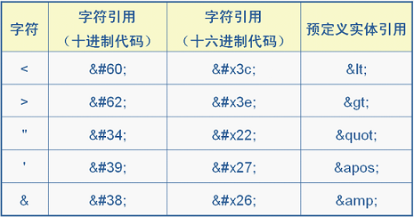
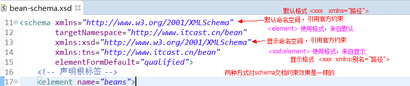
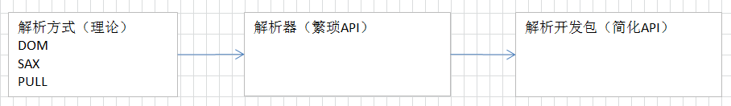
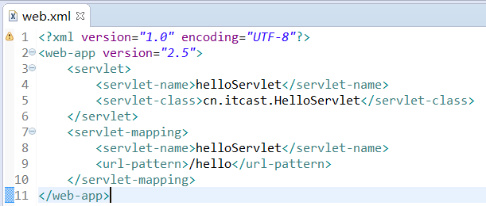
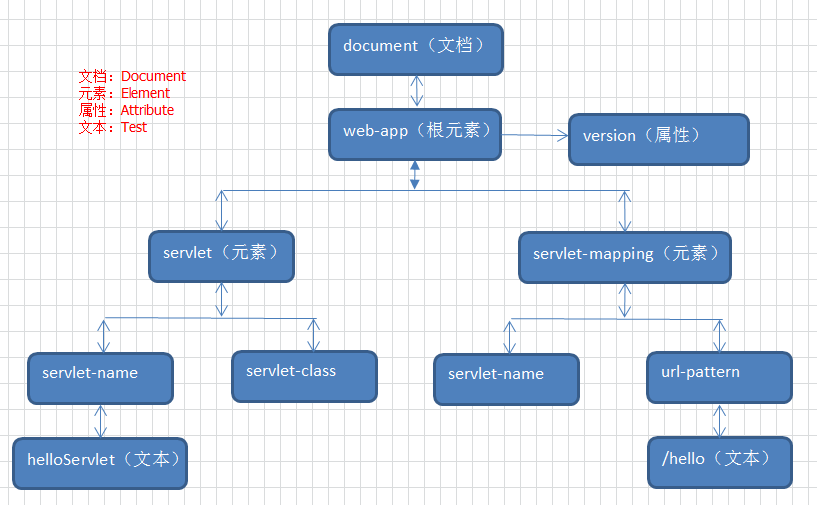
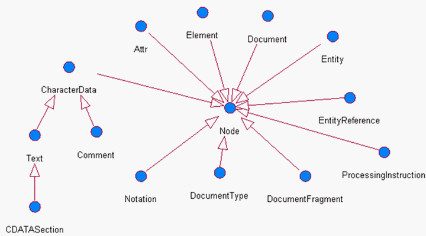

# day16【枚举、xml、综合案例】

## 今日内容

- 枚举
- xml文档
- DTD约束
- Schema约束
- DOM解析
- Xpath表达式
- BS服务器改进案例

## 教学目标

- [ ] 能够自定义枚举常量
- [ ] 能够说出XML的作用
- [ ] 了解XML的组成元素
- [ ] 能够说出有哪些XML约束技术
- [ ] 能够说出解析XML文档DOM方式原理
- [ ] 能够通过Dom4j解析XML文档
- [ ] 能够使用xpath解析HTML文档

# 第一章 枚举

## 1.1 枚举概述

枚举是JDK1.5新增的引用数据类型，和类，接口是一个级别的，定义枚举的关键字为`enum`。

`java.lang.Enum`类，是所有枚举的父类。

枚举的本质就是一个类的多个对象。

## 1.2 枚举的定义

- 格式：`public enmu 枚举名{}`
- 枚举常量定义：
  - 枚举中的常量名字大写，多个常量之间逗号分开，最后一个常量可以写分号，也可以不写。每一个常量，都表示这个类的对象。修饰符为`public static final`。
  - 枚举中有默认的无参数的private修饰的构造方法，如果手写构造方法，也必须是私有修饰的。而且构造方法必须写在常量的后面，这时最后一个常量就必须要写分号。

```java
public enum  Color {
    //枚举的静态常量
    RED,GREEN,YELLOW
}
```

```java
public enum Color{
	//枚举静态常量，直接为变量color赋值
	RED("红色"),GREEN("绿色"),YELLOW("黄色");
	private String color;
	private Color(String color){
		this.color = color ;
	}
    //省略get/set
}
```

## 1.3 枚举的使用

由于枚举的常量为静态修饰可以直接枚举名.调用

```java
public static void main(String[] args){
    MyEnum myEnum = MyEnum.GREEN;
    System.out.println(myEnum);
    System.out.println(myEnum.getName());
}
```

# 第二章 XML

## 2.1 xml概述

### 什么是XML

- XML ：可扩展标记语言（**EXtensible Markup Language**）

  XML 它是一种**标记语言**，很类似 HTML，HTML文件也是XML文档，标签都是自定义的。 如：`<user></user> 或 <student></student>`

- W3C在1998年2月发布1.0版本，2004年2月又发布1.1版本，单因为1.1版本不能向下兼容1.0版本，所以1.1没有人用。同时，在2004年2月W3C又发布了1.0版本的第三版。我们要学习的还是1.0版本。

### XML 与 HTML 的主要差异

- xml标签都是自定义的，html标签是预定义。
- xml的语法严格，html语法松散。
- xml是存储数据的，html是展示数据。

### xml的作用

- 存放数据

```xml
<?xml version="1.0" encoding="UTF-8"?>
<persons>
	<person id="p001">
		<name>张三</name>
	</person>
	<person id="p002">
		<name>李四</name>
	</person>
</persons>
```

类似于Java代码：

```java
class Person{
	String id;
	String name;
}

public void test(){
	HashSet<Person> persons = new HashSet<Person>();
	persons.add( new Person("p001","张三") );
	persons.add( new Person("p002","李四") );
}
```

- 配置文件

```xml
<?xml version="1.0" encoding="UTF-8"?>
<beans>
	<bean className="com.itheima.bean.User">
		<property name="username" value="jack"></property>
	</bean>
</beans>
```

类似于java代码:

```java
class User{
	private String username;
	private String pws;
	//补全set\get方法
}
```

```java
public static void main(String[] args){
    Class clazz = Class.forName("com.itheima.bean.User");
    Object obj = clazz.newInstance();
    Method method = clazz.getMethod("setUsername",String.class);
    method.invoke(obj,"jack");
}
```

## 2.2 xml的组成元素

文档声明

- XML文档声明格式：

```java
<?xml version="1.0" encoding="UTF-8"?>
```

1. 文档声明必须为<?xml开头，以?>结束；
2. 文档声明必须从文档的0行0列位置开始；
3. 文档声明只有2个属性：

```properties
1. versioin：指定XML文档版本。必须属性，因为我们不会选择1.1，只会选择1.0；
2. encoding：指定当前文档的编码。可选属性，默认值是utf-8；
```

### 元素

- 元素 element

```xml
<bean></bean>
```

1. 元素是XML文档中最重要的组成部分，
2. 普通元素的结构开始标签、元素体、结束标签组成。例如：<hello>大家好</hello>
3. 元素体：元素体可以是元素，也可以是文本，例如：<b><a>你好</a></b>
4. 空元素：空元素只有开始标签，而没有结束标签，但元素必须自己闭合，例如：<c/>
5. 元素命名：

```properties
1. 区分大小写
2. 不能使用空格，不能使用冒号:
3. 不建议以XML、xml、Xml开头
```

**格式化良好的XML文档，必须只有一个根元素。**

### 属性

- 属性  attribute

```xml
<bean id="" className="">
```

1. 属性是元素的一部分，它必须出现在元素的开始标签中
2. 属性的定义格式：属性名=属性值，其中属性值必须使用单引或双引
3. 一个元素可以有0~N个属性，但一个元素中不能出现同名属性
4. 属性名不能使用空格、冒号等特殊字符，且必须以字母开头

### 注释

XML的注释，以“<!--”开始，以“-->”结束。注释内容会被XML解析器忽略！

### 转义字符

因为很多符号已经被XML文档结构所使用，所以在元素体或属性值中想使用这些符号就必须使用转义字符，例如：“<”、“>”、“’”、“””、“&”。



# 第三章 XML约束

在XML技术里，可以编写一个文档来约束一个XML文档的书写规范，这称之为XML约束。
常见的xml约束：DTD、Schema

## 3.1 DTD约束

### 什么是DTD

DTD（Document Type Definition），文档类型定义，用来约束XML文档。规定XML文档中元素的名称，子元素的名称及顺序，元素的属性等。

### DTD重点要求

开发中，我们很少自己编写DTD约束文档，通常情况我们都是通过框架提供的DTD约束文档，编写对应的XML文档。常见框架使用DTD约束有：SpringMVC、MyBatis等。

通过提供的DTD“**bean.dtd**”编写XML。

```java
<?xml version="1.0" encoding="UTF-8"?>
<!--
	传智播客DTD教学实例文档。
	模拟spring规范，如果开发人员需要在xml使用当前DTD约束，必须包括DOCTYPE。
	格式如下：
	<!DOCTYPE beans SYSTEM "bean.dtd">
-->
<!ELEMENT beans (bean*,import*) >
<!ELEMENT bean (property*)>
<!ELEMENT property (#PCDATA)>

<!ELEMENT import (#PCDATA)>

<!ATTLIST bean id CDATA #REQUIRED
			   className CDATA #REQUIRED
>

<!ATTLIST property name CDATA #REQUIRED
				   value CDATA #REQUIRED
>

<!ATTLIST import resource CDATA #REQUIRED>
```

### 案例实现

完成xml内容编写：

```xml
<?xml version="1.0" encoding="UTF-8"?>
<!DOCTYPE beans SYSTEM "bean.dtd">
<beans>
	<bean id="" className=""></bean>
	
	<bean id="" className="">
		<property name="" value=""></property>
		<property name="" value=""></property>
	</bean>
	
	<import resource=""></import>
	<import resource=""></import>

</beans>
```

## 3.2 Schema约束

### 什么是Schema

Schema是新的XML文档约束；
Schema要比DTD强大很多，是DTD 替代者；
Schema本身也是XML文档，但Schema文档的扩展名为xsd，而不是xml。
Schema 功能更强大，数据类型更完善
Schema 支持名称空间

### Schema重点要求

与DTD一样，要求可以通过schema约束文档编写xml文档。常见框架使用schema的有：Spring等

通过提供“**bean-schema.xsd**”编写xml文档

```xmls
<?xml version="1.0" encoding="UTF-8"?>
<!-- 
	传智播客Schema教学实例文档。
	模拟spring规范，如果开发人员需要在xml使用当前Schema约束，必须包括指定命名空间。
	格式如下：
	<beans xmlns="http://www.itcast.cn/bean"
	   xmlns:xsi="http://www.w3.org/2001/XMLSchema-instance"
	   xsi:schemaLocation="http://www.itcast.cn/bean bean-schema.xsd"
	>
-->
<schema xmlns="http://www.w3.org/2001/XMLSchema"
		targetNamespace="http://www.itcast.cn/bean"
		xmlns:xsd="http://www.w3.org/2001/XMLSchema"
		xmlns:tns="http://www.itcast.cn/bean"
		elementFormDefault="qualified">
	<!-- 声明根标签 -->
	<element name="beans">
		<complexType>
			<choice minOccurs="0" maxOccurs="unbounded">
				<element name="bean">
					<complexType>
						<sequence minOccurs="0" maxOccurs="unbounded">
							<element name="property">
								<complexType>
									<attribute name="name" use="required"></attribute>
									<attribute name="value" use="required"></attribute>
								</complexType>
							</element>
						</sequence>
						<attribute name="id" use="required"></attribute>
						<attribute name="className" use="required"></attribute>
					</complexType>
				</element>
				<element name="import">
					<complexType>
						<attribute name="resource" use="required"></attribute>
					</complexType>
				</element>
			</choice>
		</complexType>
	</element>
</schema>
```

### 案例实现

完成xml内容编写

```xml
<?xml version="1.0" encoding="UTF-8"?>
<beans xmlns="http://www.itcast.cn/bean"
	   xmlns:xsi="http://www.w3.org/2001/XMLSchema-instance"
	   xsi:schemaLocation="http://www.itcast.cn/bean bean-schema.xsd"
>
	<bean id="" className=""></bean>
	<bean id="" className="">
		<property name="" value=""/>
		<property name="" value=""/>
	</bean>
	
	<import resource=""/>
	<import resource=""/>
</beans>
```

## 3.3 命名空间（语法）

什么是命名空间

如果一个XML文档中使用多个Schema文件，而这些Schema文件中定义了相同名称的元素时就会出现名字冲突。这就像一个Java文件中使用了import java.util.*和import java.sql.*时，在使用Date类时，那么就不明确Date是哪个包下的Date了。

总之名称空间就是用来处理元素和属性的名称冲突问题，与Java中的包是同一用途。如果每个元素和属性都有自己的名称空间，那么就不会出现名字冲突问题，就像是每个类都有自己所在的包一样，那么类名就不会出现冲突。

##### 约束文档和xml关系

当W3C提出Schema约束规范时，就提供“官方约束文档”。我们通过官方文档，必须“自定义schema 约束文档”，开发中“自定义文档”由框架编写者提供。我们提供“自定义文档”限定，编写出自己的xml文档。


### 声明命名空间

```xml
默认命名空间：<xxx xmlns=””>，使用<标签>
显式命名空间：<xxx xmlns:别名=””>，使用<别名:标签>
```



# 第四章 XML解析

## 4.1 xml解析概述

当将数据存储在XML后，我们就希望通过程序获得XML的内容。如果我们使用Java基础所学习的IO知识是可以完成的，不过你需要非常繁琐的操作才可以完成，且开发中会遇到不同问题（只读、读写）。人们为不同问题提供不同的解析方式，并提交对应的解析器，方便开发人员操作XML。

## 4.2 常见的解析方式和解析器

- ##### 开发中比较常见的解析方式有三种，如下：

  - DOM：要求解析器把整个XML文档装载到内存，并解析成一个Document对象。

```properties
优点：元素与元素之间保留结构关系，故可以进行增删改查操作。
缺点：XML文档过大，可能出现内存溢出显现。
```

- SAX：是一种速度更快，更有效的方法。它逐行扫描文档，一边扫描一边解析。并以事件驱动的方式进行具体解析，每执行一行，都将触发对应的事件。（了解）

```properties
优点：处理速度快，可以处理大文件
缺点：只能读，逐行后将释放资源。
```

- PULL：Android内置的XML解析方式，类似SAX。（了解）

**解析器**：就是根据不同的解析方式提供的具体实现。有的解析器操作过于繁琐，为了方便开发人员，有提供易于操作的解析开发包。



## 4.3 dom解析原理和结构模型



XML DOM 将整个XML文档加载到内存，生成一个DOM树，并获得一个Document对象，通过Document对象就可以对DOM进行操作。



DOM中的核心概念就是节点，在XML文档中的元素、属性、文本等，在DOM中都是节点！



## 4.4 API使用

DOM4J是一个Java的XML API，具有性能优异、功能强大和极其易使用的特点，它的性能超过sun公司官方的dom技术，如今可以看到越来越多的Java软件都在使用DOM4J来读写XML。

如果想要使用DOM4J，需要引入支持xpath的jar包 `dom4j-1.6.1.jar`

DOM4J必须使用核心类SaxReader加载xml文档获得Document，通过Document对象获得文档的根元素，然后就可以操作了。

**常用API如下：**

1. ##### SaxReader对象

   ```
   read(…) 加载执行xml文档
   ```

2. **Document对象**

   ```
   getRootElement() 获得根元素
   ```

3. **Element对象**

   ```
   elements(…) 获得指定名称的所有子元素。可以不指定名称
   element(…) 获得指定名称第一个子元素。可以不指定名称
   getName() 获得当前元素的元素名
   attributeValue(…) 获得指定属性名的属性值
   elementText(…) 获得指定名称子元素的文本值
   getText() 获得当前元素的文本内容
   ```

**API案例实现**

编写xml文件：

```xml
<?xml version="1.0" encoding="UTF-8"?>
<beans>
    <bean id="001" className="cn.itcast.demo.User">
        <property name="user" value="jacl"></property>
        <property name="user" value="rose"></property>
    </bean>

    <bean id="002" className="cn.itcast.demo.Admin">
        <property name="user" value="admin"></property>
        <property name="user" value="write"></property>
    </bean>
</beans>
```

编写解析xml代码：

```java
public static void main(String[] args) throws Exception {
    SAXReader sax = new SAXReader();
    Document document = sax.read("beans.xml");

    Element elemRoot = document.getRootElement();
    List<Element>list = elemRoot.elements();
  
    for(Element element : list){
        String id =element.attributeValue("id");
        String className = element.attributeValue("className");
        System.out.println(id+""+className);

        List<Element>listElem = element.elements();
        for(Element elem : listElem){
            String name = elem.attributeValue("name");
            String value = elem.attributeValue("value");
            System.out.println(name+""+value);
        }
    }
}
```

# 第五章 XPath解析XML

- XPath 是一门在 XML、html 文档中查找信息的语言。

- XPath 是一个 W3C 标准，可通过W3CSchool文档查阅语法

由于DOM4J在解析XML时只能一层一层解析，所以当XML文件层数过多时使用会很不方便，结合XPATH就可以直接获取到某个元素

## 5.1 使用dom4j支持xpath具体操作

默认的情况下，dom4j不支持xpath，如果想要在dom4j里面使用xpath，需要引入支持xpath的jar包 `jaxen-1.1.6.jar`

在dom4j里面提供了两个方法，用来支持xpath

```java
List<Node> selectNodes("xpath表达式")，用来获取多个节点
Node selectSingleNode("xpath表达式")，用来获取一个节点
```

## 5.2 xpath表达式常用查询形式

- **第一种查询形式**

  ```
  /AAA/DDD/BBB： 表示一层一层的，AAA下面 DDD下面的BBB
  ```

- 第二种查询形式

  ```
  //BBB： 表示和这个名称相同，表示只要名称是BBB 都得到
  ```

- 第三种查询形式

  ```
  /*: 所有元素
  ```

- 第四种查询形式

  ```
  BBB[1]：表示第一个BBB元素
  BBB[last()]：表示最后一个BBB元素
  ```

- 第五种查询形式

  ```
  //BBB[@id]： 表示只要BBB元素上面有id属性 都得到
  ```

- 第六种查询形式

  ```
  //BBB[@id='b1'] 表示元素名称是BBB,在BBB上面有id属性，并且id的属性值是b1
  ```

## 5.3 案例实现

编写xml文件：

```xml
<?xml version="1.0" encoding="UTF-8" ?>
<students>
	<student number="heima_0001">
		<name id="itcast">
			<xing>张</xing>
			<ming>三</ming>
		</name>
		<age>18</age>
		<sex>male</sex>
	</student>
	<student number="heima_0002">
		<name>jack</name>
		<age>18</age>
		<sex>female</sex>
	</student>
</students>
```

编写xpath代码解析xml文件：

```java
public static void main(String[] args) throws Exception {
        SAXReader saxReader=new SAXReader();
        String path = Demo4jXpath.class.getClassLoader().getResource("student.xml").getFile();
        File file = new File(path);
        Document document=saxReader.read(file);

        //4.结合xpath语法查询
        //4.1查询所有student标签
        List<Node> nodes = document.selectNodes("//student");
        for (Node node : nodes) {
            System.out.println(node);
        }

        System.out.println("--------------------");

        //4.2查询所有student标签下的name标签
       nodes = document.selectNodes("//student/name");
        for (Node node : nodes) {
            System.out.println(node);
        }

        System.out.println("--------------------");

        //4.3查询student标签下带有id属性的name标签
        nodes = document.selectNodes("//student/name[@id]");
        for (Node node : nodes) {
            System.out.println(node);
        }
        System.out.println("--------------------");
        //4.4查询student标签下带有id属性的name标签 并且id属性值为itcast

        nodes = document.selectNodes("//student/name[@id='itcast']");
        for (Node node : nodes) {
            System.out.println(node);
        }
    }
```

## 第六章：BS服务器改进

网络编程中的BS服务器案例中存在一个问题，我们在程序中将端口号写死，如果要更换端口号只能修改源代码。这样程序的维护性非常的差。

**解决办法**：将端口号写在配置文件（xml）中进行读取，需要更换端口号可以直接修改配置文件。

在src目录下创建文件server.xml：

```xml
<?xml version="1.0" encoding="utf-8"?>
<server>
    <port>8000</port>
</server>
```

读取xml中的端口号：

```java
public static void main(String[] args)throws Exception{
    SAXReader saxReader = new SAXReader();
    //获取类的加载器
    ClassLoader classLoader = TCPServer.class.getClassLoader();
    //类加载器中获取输入流
    InputStream inputStream = classLoader..getResourceAsStream("server.xml");
    Document document = saxReader.read(inputStream);
    Element rootElement = document.getRootElement();
    //xpath表达式，获取标签port
    Node node = rootElement.selectSingleNode("//port");
    //节点对象强转标签对象
    Element portElement = (Element)node;
    //获取端口号，转成int类型
    int port = Integer.parseInt(portElement.getText());
    ServerSocket server = new ServerSocket(port);
    while(true){
        Socket socket = server.accept();
        //开启线程
    }
}
```

